# evka_position Hardware Design Comparison

## 1. Purpose And Scope

This document is a decision guide for engineers choosing which EVKA carrier-board hardware version to build. It compares the documented 5V, 12V, ESP32-S3, onboard-charging, and final external-charge designs, then steers new core sensor builds toward the Final Design.

The source design files remain the source of record for schematics and BOM details. This comparison deliberately synthesizes them, calls out corrected risks, and favors a practical build decision over neutral history.

**Important correction used in this document:** older 12V source files describe a `TP5100` charger path as "3S mode" / 12.6V. A separate fact check of common TP5100 datasheets and modules found TP5100 to be a 1S/2S charger family (4.2V/8.4V), not a credible 3S/12.6V solution unless a specific module contains additional undocumented circuitry. Therefore the TP5100 + 3S paths are treated here as unsafe or unverified and not recommended for new builds.

---

## 2. Evolution Timeline

The hardware evolved through three major shifts: from 5V bench hardware to 12V machine power, from passive Schottky OR-ing to active battery isolation, and from Wemos D1 R32 to ESP32-S3.

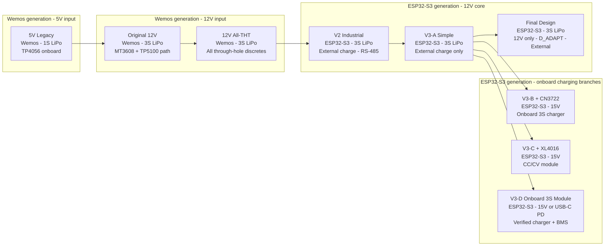

---

## 3. Master Comparison Table

| Design | MCU | Input voltage | Battery | Charging method | Source selection | Key charging/power IC | Assembly difficulty | Firmware status |
|---|---|---:|---|---|---|---|---|---|
| 5V Legacy | Wemos D1 R32 | 5V | 1S LiPo | TP4056 onboard | Schottky OR on 5V rail | TP4056, MT3608, SI2301 | Medium | Current Wemos firmware |
| Original 12V | Wemos D1 R32 | 12V | 3S LiPo | TP5100 path documented; treat as unsafe/unverified for 3S | Schottky OR at buck input | MT3608, TP5100, MP1584EN, AO4407A | Hard | Current Wemos firmware |
| 12V All-THT | Wemos D1 R32 | 12V | 3S LiPo | Same TP5100 path; treat as unsafe/unverified for 3S | Schottky OR at buck input | MT3608, TP5100, MP1584EN, IRF4905 | Medium | Current Wemos firmware |
| V2 Industrial | ESP32-S3 | 12V | 3S LiPo | External balance charger only | Active `Q_BATT` adapter priority | IRF4905, MP1584EN, MAX813L, MAX485 | Hard | ESP32-S3 migration required |
| V3-A Simple | ESP32-S3 | 12V | 3S LiPo | External balance charger only | Active `Q_BATT` adapter priority | IRF4905, MP1584EN | Medium | ESP32-S3 migration required |
| V3-B + CN3722 | ESP32-S3 | 15V | 3S LiPo | CN3722 onboard plus external balancing policy | Active `Q_BATT` adapter priority | CN3722, IRF4905, MP1584EN | Medium | ESP32-S3 migration required |
| V3-C + XL4016 | ESP32-S3 | 15V | 3S LiPo | XL4016 CC/CV fallback, supervised only | Active `Q_BATT` adapter priority | XL4016, IRF4905, MP1584EN | Hard | ESP32-S3 migration required |
| V3-D Onboard 3S Module | ESP32-S3 | 15V or USB-C PD, module-specific | 3S LiPo, 5000mAh target branch | Verified 12.6V CC/CV charger module plus BMS; balance service still required | `Q_BATT` + `D_ADAPT`, charger isolated from system load | 12.6V 1A/2A/4A modules, Type-C 2A/IP2369 PD options, 20A-40A BMS typical | Medium-high | ESP32-S3 migration required |
| **Final Design** | **ESP32-S3** | **12V** | **3S LiPo** | **External balance charger only** | **`Q_BATT` + `D_ADAPT` adapter isolation** | **IRF4905, SS36/1N5822, MP1584EN** | **Medium** | **ESP32-S3 migration required** |

---

## 4. Per-Variant Engineering Review

### 4.1 5V Legacy

The legacy board is the original Wemos D1 R32 carrier. Its enduring value is not the 5V/1S power architecture; it is the encoder signal-conditioning baseline that all later designs reuse.

#### Power Topology

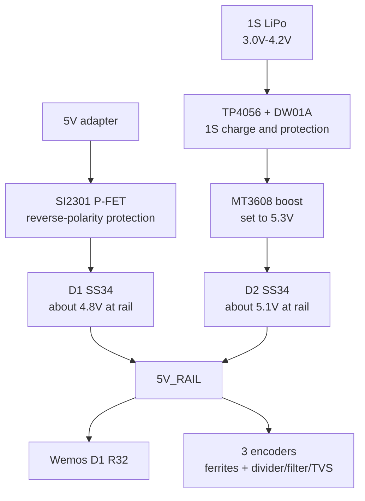

#### Key Specs

| Parameter | Value |
|---|---|
| Input range | 5V DC adapter |
| Battery | 1S LiPo, typically 1500-2000mAh |
| Output rail | About 4.8V from adapter path, about 5.1V from boosted battery path |
| Charging | TP4056 1S CC/CV module with DW01A protection |
| Source selection | Two SS34 Schottky diodes on 5V rail |
| Reverse-polarity protection | SI2301 SOT-23 P-FET |
| Approx BOM items | About 30 line items |

**Best part:** the proven 7-channel encoder signal conditioning. The 10k/20k divider converts 5V encoder TTL outputs to about 3.33V, the 1nF filter suppresses high-frequency noise without destroying quadrature timing, and the TVS/ferrite layout became the reusable baseline.

**Weaknesses**

- The boosted battery path can sit higher than the external adapter path after the Schottky drop, so adapter priority is not guaranteed.
- 1S LiPo has less stored energy than a 3S pack at the same Ah rating and drives higher current into the boost converter.
- SI2301 is SMD and awkward on pertinax or no-soldermask boards.
- 5V adapter input is not aligned with machine/cabinet 12V power.
- No ESP32-S3 path, watchdog, or industrial expansion interfaces.

**Best for:** bench firmware development and historical reference when the current Wemos firmware must run unchanged.

---

### 4.2 Original 12V

The original 12V design moved the system toward machine-compatible power: 12V input, MP1584EN buck, 3S backup battery, and the same Wemos pin map. Its most important lesson is that 12V power conversion is useful, but onboard 3S charging and passive source priority are the hard parts.

#### Power Topology

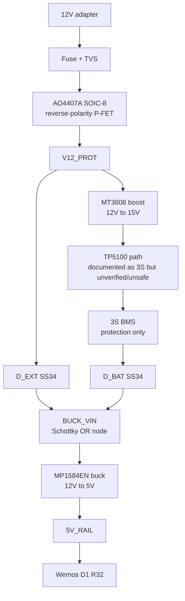

#### Key Specs

| Parameter | Value |
|---|---|
| Input range | 12V nominal; docs classify the design around 9V-16V operation |
| Battery | 3S LiPo, 11.1V nominal, 12.6V full |
| Output rail | MP1584EN buck to about 5.05V, post-filtered |
| Charging | MT3608 to 15V feeding TP5100 path; not accepted here as safe 3S charging |
| Source selection | Passive Schottky OR at buck input |
| Reverse-polarity protection | AO4407A SOIC-8 P-FET |
| Approx BOM items | About 35-38 line items |

**Best part:** the first useful 12V conversion. It introduced the MP1584EN buck, 3S battery voltage range, 12V transient protection, and the idea of feeding the existing Wemos/encoder system from a regulated 5V rail.

**Weaknesses**

- The TP5100 + 3S charger path should be treated as unsafe or unverified; TP5100 is not a reliable 12.6V 3S charger basis.
- A passive Schottky OR picks the higher post-diode voltage. A full 3S pack can exceed a nominal 12V adapter path, so adapter priority is ambiguous.
- BMS protection is not cell balancing and is not a proper charging policy.
- AO4407A and other SMD discretes are inconvenient for hand-built pertinax boards.
- The charging section adds thermal and validation burden without solving balancing.

**Best for:** historical reference and understanding the 5V-to-12V migration. It should not be the default new build.

---

### 4.3 12V All-THT

The 12V All-THT variant keeps the original 12V electrical topology but replaces difficult SMD discretes with through-hole parts for LPKF S63 and hand assembly.

#### Power Topology

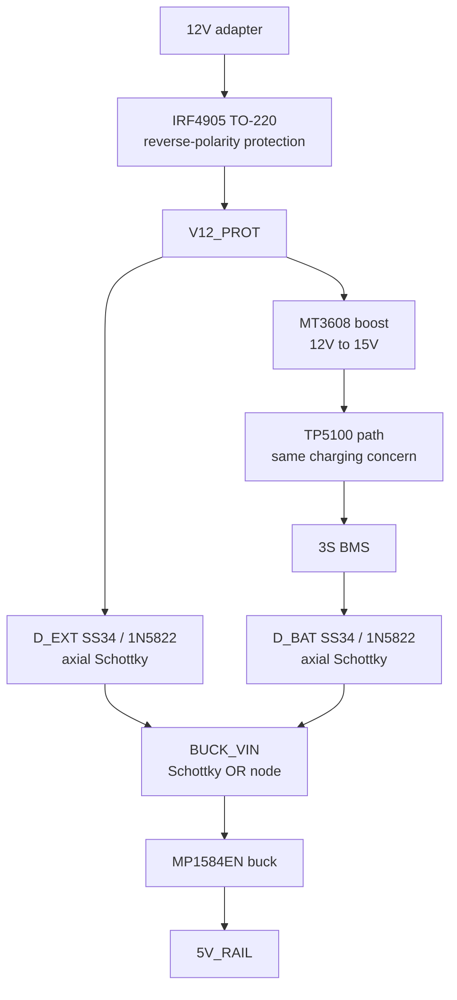

#### Key Specs

| Parameter | Value |
|---|---|
| Input range | Same as original 12V design |
| Battery | 3S LiPo |
| Output rail | MP1584EN buck to 5V rail |
| Charging | Same MT3608 + TP5100 path; not accepted here as safe 3S charging |
| Source selection | Passive Schottky OR at buck input |
| Key package changes | AO4407A to IRF4905, SMBJ18A to P6KE18A, SMA Schottky to axial SS34/1N5822 |
| Approx BOM items | Similar to original 12V, with THT replacements |

**Best part:** it makes the Wemos 12V board genuinely hand-solderable. The IRF4905 TO-220, axial TVS, and axial Schottky diodes are easier to inspect, replace, and mount on milled boards than the original SMD package set.

**Weaknesses**

- It does not fix the TP5100 + 3S charging concern.
- It does not fix the passive Schottky source-priority ambiguity.
- Through-hole parts improve assembly but consume more board area.
- It remains on Wemos D1 R32 rather than the ESP32-S3 long-term platform.
- Multiple modules and preset steps still make bring-up more complex than the final external-charge design.

**Best for:** transitional hand-built Wemos 12V work when current firmware compatibility matters more than moving to ESP32-S3. Do not rely on the documented TP5100 path for unattended 3S charging.

---

### 4.4 V2 Industrial

V2 is the first full ESP32-S3 hardware redesign. It adds active battery isolation, external balance charging, RS-485, I2C expansion, a hardware watchdog, spare GPIOs, status LEDs, and DIN-rail-oriented mechanical planning.

#### Power Topology

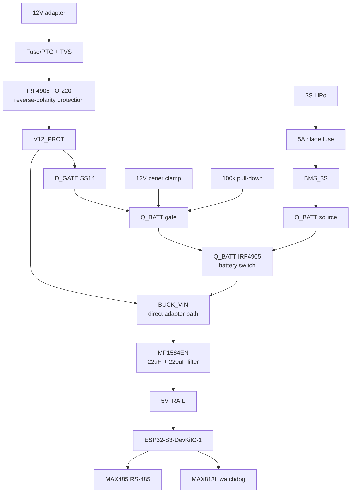

#### Key Specs

| Parameter | Value |
|---|---|
| Input range | 12V DC |
| Battery | 3S LiPo with blade fuse and BMS protection |
| Output rail | MP1584EN buck plus 22uH + 220uF filter |
| Charging | External 3S balance charger only |
| Source selection | Active `Q_BATT`; adapter present turns battery FET off |
| Industrial interfaces | MAX485 RS-485, I2C header, MAX813L watchdog, spare GPIOs |
| Approx BOM items | About 60 line items |

**Best part:** industrial readiness. V2 solves the Schottky-priority problem with active `Q_BATT`, removes onboard LiPo charging, and adds RS-485/Modbus and a hardware watchdog for PLC/SCADA-style deployments.

**Weaknesses**

- It is the most complex board in the comparison.
- RS-485, I2C, watchdog, spare GPIOs, and extra LEDs add validation and routing burden if they are not required.
- Some parts have sourcing risk compared with the simpler core designs.
- It does not include Final Design's documented `D_ADAPT` adapter-isolation correction.
- Firmware has not yet been migrated to ESP32-S3.

**Best for:** builds that truly need RS-485/Modbus, hardware watchdog reset behavior, or industrial expansion on the main board.

---

### 4.5 V3-A Simple

V3-A removes V2's industrial expansion layer and keeps the core sensor: power, ESP32-S3, three encoder interfaces, ADC monitoring, and minimal LEDs.

#### Power Topology

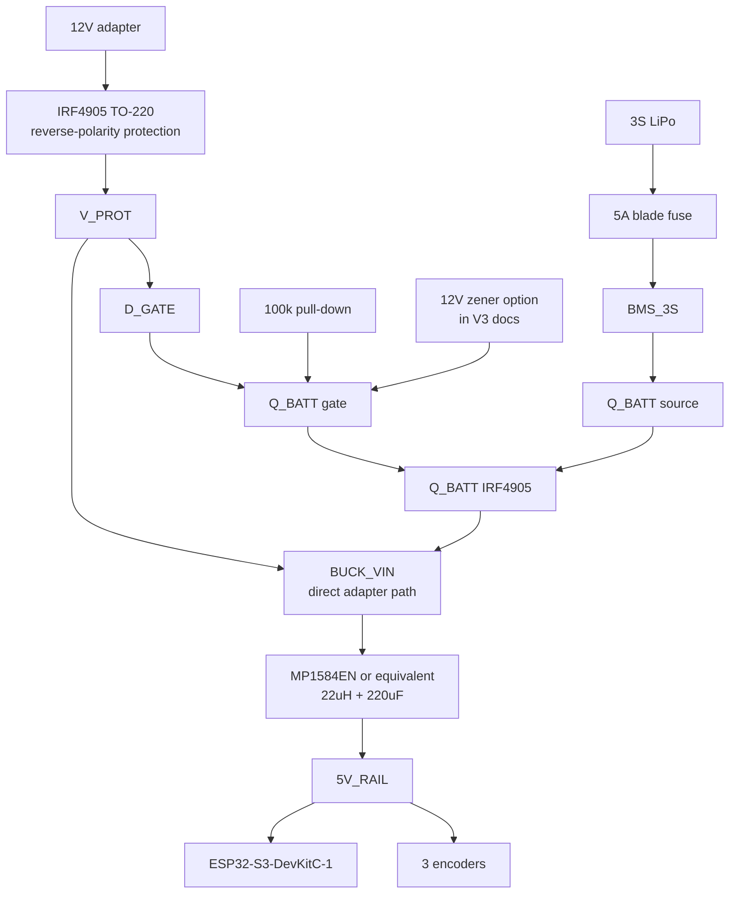

#### Key Specs

| Parameter | Value |
|---|---|
| Input range | 12V for V3-A |
| Battery | 3S LiPo RC pack |
| Output rail | Adjustable buck to 5V rail, filtered |
| Charging | External balance charger only |
| Source selection | Active `Q_BATT` inherited from V2 |
| Removed vs V2 | RS-485, I2C, watchdog, spare GPIOs, most extra LEDs |
| Approx BOM items | About 40 line items |

**Best part:** the cleanest safe 12V core before the Final Design. It keeps active battery isolation and external balance charging while removing expansion hardware that is not needed by the core sensor.

**Weaknesses**

- It lacks the Final Design's `D_ADAPT` diode, so the adapter-sense rail is not as explicitly isolated from battery-powered `BUCK_VIN`.
- The V3 documents still carry optional charging-zone and zener-clamp variants that increase decision ambiguity.
- No RS-485 or watchdog if those become real requirements.
- External charging requires a service procedure and battery access.
- Firmware has not yet been migrated to ESP32-S3.

**Best for:** reference history and understanding the final direction. For a new core board, use Final Design instead.

---

### 4.6 V3-B + CN3722

V3-B keeps the V3 core board but populates an onboard CN3722 charging zone. It changes the adapter requirement to 15V so the charger has headroom above the 12.6V 3S target.

#### Power Topology

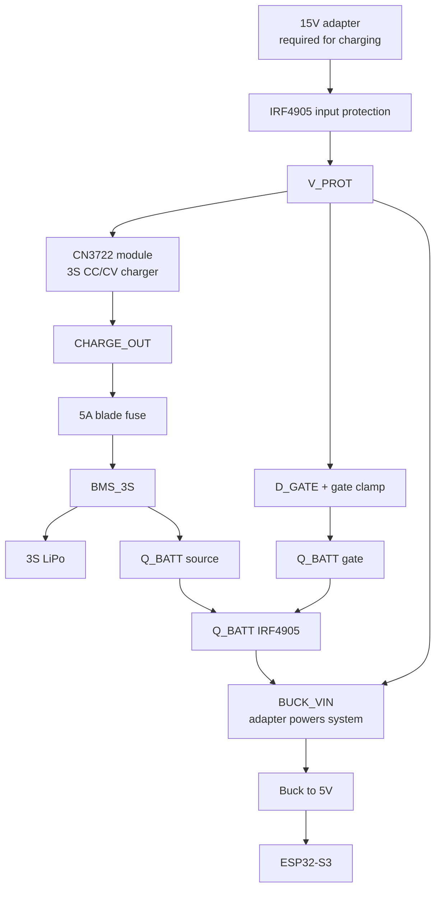

#### Key Specs

| Parameter | Value |
|---|---|
| Input range | 15V adapter required for charging; CN3722 module docs allow about 12V-18V input but 12V cannot fully charge 3S |
| Battery | 3S LiPo |
| Output rail | Same V3 buck architecture |
| Charging | CN3722 3S CC/CV, charge current set by sense resistor |
| Status | CHRG open-drain status pin available |
| Balancing | None onboard; external balance charging/service policy still required |
| Approx BOM items | V3 core plus charger module, sense resistor, charge LED parts |

**Best part:** the credible onboard 3S charger branch. CN3722 is a real multi-cell Li-ion/LiPo charger controller with CC/CV behavior and charge-status signaling, unlike the TP5100 3S path and unlike generic CC/CV buck modules.

**Weaknesses**

- Requires a 15V adapter, not the final 12V-only power standard.
- Does not balance cells onboard.
- Module variants may use different current-sense resistor values or references; every sourced module must be verified.
- Gate-clamp behavior must be evaluated for 15V operation.
- Adds charger thermal, termination, and safety validation burden.

**Best for:** a future product revision where onboard charging is mandatory and a 15V adapter is acceptable. It is not the recommended new core board.

---

### 4.7 V3-C + XL4016

V3-C replaces the CN3722 charging module with a generic XL4016 CC/CV buck module preset to 12.60V and limited current. It is useful for lab fallback, not for unattended LiPo charging.

#### Power Topology

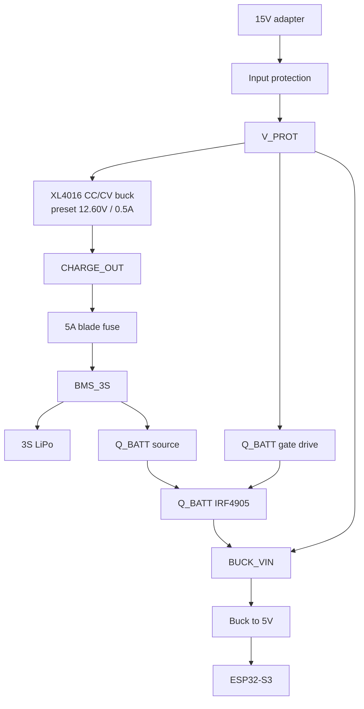

#### Key Specs

| Parameter | Value |
|---|---|
| Input range | 15V adapter for charging branch |
| Battery | 3S LiPo |
| Output rail | Same V3 buck architecture |
| Charging | Generic XL4016 CC/CV module, manually preset |
| Termination | No automatic LiPo charge termination |
| Balancing | None onboard |
| Approx BOM items | V3 core plus large adjustable buck module and indicator parts |

**Best part:** sourcing flexibility. XL4016 CC/CV modules are common, adjustable, and easy to bench-test when a CN3722 module is unavailable.

**Weaknesses**

- XL4016 is a buck regulator, not a smart LiPo charger.
- It can hold the pack at 12.60V indefinitely; this is a float-charge risk for LiPo packs.
- No onboard cell balancing.
- Trimpot drift is a credible failure mode in vibrating machine environments.
- Larger module footprint complicates mechanical layout.

**Best for:** supervised lab fallback only. It should not be used for unattended field charging.

---

### 4.8 V3-D Onboard 3S Charger Module

V3-D is an optional onboard-charging branch for cases where the user must plug the device into one adapter or USB-C charger and leave the battery installed. It keeps the ESP32-S3 sensor core and Final Design-style adapter-priority source selection, but adds a verified 3S Li-ion/LiPo charger module and a documented BMS/protection board.

This branch is not the default recommendation because it reintroduces charger sourcing, thermal, load-sharing, and battery-safety validation. The charger must charge the battery path only; the system load must run from the adapter while charging so charge termination is not confused by ESP32/encoder load current.

#### Power Topology

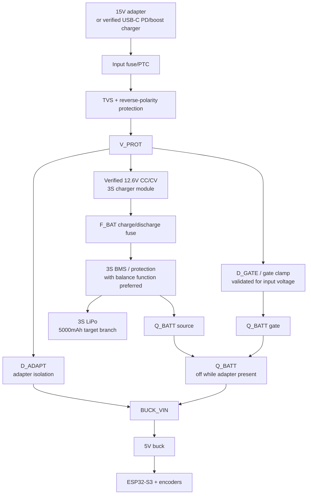

#### Key Specs

| Parameter | Value |
|---|---|
| Input range | 15V adapter for buck-style 12.6V charger modules; USB-C Type-C/PD/boost only if the exact board is verified for 3S output |
| Battery | 3S LiPo, especially 5000mAh-class packs where 2A is a conservative first charge rate |
| Output rail | Same ESP32-S3 5V rail architecture as Final/V3, powered from adapter while charging |
| Charging | Verified 12.6V CC/CV charger module; start around 2A for 5000mAh packs unless the battery requires lower current |
| BMS | 3S BMS/protection board required; 20A-40A balanced BMS is the practical range for low/medium current builds, Daly/JBD-class boards preferred over anonymous generic boards |
| Balancing | BMS passive balancing may help, but keep balance connector/service policy; do not treat BMS as the primary charger |
| Source selection | `Q_BATT` + `D_ADAPT`; charger path must be isolated from system load |
| Approx BOM items | Final/V3 core plus charger module, BMS, charge-status wiring, thermal/test points |

**Best part:** onboard 3S charging with the device still running from the adapter. For a 5000mAh pack, a verified 12.6V/2A charger module plus a 25A or 40A balanced BMS is the practical first prototype. A 12.6V/1A module is the low-heat overnight option, a 12.6V/4A module is the faster but hotter option, and Type-C/IP2369/IP2326-style USB-C boards are useful only after their exact 3S mode, PD/QC negotiation, termination, and thermals are verified.

**Weaknesses**

- Generic charger modules vary widely; charge voltage, termination current, current limit, thermal behavior, and status pins must be measured.
- A BMS is protection and weak balancing at best; it is not a precise charger and not a substitute for a balance-service policy.
- 4A charging may be acceptable for some 5000mAh RC packs, but it needs stronger adapter, fuse, trace-width, connector, enclosure, and thermal validation.
- USB-C Type-C/IP2369/IP2326-style modules are module-specific; verify they really support 3S / 12.6V output, not just 1S/2S or plain 5V input.
- BMS current ratings are load/discharge ratings, not charge-current targets. Pick them from maximum system current and startup peaks, then size the fuse, wiring, and connectors consistently.
- Charger heat and failure modes are now on the EVKA board instead of in an external charger.
- Firmware still needs ESP32-S3 migration before any S3 variant runs.

**Best for:** products where onboard charging is mandatory and a validated charger/BMS module set is acceptable. Use Final Design instead when battery service with an external balance charger is acceptable.

---

### 4.9 Final Design

The Final Design is the selected new-build package. It is based on V3-A but removes optional charger branches, adds `D_ADAPT`, documents the `Q_BATT` OFF-state margin, and commits to one 12V-only external-charge configuration.

#### Power Topology

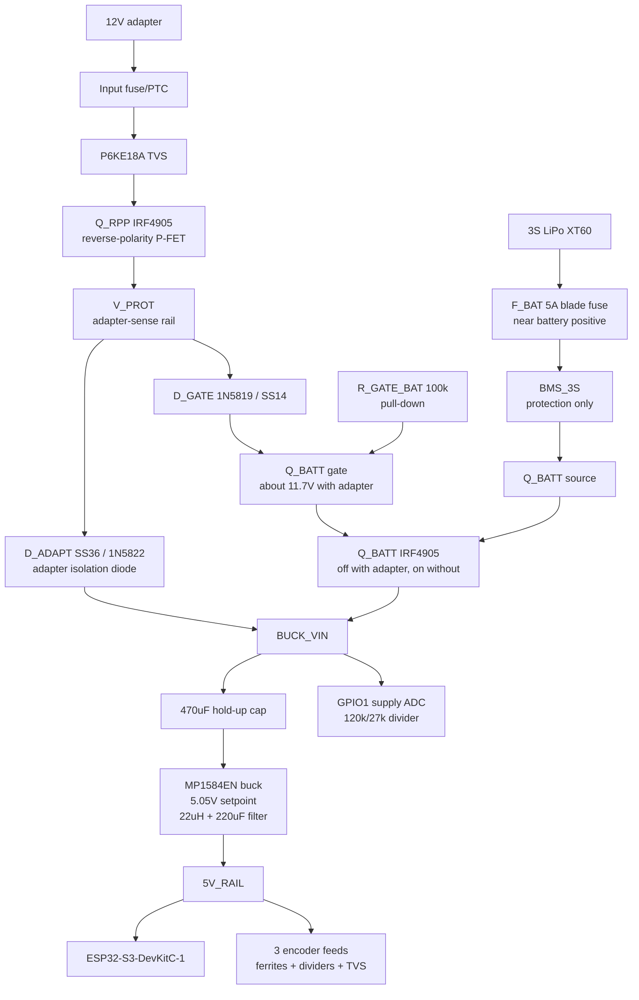

#### Key Specs

| Parameter | Value |
|---|---|
| Input range | 12V regulated adapter or cabinet 12V rail; 9V-16V design class |
| Battery | 3S LiPo RC pack, XT60 plus balance connector |
| Output rail | 5V_RAIL target 4.9V-5.1V after buck and filter |
| Charging | External 3S balance charger only; no onboard charger |
| Source selection | Active `Q_BATT` plus `D_ADAPT` adapter isolation |
| `Q_BATT` OFF-state margin | Worst case full battery: `Vgs = -0.9V`, 1.1V margin to worst-case `Vgs(th) = -2V` |
| ADC monitor | Supply ADC on GPIO 1 from `BUCK_VIN`, 120k/27k divider, scale 5.444 |
| Approx BOM items | About 35 core board line items, no charger branch |

**Best part:** one unambiguous, reviewed build baseline. `D_ADAPT` prevents battery-powered `BUCK_VIN` from backfeeding the adapter-sense/gate-drive rail, the 12V-only `Q_BATT` margin is documented, onboard charging ambiguity is removed, and external balance charging handles termination and balancing outside the carrier board.

**Weaknesses**

- No onboard charging convenience; charging is a service operation with an external 3S balance charger.
- Firmware has not yet been migrated to ESP32-S3.
- The package is reviewed and documented, but not yet physically built and validated in this repository.

**Best for:** new EVKA core sensor hardware builds.

---

## 5. Cross-Design Analysis

### 5a. Source Selection Evolution

Passive Schottky OR-ing is simple but it cannot express policy. The highest post-diode voltage powers the load. That is acceptable for emergency switchover, but it does not guarantee that the adapter wins when a full 3S pack is attached.

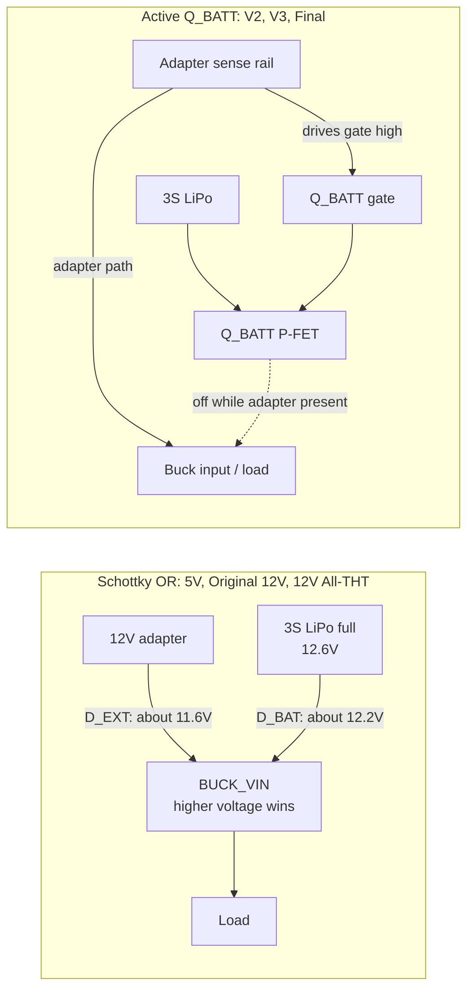

The active `Q_BATT` designs treat adapter priority as logic: adapter present means gate high, battery FET off, battery isolated. The Final Design adds `D_ADAPT` so battery-powered `BUCK_VIN` cannot backfeed the adapter-sense rail when the adapter is absent.

### 5b. Charging Safety Progression

| Design | Onboard charging? | Balancing? | Charger termination | Float-charge risk | Thermal risk |
|---|---|---|---|---|---|
| 5V Legacy | Yes, TP4056 for 1S | Not applicable for 1S | Correct 4.2V CC/CV for one cell | Low | Low |
| Original 12V | Documented TP5100 path | No onboard balancing | Unsafe/unverified for 3S | High | High during charging path |
| 12V All-THT | Same TP5100 path | No onboard balancing | Unsafe/unverified for 3S | High | High during charging path |
| V2 Industrial | No | External balance charger | External charger handles termination | None onboard | None onboard |
| V3-A Simple | No | External balance charger | External charger handles termination | None onboard | None onboard |
| V3-B + CN3722 | Yes | No onboard balancing | CN3722 CC/CV with charge status, module must be verified | Low if module validated | Moderate, needs validation |
| V3-C + XL4016 | Yes, generic CC/CV | No onboard balancing | No automatic LiPo termination | Critical for unattended use | Moderate |
| V3-D Onboard 3S Module | Yes, verified 12.6V CC/CV module | BMS passive balancing plus service policy | Module-specific; must be measured under isolated-load conditions | Low only if termination and load isolation are validated | Moderate to high, depends on charge current |
| **Final Design** | **No** | **External balance charger** | **External charger handles termination** | **None onboard** | **None onboard** |

### 5c. LiPo Charging Methods Compared

LiPo charging is the main safety divider between the designs. A safe charger needs a correct CC/CV profile, a pack-specific final voltage, current taper termination, and a policy for cell balancing. A BMS protects against faults; it is not a charger and should not be treated as the primary charge-control element.

#### 1S Charging

| Method | Input | Pack target | Strength | Weakness | EVKA fit |
|---|---|---:|---|---|---|
| TP4056 1S module with DW01A protection | 5V USB/adapter | 4.20V | Cheap, common, correct CC/CV for one cell, simple status LEDs | Linear heat at higher charge current; only one cell; not a 12V machine-power architecture | Correct for 5V Legacy only |
| External 1S hobby charger | Charger-specific | 4.20V | Better control and safer service workflow than a bare module | Requires battery access and operator procedure | Useful for bench packs, not the project direction |

For a 1S pack, balancing is not a concern because there is only one cell. The main tradeoff is energy density at the system level: a 1S pack needs a boost converter to feed 5V, so battery-side current is high and backup runtime is weaker than an equivalent 3S pack.

#### 2S Charging

| Method | Input | Pack target | Strength | Weakness | EVKA fit |
|---|---|---:|---|---|---|
| TP5100 in 2S mode | Typically 9V-12V adapter with headroom | 8.40V | Correct use of the TP5100 family; simple onboard CC/CV option for 2S | Still no cell balancing unless the pack is externally balanced; lower stored energy than 3S at the same Ah rating | Viable if the architecture is changed to 2S |
| Dedicated 2S balance charger | External charger | 8.40V | Handles termination and balancing off-board | Service operation, no onboard convenience | Safe service option |
| Generic CC/CV buck preset to 8.40V | DC adapter with headroom | 8.40V | Easy to source and test | No automatic LiPo termination; trimpot drift; supervised only | Lab fallback, not unattended field charging |

A 2S pack pairs naturally with TP5100 and avoids the 12V-vs-full-3S Schottky priority problem: a full 2S pack is 8.4V, so a 12V adapter path remains higher after diode drops. The cost is lower energy storage than 3S, and the EVKA final hardware direction is already built around 3S backup and a 12V system rail.

#### 3S Charging

| Method | Input | Pack target | Termination | Balancing | Strength | Weakness | EVKA decision |
|---|---|---:|---|---|---|---|---|
| External 3S balance charger through XT60/JST-XH | Charger-specific, battery disconnected from system as documented | 12.60V | Charger handles it | Yes, through balance lead | Best safety and inspection workflow; no charger heat on PCB; no charger module sourcing risk | Requires service access and operator procedure | **Selected for Final Design** |
| CN3722 or equivalent dedicated 3S charger controller/module | 15V adapter recommended for headroom | 12.60V | Dedicated CC/CV termination/status if module is correct | No onboard balancing unless extra balancer is added | Most credible onboard 3S option studied; useful if onboard charging is mandatory | Module variants must be verified; thermal validation required; 15V input changes gate-clamp analysis | Keep as future V3-B-style option |
| Verified 12.6V 1A charger module plus 3S BMS | 15V adapter unless module is confirmed boost/PD capable | 12.60V | Module-specific CC/CV; must be bench verified | BMS passive balancing only; keep balance service access | Lowest heat, gentle overnight charge for 5000mAh packs | Slow; still needs real termination and load isolation | V3-D conservative option |
| Verified 12.6V 2A charger module plus 3S BMS | 15V adapter unless module is confirmed boost/PD capable | 12.60V | Module-specific CC/CV; must be bench verified | BMS passive balancing only; keep balance service access | Practical low-cost onboard branch for 5000mAh packs | Quality varies; load-sharing and thermal tests mandatory | V3-D first-prototype option |
| 3S Type-C 2A charger module plus 3S BMS | USB-C PD/QC or boost input, exact-module dependent | 12.60V if configured correctly | Module-specific CC/CV; must be bench verified | Requires separate 3S BMS/protection | Clean enclosure connector and no barrel jack | Many boards are not true 3S/2A from plain USB-C; verify negotiated input power | V3-D connector-choice option |
| IP2369 PD 45W charger/power module plus 3S BMS | USB-C PD, exact-module dependent | Must be configured/verified for 3S / 12.60V | Module-specific; advertised 45W may not be continuous enclosed rating | Requires separate 3S BMS/protection unless exact board proves otherwise | Modern USB-C PD direction with more input power headroom | Jumper/settings, chemistry, 3S mode, backfeed, and thermal behavior must be proven | V3-D advanced USB-C option |
| IP2326 USB-C 2S/3S charger module | USB-C PD/QC or boost input, module-specific | 12.60V in 3S mode if configured correctly | Module-specific CC/CV; lower power class than larger PD boards | Requires separate 3S BMS/protection | Compact USB-C onboard charging path | Fragmented module documentation; slow for 3S unless exact board proves otherwise | V3-D exploratory USB-C option |
| 12.6V 4A charger module plus 3S BMS | Strong 15V+ adapter | 12.60V | Module-specific CC/CV; must be bench verified | BMS passive balancing only | Faster charging for packs rated for it | Higher heat, stronger wiring/fuse/adapter requirements | V3-D only after thermal testing |
| XL4016/XL4015/LM2596 CC/CV buck module | 15V adapter recommended | 12.60V preset | No automatic LiPo termination | No onboard balancing | Cheap, adjustable, easy to source | Can float the pack indefinitely; trimpot drift; no charge-done logic | Supervised lab fallback only |
| TP5100 path boosted to 15V and labeled 3S | 12V to boost to 15V | Claimed 12.60V in older docs | Not credible for common TP5100 1S/2S parts | No onboard balancing | Historical attempt at onboard convenience | Treat as unsafe/unverified for 3S; do not build as a 3S charger | Reject for new builds |
| BMS-only or direct adapter charging | 12V/15V adapter | Undefined | None | BMS is protection only | Minimal parts | No controlled CC/CV profile, no normal termination, high safety risk | Reject |
| Full onboard smart charger plus balancing ICs | Usually >15V or dedicated power stage | 12.60V | Possible if designed correctly | Possible if designed correctly | Could support sealed products | Higher complexity, usually SMD-heavy, not documented in this project | Out of scope unless product requirements change |

**Charging recommendation by pack size:**

| Pack | Recommended method | Why |
|---|---|---|
| 1S | TP4056 module or external 1S charger | Correct simple CC/CV, no balancing requirement |
| 2S | TP5100 in 2S mode or external 2S balance charger | TP5100 is appropriate at 8.4V; external charger is safer if balancing is required |
| 3S | External 3S balance charger | Best safety, balancing, and validation profile for the current EVKA hardware |
| 3S with mandatory onboard charging | V3-D verified charger/BMS module branch, or CN3722-specific V3-B branch, plus a balancing/service policy | Acceptable only after module, thermal, termination, and load-sharing validation |

For EVKA, the Final Design intentionally chooses 3S backup with **external balance charging only**. That is less convenient than onboard charging, but it removes the riskiest part of the carrier board and keeps the new-build hardware focused on measurement, power selection, and ESP32-S3 migration.

#### V3-D Charger Module Options

The following options belong to the V3-D onboard-charging branch. They should be selected as module/IC families to validate, not assumed to be interchangeable drop-in parts.

| Option | Best use | Output/configuration | Charge current | Input | Main validation item | Preference |
|---|---|---|---:|---|---|---|
| Verified 3S 12.6V 2A charger module | First V3-D prototype with 5000mAh pack | Real 3S CC/CV to 12.60V | 2A, about 0.4C for 5000mAh | Usually 15V DC adapter | Termination current, thermal rise, adapter headroom, charge-status behavior | Best simple module path |
| 3S Type-C 2A charger module | Clean USB-C enclosure port | 12.60V only if exact board supports/configures 3S | 2A listed | USB-C, often PD/QC required | Negotiated input voltage/current, 3S setting, thermals, backfeed | Best connector-choice path |
| Verified 3S 12.6V 1A charger module | Overnight/low-heat charging | Real 3S CC/CV to 12.60V | 1A, about 0.2C for 5000mAh | Usually 15V DC adapter | Termination and charge time; still validate isolation | Safest slow module path |
| Verified 3S 12.6V 4A charger module | Faster charging when needed | Real 3S CC/CV to 12.60V | 4A, about 0.8C for 5000mAh | Strong 15V+ DC adapter | Heat, adapter rating, fuse/trace/connector current, pack charge-rate approval | Use only if needed |
| IP2369 PD 45W module | Advanced USB-C PD version | Must be configured/verified for 3S / 12.60V | Up to exact module limit | USB-C PD | Board documentation, jumpers, chemistry setting, 3S mode, continuous thermal rating | Advanced branch only |
| IP2326 USB-C 2S/3S module | Compact exploratory USB-C branch | Must be verified for 3S / 12.60V | Module-specific | USB-C PD/QC or boost, module-specific | Fragmented docs, negotiation, boost behavior, thermals | Exploratory only |

#### V3-D BMS Pairing Options

Use a BMS for protection and weak balancing, not as the charger. The current rating is the allowed load/discharge class; it is not the desired charge current. Size the BMS, fuse, wire, connector, and PCB copper as one system.

| BMS option | Best use | EVKA fit | Main caution | Preference |
|---|---|---|---|---|
| 3S 6A BMS with balancing | Very low-power electronics | Only if the board has no motors and no high startup current | Little margin; not suitable for motor or actuator loads | Avoid for general EVKA builds |
| 3S 20A balanced BMS | Low/medium current electronics | Reasonable if measured peak current stays low | Marketplace trip thresholds and balance current vary | Acceptable if tested |
| 3S 25A balanced BMS | Middle option | Good pairing for the 2A charger-module prototype | Verify MOSFET heating and common/separate-port behavior | Good practical option |
| 3S 40A balanced BMS | Higher inrush or motor peak margin | Practical robust pairing if wiring/connectors/fuse are sized for it | Do not install a high-current BMS while leaving weak wiring or connectors | Recommended margin option |
| 3S 60A balanced BMS | High-current motors or future actuator branch | Usually unnecessary for the core sensor board | Larger, hotter, and only useful if the whole power path is rated for it | Use only for high-current design |
| Daly/JBD-class 3S BMS | More traceable protection board | Preferred when space and cost allow | Model-specific documentation still must be checked | Preferred over anonymous boards |

#### V3-D Practical Options

| Option | Stack | Use When | Notes |
|---|---|---|---|
| Option A - safest simple prototype | 3S 12.6V 2A charger module + 3S 25A or 40A balanced BMS + 15V / 3A adapter | You want the cheapest practical onboard 3S charger branch | Best starting point. Use 25A for low/medium electronics; use 40A when startup peaks or future motors justify it and the fuse/wiring/connector set is sized consistently. |
| Option B - cleaner enclosure | 3S Type-C 2A charger module + 3S 25A or 40A balanced BMS + required USB-C PD/QC adapter | USB-C is important for user interface or enclosure design | Verify the board really outputs 12.60V for 3S and negotiates enough input power; do not assume a Type-C connector means PD. |
| Option C - professional custom PCB | TI `BQ24170` charger/power-path circuit + 3S BMS/protection + adapter/load-sharing path | You want a cleaner engineered onboard charger instead of anonymous modules | Best custom-PCB direction for 1-3S with power-path, but it requires SMD layout, thermal design, and charger validation. |

Professional custom-PCB charger ICs are a separate future path. They are better electrically than anonymous modules, but they move the design away from the current through-hole/module LPKF workflow.

| IC | Use case | Strength | Caution |
|---|---|---|---|
| TI `BQ24170` | Integrated 1-3S charger with power-path for a professional onboard design | TI lists it as a 1-3 cell 4A synchronous buck charger with Power Path selector, integrated MOSFETs, termination, thermistor support, and adapter/battery path control | VQFN layout, thermal design, and validation required; no cell balancing by itself |
| TI `BQ24610` | Higher-current custom charger controller | 1-6 cell synchronous buck charge controller with 5V-28V input and high-current external power stage capability | More external components and layout work than BQ24170; still needs protection/balancing policy |
| Analog Devices `LTC4015` | Advanced charger with telemetry | Synchronous buck controller with I2C telemetry, coulomb counter, input/system current monitoring, and PowerPath features | Expensive and complex QFN design; overkill unless telemetry and professional PCB manufacturing are required |

### 5d. Onboard Charging Architectures

Choosing a charger board is only half of the onboard-charging decision. The architecture decides whether the load can disturb the charge algorithm.

| Architecture | Can run while charging? | Complexity | EVKA recommendation |
|---|---:|---:|---|
| Charge-only mode | No | Low | Best first integrated onboard-charging prototype if operation during charging is not required. Use a switch, relay, dock detect, or connector logic so the system load is disconnected while the battery charges. |
| Power-path / load-sharing | Yes | Medium | Best final onboard-charging architecture. Adapter powers the system directly while a separate charger path charges the battery, so ESP32/encoder load current does not confuse charge termination. |
| Parallel battery-load charging | Yes | Low | Avoid. Charger, battery, and system load share one node, so load current can look like battery taper current and extend or corrupt termination behavior. |
| Docking-style onboard charging | Optional | Medium | Good for a polished robot/device enclosure. Add dock detect, stop motors/high-current loads, then enable the charger. |
| Smart MCU-supervised charging | Optional | Medium-high | Useful safety layer for adapter present, battery voltage, temperature, BMS status, fan/LEDs, and shutdown. It does not replace the charger or BMS. |
| Removable battery / external balance charging | No | Very low | Safest development and current Final Design workflow. Remove or isolate the pack and use an external 3S balance charger. |

V3-D should start with **charge-only mode** if onboard charging is being prototyped for the first time. If the device must operate while plugged in, move to **power-path/load-sharing** and keep the system load separated from the battery charging path. Do not use parallel load charging as the production topology.

### 5e. Buildability And Power Cost

The following are rough planning estimates for power/charging parts only: input protection, reverse-polarity protection, source selection, buck, battery interface, and charger if present. They are not total BOM prices and should not be treated as purchasing quotes.

| Design | SMD required | THT-only? | Module count | Power BOM line items | Approx power section cost (₺) |
|---|---|---|---:|---:|---:|
| 5V Legacy | Yes, SI2301 unless adapted | No | 2 | About 12 | 80-120 |
| Original 12V | Yes, AO4407A and SMD discretes | No | 4 | About 18 | 150-200 |
| 12V All-THT | No SMD discretes | Yes | 4 | About 18 | 150-200 |
| V2 Industrial | No SMD discretes by default | Yes | 2-3 | About 16 plus expansion power support | 250-350 |
| V3-A Simple | No SMD discretes by default | Yes | 1-2 | About 13 | 180-250 |
| V3-B + CN3722 | No SMD discretes by default | Yes | 2-3 | About 16 | 220-300 |
| V3-C + XL4016 | No SMD discretes by default | Yes | 2-3 | About 15 | 200-280 |
| V3-D Onboard 3S Module | No SMD discretes if module-based | Yes for carrier, charger/BMS are modules | 3-4 | About 18-22 | 260-450 |
| **Final Design** | **No SMD discretes by default** | **Yes** | **1-2** | **About 14** | **180-250** |

### 5f. Firmware Readiness

The active firmware still targets Wemos D1 R32 through PlatformIO environment `wemos_d1_r32`. ESP32-S3 hardware packages are ahead of firmware and require migration before they run.

| Design group | Current firmware fit | Required work |
|---|---|---|
| 5V Legacy | Direct fit | None for baseline operation |
| Original 12V / 12V All-THT | Same Wemos pin map | Battery/supply ADC constants must be intentionally enabled/configured if used |
| V2 / V3 / V3-D / Final | Not yet migrated | Add ESP32-S3 PlatformIO environment, remap GPIOs, prefer PCNT-based encoder counting, retest all firmware features |

| Signal | Current Wemos D1 R32 | Final Design ESP32-S3 |
|---|---:|---:|
| Theta A | GPIO 14 | GPIO 4 |
| Theta B | GPIO 12 | GPIO 5 |
| Phi A | GPIO 32 | GPIO 6 |
| Phi B | GPIO 35 | GPIO 7 |
| Wire A | GPIO 16 | GPIO 15 |
| Wire B | GPIO 17 | GPIO 16 |
| Wire Z | GPIO 18 | GPIO 17 |
| Supply ADC | GPIO 36 on Wemos-era docs | GPIO 1, ADC1_CH0 |
| ADC divider | 100k/100k for older battery monitor path | 120k/27k from `BUCK_VIN`, scale 5.444 |

---

## 6. Decision Flowchart

```mermaid
flowchart TD
    S["Need to build hardware?"] --> Q1{"Need RS-485/Modbus<br/>or hardware watchdog?"}
    Q1 -->|"Yes"| V2["V2 Industrial<br/>Use only if expansion is real"]
    Q1 -->|"No"| Q2{"Need onboard charging?"}
    Q2 -->|"Yes, simple module / USB-C branch"| V3D["V3-D Onboard 3S Module<br/>verified charger + BMS<br/>load isolated from charger"]
    Q2 -->|"Yes, CN3722-specific branch"| V3B["V3-B + CN3722<br/>15V adapter, verify module, still no balancing"]
    Q2 -->|"Yes, supervised lab only"| V3C["V3-C + XL4016<br/>manual monitoring only"]
    Q2 -->|"No"| FINAL["Final Design<br/>12V only - Q_BATT + D_ADAPT<br/>external balance charging"]
    S --> Q4{"Rebuilding historical<br/>Wemos hardware?"}
    Q4 -->|"Bench/reference"| LEG["5V Legacy"]
    Q4 -->|"12V prototype"| THT["12V All-THT<br/>do not rely on TP5100 3S charging"]
```

---

## 7. Recommendation

For new EVKA core sensor hardware, build **Final Design** unless onboard charging is a hard product requirement. It is the only package that combines the ESP32-S3 direction, the simplified V3-A scope, active `Q_BATT` adapter priority, `D_ADAPT` backfeed prevention, mandatory external balance charging, and a single 12V-only configuration with no charger-variant ambiguity.

The Final Design is not yet a running firmware target. The hardware documentation is ahead of the active PlatformIO project, so the board still needs an ESP32-S3 firmware port and real bring-up validation.

| Area | Done | Remaining before operational use |
|---|---|---|
| Hardware decision | Final 12V-only external-charge package selected | Build the first board and run the validation checklist |
| Power path | `Q_BATT`, `D_ADAPT`, fuse, TVS, buck, ADC divider documented | Verify rails, switchover, leakage, and thermal behavior on real hardware |
| Charging policy | Onboard charging removed; external 3S balance charging required | Document enclosure/service access for the chosen battery pack |
| Onboard-charging branch | V3-D documented as optional charger-module/BMS path | Select exact charger module/BMS, choose charge-only or power-path architecture, validate load isolation, termination, cell balance, thermals, and adapter sizing |
| Firmware platform | Pin assignment header exists in final design docs | Add ESP32-S3 PlatformIO environment |
| Encoder pins | Final GPIO map documented | Update `SphericalSensor.h` and related tests/tools |
| Encoder library | PCNT-based ESP32-S3 direction documented | Prefer or migrate to `ESP32Encoder`, then validate counts on hardware |
| Application features | Existing Wemos firmware has WiFi, TCP, dashboard, calibration, and encoder logic | Retest those features on ESP32-S3 hardware before machine use |

If onboard charging is mandatory, use **V3-D** as the comparison branch to develop: start with Option A, a verified 12.6V/2A charger module for a 5000mAh pack plus a 25A or 40A balanced 3S BMS and 15V / 3A adapter. Use Option B only when USB-C is an enclosure requirement and the exact Type-C/PD module proves real 3S / 12.60V behavior. Use Option C, `BQ24170` with load-sharing, for a professional custom PCB. Keep `Q_BATT + D_ADAPT` load isolation and retain balance-service access. Use **V3-B** only when the design is specifically based on CN3722. Treat **V3-C**, generic CC/CV buck modules, parallel load charging, and BMS-only charging as supervised lab fallback or rejected paths, not production hardware.

Use **5V Legacy** or **12V All-THT** only when intentionally rebuilding historical Wemos-era hardware. Treat the 12V TP5100 + 3S charging path as unsafe/unverified and do not use it as the new-build direction.
