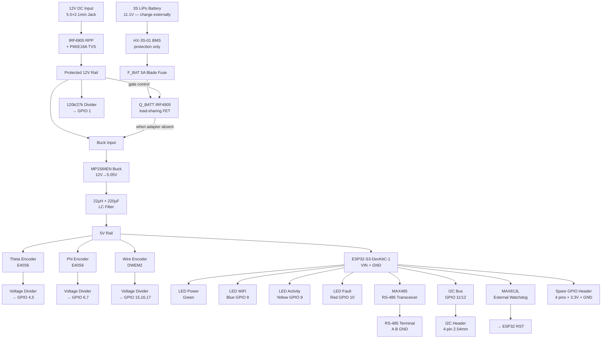

# EVKA Position V2 — Hardware Design

> Complete hardware redesign for the EVKA spherical positioning sensor system.  
> **LPKF S63 compatible** — 100% through-hole, double-sided milled PCB.  
> **MCU:** ESP32-S3-DevKitC-1 on female headers.  
> **Power:** 12V DC input, 3S LiPo backup (no onboard charging), active MOSFET priority, MP1584EN buck.  
> **Interfaces:** RS-485/Modbus RTU, I2C expansion, 4 spare GPIOs.  
> **Industrial features:** External watchdog, 4 status LEDs, DIN rail mounting.

---

## What's New in V2

| Aspect | V1 (5V/12V legacy) | V2 (this design) |
|---|---|---|
| **MCU** | ESP32 Wemos D1 R32 | **ESP32-S3-DevKitC-1** (native USB-C, better security) |
| **Power input** | 5V or 12V | **12V DC only** (simpler, cleaner) |
| **Charging** | TP5100 + MT3608 boost | **No onboard charging** — RC LiPo charged externally via balance charger (iMax B3 / SkyRC E3S). Eliminates termination trap + fire hazard of onboard RC LiPo charging. |
| **Source selection** | Diode OR-ing | **Active IRF4905 P-MOSFET load-sharing** — adapter always has unconditional priority; battery isolated when adapter present |
| **Buck** | MP1584EN 12V→5V | **MP1584EN** (confirmed in stock Turkey, direnc.net 26.46₺; MP2315 not stocked) |
| **Reverse polarity** | SI2301 SOT-23 / AO4407A SOIC-8 | **IRF4905 TO-220** (THT, easy to solder) |
| **RS-485** | None | **Onboard MAX485** (Modbus RTU ready) |
| **Watchdog** | Software only | **MAX813L external** (hardware reset on hang) |
| **RTC** | None | **DS3231 header** (timestamped logging) |
| **ADC monitoring** | ESP32 internal only | **ADS1115 header** (16-bit, 4-channel monitoring) |
| **Status LEDs** | 2 (power, battery) | **4** (power, WiFi, activity, fault) |
| **Spare GPIOs** | None | **4 pins** on 2.54mm header |
| **Form factor** | 120×80mm standalone | **120×80mm with DIN rail holes** |

---

## Folder Structure

```
docs/hardware_design/12v_legacy/v2/
├── README.md                         # This file
├── circuit_schematic_v2.md           # Full system schematic with ASCII diagrams
├── bill_of_materials_v2.md           # Complete BOM with Turkish sourcing
├── pcb_layout_guide_v2.md            # LPKF S63 specific layout rules
├── pin_assignment_v2.md              # GPIO map and migration notes
├── remote_pendant_v2.md              # Upgraded 5-button remote spec
├── subsystems/
│   ├── power_supply_v2.md            # 12V input, charger, buck, battery
│   ├── mcu_subsystem_v2.md           # ESP32-S3-DevKitC-1, pin map, USB
│   ├── encoder_interface_v2.md       # 3× encoder conditioning, dividers, TVS
│   └── expansion_interfaces_v2.md    # RS-485, I2C, spare GPIO, watchdog
└── firmware/
    └── pin_assignment_v2.h           # Copy-paste header for PlatformIO
```

---

## System Block Diagram



---

## Pin Map Summary

| GPIO | Function | Direction | Notes |
|------|----------|-----------|-------|
| 1 | Battery ADC | Input | ADC1_CH0, safe with WiFi |
| 2 | LED Power / Status | Output | Boot default, onboard LED |
| 4 | Theta A | Input | Quadrature channel A |
| 5 | Theta B | Input | Quadrature channel B |
| 6 | Phi A | Input | Quadrature channel A |
| 7 | Phi B | Input | Quadrature channel B |
| 8 | LED WiFi | Output | Blue |
| 9 | LED Activity | Output | Yellow |
| 10 | LED Fault | Output | Red |
| 11 | I2C SDA | Bidir | 4.7kΩ pull-up |
| 12 | I2C SCL | Bidir (open-drain) | 4.7kΩ pull-up |
| 13 | RS-485 TX | Output | UART via GPIO matrix |
| 14 | RS-485 RX | Input | UART via GPIO matrix |
| 15 | Wire A | Input | Quadrature channel A |
| 16 | Wire B | Input | Quadrature channel B |
| 17 | Wire Z | Input | Index pulse |
| 18 | RS-485 DE/RE | Output | Direction control |
| 21 | Spare GPIO 1 | Bidir | Header |
| 38 | Spare GPIO 2 | Input | Header (input-only) |
| 39 | Spare GPIO 3 | Input | Header (input-only) |
| 40 | Spare GPIO 4 | Input | Header (input-only) |

---

## PCB Specification

| Parameter | Value |
|-----------|-------|
| Dimensions | **120mm × 80mm** |
| Layers | **2** (double-sided copper) |
| Material | FR4 or pertinax |
| Manufacturing | **LPKF S63** mechanical milling |
| Vias | Wire-through-hole, soldered both sides |
| Soldermask | **None** (milled PCB) |
| Silkscreen | **None** — use paper placement template |
| Component type | **100% through-hole** + plug-in modules |
| Mounting | 4× M3 holes for DIN rail clip |

---

## Sourcing Strategy (Turkey)

| Category | Primary Source | Notes |
|----------|---------------|-------|
| **Dev boards, modules** | Direnc.net, Robolinkmarket | ESP32-S3-DevKitC-1-N8R2 (564.60₺), MP1584EN (26.46₺) |
| **Passives, discretes** | Direnc.net, Komponentci | Resistors, caps, diodes, LEDs |
| **Connectors, terminals** | SAMM Market, AliExpress | KF301, pin headers, DC jack |
| **ICs (DIP)** | Direnc.net, Moser Elektronik | MAX485, MAX813L, IRF4905 |
| **Battery, BMS** | AliExpress / local RC shops, robolinkmarket.com | 3S LiPo, HX-3S-01 BMS (52.20₺ robolinkmarket) |
| **Fallback** | LCSC.com (ships to Turkey) | Any hard-to-find parts |

---

## Migration from V1

### Firmware changes required
1. Update `platformio.ini` to use `board = esp32-s3-devkitc-1`
2. Replace all GPIO references in `SphericalSensor.h` using new map
3. **Replace `PaulStoffregen/Encoder` with `madhephaestus/ESP32Encoder`** — uses ESP32-S3 PCNT hardware, zero CPU overhead for quadrature counting. See `docs/hardware_design/12v_legacy/v2/subsystems/encoder_interface_v2.md` section 9a.
4. Add `Wire.h` for I2C (RTC, ADS1115)
5. Add `ModbusRTU` library for RS-485
6. Add `RTClib` for DS3231 timestamping

### Hardware changes
- **Cannot reuse V1 PCB** — pin map incompatible with S3
- **Can reuse:** Encoders, cables, 3S battery, BMS
- **Must replace:** MCU dev board, charger module, power section

---

## Related Documents

- Simple V3 design: [`../v3/`](../v3/) — ESP32-S3 core-only board with internal 3S backup and generic ready-made power-path module interface
- Legacy 12V design: [`../12v/`](../12v/)
- Legacy 5V design: [`../5v/`](../../5v/)
- System architecture: [`../system_architecture.md`](../../system_architecture.md)
- Calibration procedures: [`../../calibration/`](../../../calibration/)

---

## Document Index

| Document | Purpose |
|----------|---------|
| [`circuit_schematic_v2.md`](circuit_schematic_v2.md) | Complete ASCII schematic — every net, every connection |
| [`bill_of_materials_v2.md`](bill_of_materials_v2.md) | Full BOM with example MPNs, Turkish sources, pricing |
| [`pcb_layout_guide_v2.md`](pcb_layout_guide_v2.md) | LPKF S63 layout zones, trace widths, assembly sequence |
| [`pin_assignment_v2.md`](pin_assignment_v2.md) | GPIO map, strapping pin warnings, migration guide |
| [`remote_pendant_v2.md`](remote_pendant_v2.md) | 5-button ESP32-C3 remote, ESP-NOW protocol |
| [`subsystems/power_supply_v2.md`](subsystems/power_supply_v2.md) | Power entry, protection, charger, buck, battery |
| [`subsystems/mcu_subsystem_v2.md`](subsystems/mcu_subsystem_v2.md) | ESP32-S3 pinout, DevKitC-1 headers, USB |
| [`subsystems/encoder_interface_v2.md`](subsystems/encoder_interface_v2.md) | Divider networks, TVS, ferrites, connector pinouts |
| [`subsystems/expansion_interfaces_v2.md`](subsystems/expansion_interfaces_v2.md) | RS-485, I2C, watchdog, spare GPIO |
| [`firmware/pin_assignment_v2.h`](firmware/pin_assignment_v2.h) | Ready-to-use C header for firmware |
