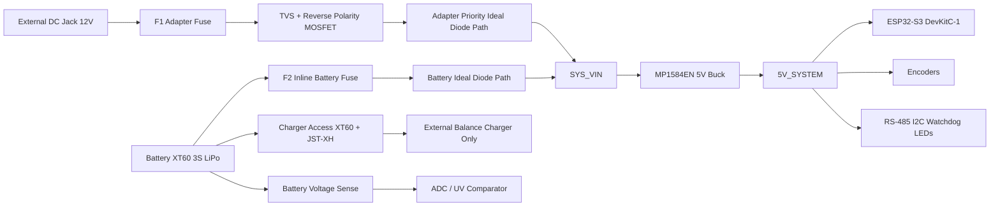

# Power Subsystem Technical Review and Redesign Study

## Executive summary

Your present concept contains several individually reasonable building blocks, but the **overall power architecture is not yet safe or coherent enough for a 3S high-discharge RC LiPo system**. The biggest problem is not any single part; it is the interaction between them. In particular, a **12 V adapter and a 12.6 V full 3S LiPo cannot be cleanly prioritized with simple Schottky OR-ing**, so the battery can continue to power the system even when external power is connected. That defeats the intended “adapter-priority” behavior and becomes especially problematic if you also try to charge the pack while the load is running. A second major issue is that **BQ24650 does not perform cell balancing**, and low-cost “BQ24650 modules” sold online are generic, weakly documented boards aimed at solar/MPPT-style use rather than a robust, serviceable product architecture. citeturn15search1turn20search0turn30search6turn20search1turn20search11

For a **safe, repairable, cost-effective prototype in Turkey**, my primary recommendation is:

**Use external DC power for normal operation, use the RC LiPo only as a backup/discharge source, and charge the LiPo only with an external balance charger through its main lead and JST-XH balance lead. Do not implement onboard charging on this PCB.**

That means: keep an adapter input, keep a battery input, redesign the source-selection stage so the adapter truly has priority, keep a single 5 V buck stage, remove the post-buck LC filter unless it is re-designed properly, and do **not** rely on a generic 3S BMS board as your primary charging/balancing solution. This is the most robust match to your stated constraints: LPKF prototyping, through-hole/module-friendly construction, local sourcing, repairability, and safety first. citeturn21search4turn21search0turn31search8turn31search17turn10search0turn10search4

If onboard charging is mandatory, my fallback recommendation is **not** “keep the same RC LiPo and add a cheap 12.6 V charger board.” The realistic fallback is to **change the battery strategy**: either use a **protected 3S Li-ion pack with integrated protection/BMS**, or build a fully integrated charger/power-path design around a proper multi-cell charger with system power-path management such as the entity["organization","Texas Instruments","semiconductor company"] BQ24618 or notebook-class NVDC parts. That route is electrically sound, but it is **much less suitable** for an LPKF-style prototype and significantly more complex than your current board. citeturn8search0turn8search1turn8search4turn6search1turn6search3turn6search11

## Current design review

Your uploaded design documents show a classic mixed-source architecture: external barrel input, protection parts, diode OR-ing, a 5 V buck, and an onboard multi-cell charging idea. The component choices are not random, but several of them are being used in ways that are **electrically acceptable in isolation** yet **suboptimal or misleading in the full system**.

**Input protection path.** A TVS plus reverse-polarity MOSFET is good practice. A resettable PTC may also be useful on a modest adapter input. The part you referenced, MF-R110, is a **1.1 A hold / 2.2 A trip class PPTC**, which is plausible for a small electronics load but **not** for a design that also expects battery charging current on the same path. Even without charging, PPTCs are not a substitute for a properly chosen fuse on a high-energy battery branch because they trip slowly and their resistance rises with temperature rather than opening cleanly. citeturn5search1turn5search3turn5search4

**NTC + PTC together.** This is not automatically wrong, but it is usually unnecessary in a low-to-moderate power embedded board unless you have a very large input bulk capacitor or a problematic adapter. Power NTC thermistors are intended for surge limiting at initial energization, but once hot they lose most of that resistance, so they are not “fuses,” and repeated hot restarts do not get the same inrush limiting. In this project, the NTC adds complexity and uncertainty without solving a dominant problem. I would **remove the NTC unless bench testing shows a real inrush issue**. citeturn29search0turn5search1

**P6KE18A / P6KE20A selection.** For a 12 V adapter and a 3S LiPo that reaches 12.6 V, **P6KE18A is the better fit of those two choices**. P6KE18A has a **15.3 V reverse standoff** and starts breaking down around **17.1–18.9 V**; P6KE20A moves those thresholds higher, so it protects less aggressively. For a strictly 12 V system, P6KE18A is reasonable. If you later add a **15 V USB-C PD input**, then P6KE18A becomes too close to nominal and you should re-select the TVS. For compact SMD assembly, an SMBJ18A-class part is locally available and makes more sense than a large DO-15 TVS on a new compact PCB. citeturn26search2turn32search5turn32search0turn32search8

**IRF4905 as reverse-polarity MOSFET.** Electrically, it is acceptable. IRF4905 is a low-RDS(on), -55 V P-channel MOSFET in TO-220, so for a through-hole prototype it is easy to source and forgiving thermally. The downside is not basic suitability; the downside is that it is **physically large and old-fashioned for this job**, and the common implementation needs proper gate biasing and ideally a **gate-source clamp** if you want robust transient tolerance. I would rate it as **usable for the prototype, but not elegant**. citeturn3search2turn26search1turn26search8

**Schottky OR-ing with SS34 / 1N5822.** As diodes, these parts are fine. As the main source-selection strategy for your system, they are **not fine**. SS34-class parts are around **0.5 V forward drop at 3 A**, and 1N5822 is also in the same general Schottky-drop class. That means you lose headroom, waste power, and heat the diode. More importantly, the higher source wins. A full 3S LiPo at 12.6 V will often beat a nominal 12 V adapter through simple diode OR-ing, so your “external input priority” disappears precisely when the battery is most charged. That is a system-level design error, not a diode-quality problem. Use **ideal-diode MOSFET OR-ing or a true power-path/priority controller** instead. citeturn4search11turn3search3turn15search1turn15search9

**Buck converter choice: MP1584EN.** For a practical prototype, the MP1584EN module is acceptable. The device family supports **4.5 V to 28 V input**, **up to 3 A**, and **1.5 MHz** switching, which is a reasonable fit for 12 V / 3S battery down to 5 V. It is much more compact than LM2596 modules and generally a better fit for an embedded sensor board. The real caveat is module quality: hobby-market modules vary, so you must validate thermal rise, output ripple, startup, and load transient behavior on the actual board. For a production-grade design I would want a more controlled power stage, but for your constraints, MP1584EN is still a reasonable prototype choice. citeturn0search1turn11search0turn11search11

**LC filter after the buck.** I recommend removing it unless you redesign it intentionally. TI’s guidance is explicit that adding a second-stage output filter can introduce **stability problems**, not just extra attenuation, and their application material treats output post-filters as something that must be designed with loop interaction in mind. A casual “buck → 22 µH → big cap” arrangement is often worse than a clean buck output with proper local decoupling. For this board, use the buck’s intended output network, keep bulk capacitance near the load entry point, and use a ferrite bead branch only if you need to isolate particularly noisy peripherals from the MCU rail. citeturn21search4turn21search0turn21search8turn21search16

**5 V rail adequacy for the ESP32-S3 and encoders.** Your 5 V rail must not sag into “USB-but-barely” territory after unnecessary diode drops. The Autonics E40S6 family you referenced supports **5 VDC ±5%** and can draw **up to 80 mA** unloaded for some versions. RC-style draw-wire encoders and interface electronics add more load and more switching noise. That means a “5 V rail” that becomes 4.6–4.7 V after a Schottky isolation diode is bad design margin. Set the regulated rail near **5.1 V**, avoid gratuitous series drop, and isolate USB back-feed by design rather than stealing 300–500 mV with a Schottky in the main rail. citeturn23search0turn23search5turn23search6turn24search3

**Fuse rating and current path realism.** For the electronics load alone, the board probably does **not** need multi-amp copper everywhere. IPC-style calculators show that on 1 oz external copper, 1 mm trace widths already carry around 1 A with comfortable margin depending on temperature rise assumptions, and 1.5 mm is even more comfortable. The real issue is not trace math; it is the **energy available from the 65C pack**. A 5000 mAh 65C pack is, in theory, a hundreds-of-amps-class source, while your PCB and connectors are not. Therefore the **battery branch needs a real fuse close to the battery**, sized to your system load, not sized to the battery’s theoretical capability. Your adapter and battery branches should be fused separately. citeturn22search1turn22search11turn31search20

**Main risks found.** The three highest-risk items in the current architecture are:  
1. **Schottky OR-ing does not guarantee adapter priority.**  
2. **BQ24650 + generic 3S BMS does not equal safe balanced RC-LiPo charging.**  
3. **The post-buck LC filter creates more risk than value in a prototype system.**  
These three issues are enough, by themselves, to justify a redesign. citeturn15search1turn20search0turn30search6turn11search10turn21search4

## Architecture comparison

The visual ecosystem you are working in is this: a raw multi-cell RC pack with a high-current discharge connector and a separate balance connector, plus purpose-built balance chargers rather than phone-style battery boards.

image_group{"layout":"carousel","aspect_ratio":"16:9","query":["3S RC LiPo battery XT60 JST-XH balance connector","SkyRC E3 LiPo balance charger","iMAX B6 balance charger","XT60 panel mount connector"]}

| Option | Safety | Cost | Turkey availability | PCB integration | Charging correctness | Balancing support | Operates while plugged in | Suitability for 3S 5000 mAh 65C RC LiPo | Recommended use |
|---|---|---:|---|---|---|---|---|---|---|
| A — External balance charger only | Very high | Low | Good | Very easy | Excellent | Excellent | Not inherently | Excellent | Best charging method for raw RC LiPo |
| B — Adapter powers system, battery is backup only, no onboard charging | Very high | Low | Good | Easy | N/A onboard | External only | Excellent with proper power-path | Excellent | **Best overall prototype architecture** |
| C — Simple 12.6 V CC/CV charger module + BMS | Low to medium | Very low | Good | Easy | Poor for RC LiPo | Weak / uncertain | Poor | Poor | Only as a risky shortcut, not recommended |
| D — Proper onboard charger IC + proper power path | High if done well | Medium to high | Mixed | Hard | Good | Still needs separate balancing strategy unless integrated pack solution is used | Good to excellent | Fair to good | Only if onboard charging is mandatory and you accept complexity |
| E — USB-C PD input | Medium | Low to medium | Good | Easy to medium | Depends on charger architecture | Depends | Good as an input source | Good as an input option, not a charging strategy by itself | Useful secondary input option |
| F — Protected 3S Li-ion pack with integrated protection/BMS | High | Medium | Moderate | Medium | Better than raw RC pack | Better at pack level | Good with proper system design | Only if you are willing to change battery type | Better for productized systems than for raw RC packs |

Why this table comes out this way is straightforward. Raw RC LiPo packs are designed around balance-charger workflows and commonly expose a JST-XH balance connector; balance chargers such as SkyRC models are explicitly built for balancing 2S/3S lithium packs during charge. By contrast, the BQ24650 is a solar-oriented multi-cell buck charger with no cell balancing of its own, and cheap marketplace boards around it are generic imports with little design transparency. True “charge and run” behavior belongs to NVDC / system-power-path charger families, not to simple 12.6 V CC/CV modules. citeturn31search8turn31search17turn17search12turn20search0turn30search6turn20search1turn20search11turn6search3turn6search9turn6search11

## Recommended architecture

My **primary recommendation** is:

**External 12 V adapter for normal use + battery backup on the PCB + external RC balance charging only.**

In practice, that is **Option B for the system** and **Option A for charging procedure**.

This choice gives you the behavior you actually want: external power operation, battery operation, safe transition between them, reasonable local sourcing, understandable wiring, simpler PCB layout, and much less risk of turning the board into a battery charger development project. It also respects the fact that your battery is **not** a small protected consumer pack; it is a **high-discharge RC LiPo**, and the safest charging method for that class of pack remains a proper balance charger using the main lead plus the balance lead. citeturn31search20turn31search8turn31search17turn10search0turn10search4

The essential redesign points are these:

**Use a true source-priority stage, not Schottky OR-ing.** The clean low-complexity way is a pair of MOSFET ideal-diode paths or an ideal-diode controller such as the LTC4412 driving a P-channel MOSFET. ADI describes this class of controller as a low-loss replacement for OR-ing diodes, with automatic switching between sources and much lower drop than Schottkys. If you want a simpler through-hole prototype, you can also build the priority function with discrete P-MOSFET ideal-diode arrangements, but you must design the priority intentionally. citeturn15search1turn15search3turn15search9

**Keep one buck stage to 5 V and remove the post-buck LC.** The MP1584EN module remains the best compact low-cost module choice among the parts you mentioned. LM2596 is more available but larger and slower; XL4015 offers more current but is larger than you need unless you expand the 5 V load significantly. For the current board, the likely continuous 5 V demand is still well inside the MP1584EN class if the module is genuine and thermally validated. citeturn11search0turn11search1turn11search2turn11search6

**Do not put onboard charging in the first prototype.** This is the decisive recommendation. The BQ24650 itself is not the expensive part; the expensive part in Turkey is often the evaluation board, which one local listing shows around **8,007 TL**, while TI’s own page shows **$99** for the EVM. The IC itself is not absurdly expensive, but integrating it properly is a nontrivial power design, and it still does not solve balancing by itself. citeturn20search10turn20search12turn20search4

**Battery handling procedure should be explicit.** Either remove the pack for charging, or provide an accessible service hatch/pigtail so the user connects an external balance charger directly to the pack’s XT60-class main lead and JST-XH balance lead. The charger should **not** be connected through the board’s main DC input. citeturn31search8turn31search17turn17search12

**Alternative if onboard charging is mandatory.** If management insists on “plug it in and it charges,” then do not keep the same architecture and just bolt on a cheap 12.6 V board. The least bad serious route is either:  
- switch to a protected 3S Li-ion pack architecture, or  
- design around a charger family with real system-power-path behavior, such as BQ24618 or notebook-style NVDC parts.  
BQ24618 is specifically described by TI as a **1–6 cell Li-ion/Li-polymer buck charger with system power selector**, but it is a **VQFN-24** device and therefore a poor fit to your “avoid fine-pitch unless necessary” constraint. BQ25700A / BQ25798 / BQ24773-class devices add even better power-path behavior, but they move the project decisively into advanced SMD power-design territory. citeturn8search0turn8search1turn8search4turn6search1turn6search3turn6search11

## Hardware examples and BOM changes

**Representative locally visible examples are below. Prices are approximate and can move quickly.**

| Item | Function | Approx. price and likely source | Recommendation | Notes / warnings |
|---|---|---|---|---|
| DC barrel jack, 5.5 × 2.1 mm panel/chassis types | Adapter input | 2.33 TL to 13.23 TL at entity["company","Direnc.net","electronics retailer"]. citeturn12search4turn12search10turn12search2 | Yes, for adapter input only | Fine for a 12 V wall adapter; **not** my preferred battery connector |
| XT60 pair | Main battery connector | ~13.23 TL at Direnc.net; many other local sellers. citeturn13search0turn14search9 | **Yes** | Correct class of connector for a 3S 5000 mAh RC pack |
| XT30 pair | Smaller battery/service connector | ~13.23 TL at Direnc.net; 30 A class. citeturn14search0turn14search9 | Maybe | Only if your actual system current is low and you want smaller mechanics; XT60 is safer here |
| 5×20 fuse holder / cable fuse holder | Adapter-input fuse | ~33.52–40.22 TL at Direnc.net. citeturn28search1turn28search3turn28search5 | Yes | Good for adapter branch; use a real fuse, not only a PTC |
| Mini blade fuse holder | Battery inline fuse | ~75 TL seen on Trendyol-type automotive listings. citeturn28search2turn28search8 | **Yes** | Better than a PPTC for the battery harness |
| MF-R110 / similar PPTC | Resettable overcurrent protection | MF-R110 class is 1.1 A hold; generic 0.9–1.6 A local PPTCs are cheap. citeturn5search1turn27search8turn27search2 | Limited / conditional | Fine on adapter input if current is modest; **not enough** as the main battery fuse strategy |
| P6KE18A | THT TVS on 12 V rail | ~6–8 TL at Direnc.net; 15.3 V standoff. citeturn32search2turn32search4turn26search2 | Yes, if THT is preferred | Reasonable for 12 V-only input |
| SMBJ18A | Compact SMD TVS alternative | ~1.5–1.9 TL at Direnc.net. citeturn32search0turn32search8turn32search13 | **Yes** | Better compact choice on a new PCB than a large DO-15 TVS |
| IRF4905 TO-220 | Reverse-polarity / ideal-diode style P-MOSFET | ~10.6–12.7 TL at Direnc.net. citeturn26search8turn26search14 | Yes, with caveats | Add sane gate network and preferably VGS clamp |
| LTC4412 + external P-MOSFET | Ideal-diode / source-priority control | Distributor stock via Mouser Turkey; feature set confirmed, local hobby availability unclear. citeturn15search0turn15search1turn15search3 | Yes, if SMD is acceptable | Best electrical answer for clean source switchover |
| SS34 / 1N5822 class Schottky | Simple OR-ing | Very cheap; typical Vf around 0.5 V class at a few amps. citeturn4search11turn3search3 | **No** for main source OR-ing | Safe enough electrically, but inefficient and wrong for source priority |
| MP1584EN buck module | Main 5 V rail | ~22 TL at Direnc.net. citeturn11search11turn11search0 | **Yes** | Best compact module choice of the ones you listed |
| LM2596 module | Alternative buck | ~44–60 TL at Direnc.net. citeturn11search4turn11search12 | Maybe | Robust and common, but larger and noisier |
| XL4015 module | Higher-current buck alternative | ~55 TL basic module; ~265 TL display module at Direnc.net. citeturn11search6turn11search13 | Maybe | Useful only if you really need more current or CC mode |
| SkyRC E3 / E3S-style balance charger | External 2S/3S RC charging | ~1,713–1,800 TL from Hepsiburada/Amazon TR class listings. citeturn10search0turn10search3turn10search4turn10search6 | **Yes** | Good low-complexity external charger for this battery class |
| iMAX B6 / B6AC class charger | More flexible external balance charger | Generic listings ~2,900 TL; some “original” listings are wildly overpriced; Robotistan explicitly says one B6AC is not original. citeturn25search0turn25search1turn25search15 | Yes, but buy carefully | Prefer reputable source; avoid dubious clones for battery safety |
| 12.6 V 2 A charger adapter | Simple CC/CV adapter for 3S Li-ion packs | ~330 TL on Trendyol class listings. citeturn10search8turn10search11 | **No** for raw RC LiPo | Acceptable for some protected Li-ion packs, not a substitute for balance charging |
| Generic 3S 12.6 V charge module | Low-cost onboard charging shortcut | ~159 TL to ~474 TL on Trendyol class listings. citeturn10search14turn10search5 | **No** | Wrong risk profile for a raw 3S RC LiPo |
| BQ24650EVM-639 | TI evaluation board | ~8,007 TL local listing; TI lists $99 direct. citeturn20search10turn20search12 | **No** for this prototype | Too expensive for your stated goal |
| BQ24650 generic module | Imported solar/charger board | ~1,173 TL plus shipping/customs at Ubuy class listing. citeturn20search1 | **No** | Weak documentation; not something I would trust for RC LiPo product charging |
| BQ24618 IC | Proper charger IC with system power selector | ~6.17 € at Mouser Turkey. citeturn8search1 | Only if onboard charging is mandatory | Electrically sound family, mechanically poor fit for LPKF prototype |
| TP5100 | 1S/2S charger IC/module | 1S/2S only, 8.4 V max class. citeturn9search0turn9search3turn9search4 | **Do not use** | Not suitable for 3S |
| 3S 20A / 25A BMS boards | Pack protection modules | ~34–41 TL local listings. citeturn11search10turn11search7 | Emergency-only, conditional | Protection board, not a real RC balance charger; do not confuse those roles |

**BOM changes from your current direction.**

| Current concept item | Keep / remove / replace | Reason |
|---|---|---|
| BQ24650 charger path on PCB | **Remove** | Too much complexity for too little benefit in this prototype; no cell balancing built in |
| Generic 3S BMS as “charging solution” | **Remove from primary charging concept** | It is not a substitute for external RC balance charging |
| Schottky source OR-ing | **Replace** | Use ideal-diode MOSFET paths or a controller-based priority stage |
| MP1584EN 5 V buck | **Keep** | Best compact low-cost option among your listed choices |
| Post-buck LC filter | **Remove** | Stability/transient risk is higher than the benefit |
| P6KE18A / TVS input clamp | **Keep or modernize** | P6KE18A okay in THT; SMBJ18A cleaner if you redesign |
| IRF4905 reverse MOSFET | **Keep if you need through-hole simplicity** | Electrically workable, but add proper gate treatment |
| Single low-current PPTC as main protection strategy | **Replace with separate adapter fuse + battery fuse** | Battery branch needs a real fuse near the pack |
| Raw RC LiPo charged through PCB | **Prohibit** | Charge externally through the battery’s main and balance leads |

## Proposed power subsystem and safety design

**Recommended block diagram**

```text
External DC Jack (12 V adapter)
    -> F1 real fuse (2 A to 3 A, adapter branch)
    -> TVS diode
    -> Reverse-polarity P-MOSFET
    -> Adapter-priority ideal-diode / source selector
    -> SYS_VIN

Battery pack (3S RC LiPo, XT60)
    -> F2 inline blade fuse close to battery (5 A to 7.5 A typical, sized to system)
    -> Battery ideal-diode path
    -> SYS_VIN

SYS_VIN
    -> 5 V buck converter (MP1584EN module preferred)
    -> 5V_SYSTEM
    -> ESP32-S3 DevKitC-1
    -> 5 V encoders
    -> RS-485 / I2C / watchdog / LEDs

Battery monitoring
    -> pack-voltage divider + RC filter
    -> ESP32 ADC and/or dedicated undervoltage comparator

Charging path
    -> NOT on PCB
    -> external RC balance charger connected directly to battery main lead + JST-XH balance lead
```



This architecture deliberately separates **powering the board** from **charging the battery**. That separation is the core safety improvement. External power and battery backup still coexist on the PCB, but charge management stays with equipment that is already designed for multi-cell balancing. That is the most defensible decision for a raw RC LiPo pack. citeturn31search8turn31search17turn15search1turn21search4

**Practical safety review.**  
Reverse polarity at the adapter input should be stopped by the P-channel MOSFET stage; the TVS is for surge clamping, not polarity correction. A hard short on the adapter side should open the adapter fuse. A hard short on the battery side must be limited by the **inline battery fuse near the pack**, because the pack itself can source far more current than your PCB can survive. If both battery and adapter are connected, the priority stage should make the adapter supply the load and isolate the battery path from unnecessary discharge. If a charger is connected while the system draws current and you are using only a simple charger, the charger cannot reliably distinguish pack current from system current, so termination and true charging state become ambiguous; this is exactly why proper system-power-path chargers advertise battery supplement and regulated system rails as features. citeturn15search1turn6search3turn6search9turn6search11

**Balancing and charger behavior.**  
BQ24650 does **not** balance cells by itself. Cheap “3S BMS” boards sold locally are often explicitly described as protection boards for 18650 packs, and one local listing states plainly that the board is for protection and **does not perform charging**. Passive balancing itself is real, but ADI and TI both describe cell balancing as a distinct battery-management function, separate from simple CC/CV charging. Therefore: a “charger module + generic 3S BMS board” is **not equivalent** to a proper RC balance-charging system. citeturn30search6turn11search10turn11search3turn30search0turn30search12

**Recommended voltage thresholds for a 3S pack.**  
A standard LiPo is **4.2 V/cell full**, **3.7 V/cell nominal**, and typically stored around **3.8–3.9 V/cell**. RC manuals and ESC programming guides commonly use cutoff options around **3.0–3.3 V/cell**, with 3.2–3.3 V/cell being the more conservative setting. Based on that, I recommend the following engineering thresholds for your firmware and hardware:  
- **Full charge:** 12.60 V  
- **Nominal:** 11.10 V  
- **Storage target:** 11.4–11.7 V  
- **Low battery warning:** about **10.8–11.1 V** under light load  
- **Graceful shutdown target:** about **10.2–10.5 V**  
- **Emergency hardware cutoff:** about **9.6–9.9 V**, and absolutely do not design around BMS cutoffs in the 2.8–3.0 V/cell range as a normal operating threshold  
These are conservative and appropriate for battery life. Firmware should warn early; hardware should enforce the last-resort floor. citeturn31search8turn17search5turn17search9turn18search1turn18search6turn18search8

**Safety checklist.**  
Use hardware for the things firmware cannot be trusted to catch fast enough: fuse coordination, reverse-polarity protection, source isolation, and last-resort undervoltage behavior. Use firmware for the things that benefit from context: low-battery warning, load shedding, logging brownout events, refusing motorized movement under low voltage, and alerting the operator before the emergency cutoff is reached. Also, treat a drifting cell as a **charging-process problem**, not a software problem; that is exactly what external balancing is for. citeturn30search13turn31search17turn17search12

## PCB and layout checklist with final recommendation

**Layout advice specific to this board.**  
Keep the high-current entry path physically short and obvious: connector → fuse → TVS → reverse MOSFET → source selector. Place the TVS immediately at the input connector return loop. Keep the buck converter close to SYS_VIN entry and keep its hot loop compact. Do not run encoder signal routing through the switching power zone. Put a ground pour under the power section only where it does not force noisy current through the signal ground return. Use star-like thinking for the 5 V distribution: one branch to the MCU/dev board, one to the encoder/peripheral rail if needed. On an LPKF-style unsoldermasked prototype, enlarge creepage/clearance margins around battery and VIN copper, and give yourself generous test pads because rework and inspection matter more than raw density in this stage. citeturn21search4turn22search1turn22search11

For copper width, your previously described 1.0–1.5 mm external power traces are **electrically adequate for the likely board load**, but I would still widen **battery**, **SYS_VIN**, and **buck input/output** paths where space is available, and I would use local copper pours at connector pads and MOSFET/diode pads for thermal spreading. The board’s weak points will be the **connector metallurgy, fuse placement, and fault energy**, not steady-state ampacity of a 1.5 mm trace. citeturn22search1turn22search11

**Final recommendation.**  
For this project, the right answer is **not** to perfect the current charger path. The right answer is to **simplify the board and make the battery workflow explicit**.

My recommendation is:

1. Keep the **12 V adapter input**.  
2. Keep the **3S RC LiPo as a backup/discharge source**.  
3. Replace **Schottky OR-ing** with an **ideal-diode / MOSFET priority stage**.  
4. Keep a **single 5 V buck** and remove the undamped post-buck LC filter.  
5. Add a **real inline battery fuse near the pack**.  
6. Add **battery voltage sensing** and perform graceful low-battery shutdown in firmware.  
7. **Do not charge the RC LiPo on this PCB.** Charge it only with an external balance charger through the pack’s main lead and balance lead.  
8. If onboard charging later becomes mandatory, do **not** use a cheap 12.6 V module + generic BMS shortcut; redesign around a proper system-power-path charger or change to a protected pack strategy. citeturn15search1turn21search4turn20search10turn8search0turn6search3turn31search17

**Open questions and limitations.**  
Some exact implementation details still depend on facts not fully specified in the prompt or the accessible snippets: the actual maximum simultaneous 5 V load, whether the battery remains installed during charging, whether the system must operate during charging in the field, and whether you are willing to migrate from the dev board to a native ESP32-S3 design later. Those details do not change the primary recommendation above, but they do matter for the exact fuse values, undervoltage threshold implementation, and whether a discrete ideal-diode solution is enough or a controller-based path selector is worth the extra complexity.