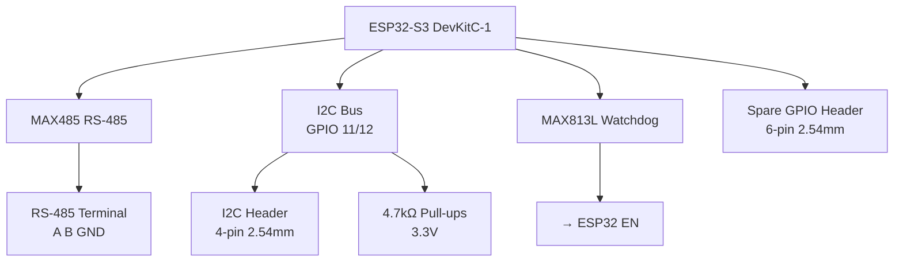

# Expansion Interfaces Subsystem — V2 Design

> RS-485/Modbus RTU, I2C expansion bus, external watchdog, spare GPIOs.  
> All through-hole, LPKF S63 compatible.  
> Designed for industrial integration and future-proofing.

---

## 1. System Overview



---

## 2. RS-485 / Modbus RTU Interface

### 2a. Why RS-485?

RS-485 is the **de facto industrial standard** for serial communication:
- Differential signaling: immune to EMI in factory environments
- Long distances: up to 1200m at 100kbps
- Multi-drop: up to 32 devices on one bus
- Every PLC supports Modbus RTU over RS-485

### 2b. Transceiver — MAX485EPA+ (DIP-8)

```
    MAX485 Pinout (DIP-8, top view, notch left):
    
    ┌─────────────────┐
    │  1 RO │ VCC  8  │  RO = Receiver Output → GPIO 14 (RX)
    │  2 RE │ B    7  │  RE = Receiver Enable (LOW = enable)
    │  3 DE │ A    6  │  DE = Driver Enable (HIGH = enable)
    │  4 DI │ GND  5  │  DI = Driver Input ← GPIO 13 (TX)
    └─────────────────┘        A/B = Differential bus
    
    VCC = 5V or 3.3V (MAX485 works at 3.3V with reduced drive)
```

**Wiring:**
```
    5V_RAIL ──── VCC (pin 8)
    GND ───────── GND (pin 5)
    
    GPIO 13 ───── DI (pin 4)    [TX from ESP32]
    GPIO 14 ───── RO (pin 1)    [RX to ESP32]
    GPIO 18 ─────┬── RE (pin 2) [Receiver enable, active LOW]
                 └── DE (pin 3) [Driver enable, active HIGH]
    
    Pin 6 (A) ──── J_RS485 pin 1 (A)
    Pin 7 (B) ──── J_RS485 pin 2 (B)
    GND ────────── J_RS485 pin 3 (GND)
```

**Direction control (DE/RE):**
```cpp
#define PIN_RS485_DE 18

digitalWrite(PIN_RS485_DE, HIGH);  // Transmit mode
Serial2.write(data);
digitalWrite(PIN_RS485_DE, LOW);   // Receive mode
```

**Why tie DE and RE together?** When GPIO 18 is HIGH, driver enabled + receiver disabled (transmit). When LOW, driver disabled + receiver enabled (receive). This is standard half-duplex RS-485.

### 2c. Bus Termination

```
    J_RS485 terminal block (KF301-3P, 5.08mm)
    
    Pin 1: A ────┬─────────────────────── to bus
                 │
            ┌────┴────┐
            │  120Ω   │  R_TERM (with jumper)
            │         │
            └────┬────┘
                 │
    Pin 2: B ────┴─────────────────────── to bus
    Pin 3: GND ────────────────────────── shield/reference
```

**Termination rule:** Place 120Ω resistor at both ends of the RS-485 bus. On this PCB, include a **120Ω resistor with solder jumper** — populate only if this device is at the end of the bus.

### 2d. Modbus RTU Register Map (Proposed)

When Modbus firmware is implemented:

| Register | Address | Type | Description |
|----------|---------|------|-------------|
| 40001 | 0 | UINT16 | X position (mm × 10) |
| 40002 | 1 | UINT16 | Y position (mm × 10) |
| 40003 | 2 | UINT16 | Z position (mm × 10) |
| 40004 | 3 | UINT16 | Radius (mm × 10) |
| 40005 | 4 | INT16 | Theta angle (degrees × 100) |
| 40006 | 5 | INT16 | Phi angle (degrees × 100) |
| 40007 | 6 | UINT16 | Battery voltage (V × 100) |
| 40008 | 7 | UINT16 | Status flags (bitfield) |
| 40009 | 8 | UINT16 | Firmware version |

**Default Modbus settings:**
- Baud rate: 9600 (configurable)
- Data bits: 8
- Parity: None
- Stop bits: 1
- Slave address: 1 (configurable via NVS or DIP switch)

### 2e. Alternative Transceivers

| Part | Package | Voltage | Cost | Notes |
|------|---------|---------|------|-------|
| MAX485EPA+ | DIP-8 | 5V/3.3V | ~15₺ | Industry standard, widely available |
| SP485EN | DIP-8 | 5V/3.3V | ~10₺ | Pin-compatible, cheaper |
| MAX3078E | DIP-8 | 3.3V | ~20₺ | True 3.3V, better ESD |

**Recommendation:** MAX485EPA+ — most available in Turkey, well-documented.

---

## 3. I2C Expansion Bus

### 3a. Header Specification

```
    J_I2C — 1×4 pin header, 2.54mm pitch
    
    Pin 1: SDA (GPIO 11)
    Pin 2: SCL (GPIO 12)
    Pin 3: 3.3V
    Pin 4: GND
    
    ┌─────────┐
    │ 1 2 3 4 │
    │ S S 3 G │
    │ D C . N │
    │ A L 3 D │
    └─────────┘
```

### 3b. Pull-ups and Protection

```
    3.3V ──── 4.7kΩ ────┬── SDA (GPIO 11)
                        │
                   1.5KE3.3CA ── GND
    
    3.3V ──── 4.7kΩ ────┬── SCL (GPIO 12)
                        │
                   1.5KE3.3CA ── GND
```

| Component | Value | Purpose |
|-----------|-------|---------|
| R_PULLUP | 4.7kΩ × 2 | I2C bus pull-up (required for open-drain) |
| TVS_I2C | 1.5KE3.3CA × 2 | ESD protection for external modules |

**Note:** Some I2C modules (like ZS-042 DS3231) include their own pull-ups. If multiple modules are connected, total pull-up resistance may become too low (<1kΩ). In that case, remove on-module resistors or change R_PULLUP to 10kΩ.

### 3c. Supported Plug-in Modules

| Module | Address | Purpose | Cost |
|--------|---------|---------|------|
| DS3231 RTC | 0x68 | Timestamped logging | ~70₺ (module) |
| ADS1115 ADC | 0x48 | 16-bit voltage monitoring | ~40₺ (module) |
| SSD1306 OLED | 0x3C | Local status display | ~40₺ (module) |
| PCF8574 GPIO | 0x20–0x27 | 8-bit I/O expansion | ~25₺ (module) |
| MCP23017 GPIO | 0x20–0x27 | 16-bit I/O expansion | ~30₺ (module) |
| BME280 | 0x76 | Temperature/humidity/pressure | ~50₺ (module) |

**Address conflict check:**
- DS3231: 0x68 (fixed)
- ADS1115: 0x48 (default, configurable via ADDR pin)
- SSD1306: 0x3C or 0x3D (configurable)
- PCF8574: 0x20–0x27 (configurable via A0–A2 pins)

No conflicts with default addresses if only one device per type is used.

### 3d. I2C Wiring Example (DS3231 + ADS1115)

```
    J_I2C header
       │
       ├── SDA ────┬── DS3231 SDA
       │           └── ADS1115 SDA
       │
       ├── SCL ────┬── DS3231 SCL
       │           └── ADS1115 SCL
       │
       ├── 3.3V ───┬── DS3231 VCC
       │           └── ADS1115 VCC
       │
       └── GND ────┬── DS3231 GND
                   └── ADS1115 GND
```

**Cable:** 4-wire Dupont/ribbon cable, <30cm for reliable I2C at 100kHz.

---

## 4. External Watchdog — MAX813L

### 4a. Why External Watchdog?

ESP32 has an internal watchdog timer (WDT), but it only catches:
- Task starvation in FreeRTOS
- Infinite loops in a single task

It does NOT catch:
- Total CPU hang in interrupt context
- Flash corruption causing erratic execution
- Power glitch during WiFi initialization leaving radio in bad state

**MAX813L catches everything** — if the firmware doesn't toggle WDI within 1.6 seconds, it hard-resets the ESP32.

### 4b. MAX813L Pinout and Wiring

```
    MAX813L (DIP-8, top view, notch left):
    
    ┌─────────────────┐
    │  1 GND │ VCC   8 │  GND = Ground
    │  2 WDO │ RESET 7 │  WDO = Watchdog output (not used here)
    │  3 MR  │ PFI   6 │  MR = Manual reset input
    │  4 WDI │ PFO   5 │  WDI = Watchdog input (from firmware)
    └─────────────────┘      VCC = 5V power supply
                             RESET = Active-LOW reset output → ESP32 EN
                             PFI = Power-fail threshold input
                             PFO = Power-fail output (open-drain)
```

**Recommended wiring:**
```
    5V_RAIL ──── VCC (pin 8)
    GND ───────── GND (pin 1)
    
    GPIO 9 ────── WDI (pin 4)     [Toggled every loop iteration]
    
    5V_RAIL ── 100kΩ ──┬── PFI (pin 6)   [Power-fail threshold]
                       │
                  68kΩ  │
                       │
                      GND
    
    PFI threshold: 1.25V × (100k+68k)/68k = 3.09V
    → Triggers PFO when 5V drops below ~3.1V
    
    RESET (pin 7) ────┬── ESP32 EN pin
                      │
                 10kΩ  │  [Pull-up to 3.3V]
                      │
                     3.3V
    
    MR (pin 3) ────┬── Reset Button ──── GND
                   │
              10kΩ  │  [Pull-up to 5V]
                   │
                  5V_RAIL
```

### 4c. Watchdog Firmware Integration

```cpp
#define PIN_WDI 9

void setup() {
    pinMode(PIN_WDI, OUTPUT);
    digitalWrite(PIN_WDI, LOW);
}

void loop() {
    // Main 20Hz control loop
    readEncoders();
    calculatePosition();
    broadcastData();
    
    // Toggle watchdog every loop
    static bool wdiState = false;
    wdiState = !wdiState;
    digitalWrite(PIN_WDI, wdiState);
    
    delay(50);  // 20 Hz
}
```

**Timeout:** If `loop()` hangs and WDI stops toggling, MAX813L pulses RESET low after **1.6 seconds**.

### 4d. Power-Fail Detection

The PFI/PFO pins can signal an impending power loss:
```cpp
#define PIN_PFO 10  // Optional — use LED Fault pin

void setup() {
    pinMode(PIN_PFO, INPUT_PULLUP);
    attachInterrupt(digitalPinToInterrupt(PIN_PFO), onPowerFail, FALLING);
}

void onPowerFail() {
    // 5V is sagging — save critical data to NVS quickly
    nvs_put_float("last_x", currentX);
    nvs_put_float("last_y", currentY);
    nvs_put_float("last_z", currentZ);
}
```

**Note:** With 220µF on BUCK_VIN, you have ~10ms to save data before 5V collapses. NVS writes take ~5ms — feasible but tight.

### 4e. SD Card (Optional, SPI)

```
Interface: SPI3 (HSPI) — GPIO 33 (MOSI), 34 (MISO), 35 (CLK), 36 (CS)
Status: Optional — these GPIOs are unassigned on DevKitC-1-N8R2 (no PSRAM on these pins)
Connector: J_SD (1×5 header, 2.54mm): MOSI, MISO, CLK, CS, GND
Cost: ~10–15₺ (bare push-push socket) or ~50–70₺ (module with level shift)
```

**Notes:**
- Verify GPIOs 33–36 are free on DevKitC-1-N8R2 board schematic before routing.
- GPIOs 35–42 are occupied on N8R8 (PSRAM) variant — only safe on N8R2 or N8.
- Use `SD.h` or `SdFat` library; clock up to 20MHz on LPKF FR4.
- Populate J_SD footprint but leave DNP (do not populate) by default.

### 4f. W5500 Ethernet (DNP by default)

```
Interface: SPI3 shared with SD card — add separate CS pin per device
Header: J_ETH (2×5, 2.54mm): SCK, MISO, MOSI, CS, INT, RST, 3.3V, GND
Parts: W5500 module, ~180₺ (samm.com); SPI 3.3V compatible (internal 3.3V LDO on module)
```

**Notes:**
- Populate only when wired Ethernet is needed (metal enclosures, industrial Modbus/TCP).
- WiFi and Ethernet share the network stack — configure one at a time in firmware.
- W5500 CS on GPIO 32 (verify against N8R2 schematic); INT on GPIO 21 (spare GPIO header).
- Use `Ethernet.h` (WIZnet) or `AsyncWebServer` with W5500 driver.
- Footprint DNP by default; route traces to J_ETH during initial layout.

### 4g. CAN Bus (DNP by default)

```
Interface: ESP32-S3 TWAI controller — configurable to any 2 GPIOs
Recommended: GPIO 41 (TX), GPIO 42 (RX)
  ⚠️ GPIO 41/42 are default JTAG TMS/TDI — JTAG is disabled when these GPIOs are used for CAN.
  Acceptable in production builds. Developers needing JTAG: remap CAN to GPIO 33/34 instead.
Transceiver: SN65HVD230 (3.3V, SOP-8) — ~1–3 USD from AliExpress
Header: J_CAN (1×4, 2.54mm): CANH, CANL, 3.3V, GND
Termination: 120Ω solder jumper at J_CAN (same pattern as RS-485)
```

**Notes:**
- Use ESP32 TWAI (Two-Wire Automotive Interface) driver via `driver/twai.h`.
- CANopen CiA 406 position sensor profile enables PLC integration without custom protocol.
- DNP by default; route GPIO 41/42 traces to transceiver footprint during initial layout.

---

## 5. Spare GPIO Header

### 5a. Header Specification

```
    J_GPIO — 1×6 pin header, 2.54mm pitch
    
    Pin 1: GPIO 21  (bidirectional)
    Pin 2: GPIO 38  (input-only)
    Pin 3: GPIO 39  (input-only)
    Pin 4: GPIO 40  (input-only)
    Pin 5: 3.3V
    Pin 6: GND
    
    ┌─────────┐
    │ 1 2 3 4 │
    │ G G G G │
    │ P P P P │
    │ 1 2 3 4 │
    │ 0 0 0 0 │
    └─────────┘
```

### 5b. Use Cases

| Application | GPIO | Connection | Notes |
|-------------|------|-----------|-------|
| Limit switch (Theta min) | GPIO 38 | Switch to GND | Input-only, internal pull-up |
| Limit switch (Theta max) | GPIO 39 | Switch to GND | Input-only, internal pull-up |
| Emergency stop | GPIO 40 | NC switch to GND | Input-only, safety-critical |
| Auxiliary output | GPIO 21 | Relay/transistor | Bidirectional, can drive LED/relay |

### 5c. Limit Switch Wiring

```
    3.3V ──── 10kΩ pull-up ────┬── GPIO 38
                               │
                          Limit switch (NC) ── GND
    
    Normally: Switch closed → GPIO 38 = LOW
    Triggered: Switch open → GPIO 38 = HIGH (pull-up)
    
    Invert in firmware:
    bool limitThetaMin = digitalRead(38);  // HIGH = triggered
```

---

## 6. Status LEDs

### 6a. LED Circuit (×4)

```
    5V_RAIL ── 1kΩ ──┤>── GND    LED1 Green  (Power — hardwired)
    
    GPIO 8 ─── 1kΩ ──┤>── GND    LED2 Blue   (WiFi status)
    GPIO 9 ─── 1kΩ ──┤>── GND    LED3 Yellow (Activity heartbeat)
    GPIO 10 ── 1kΩ ──┤>── GND    LED4 Red    (Fault/Alarm)
```

### 6b. LED Behavior Specification

| LED | Color | GPIO | Normal State | AP Mode | STA Connected | Fault |
|-----|-------|------|--------------|---------|---------------|-------|
| Power | Green | — | **ON** | ON | ON | ON |
| WiFi | Blue | 8 | OFF | Slow blink (1Hz) | **Solid ON** | OFF |
| Activity | Yellow | 9 | Blink (20Hz, brief) | Blink (20Hz) | Blink (20Hz) | OFF |
| Fault | Red | 10 | OFF | OFF | OFF | **Solid ON** |

**Firmware implementation:**
```cpp
#define LED_WIFI 8
#define LED_ACTIVITY 9
#define LED_FAULT 10

void updateLeds() {
    // WiFi LED
    if (WiFi.status() == WL_CONNECTED) {
        digitalWrite(LED_WIFI, HIGH);
    } else if (WiFi.getMode() & WIFI_AP) {
        digitalWrite(LED_WIFI, millis() % 1000 < 500 ? HIGH : LOW);
    } else {
        digitalWrite(LED_WIFI, LOW);
    }
    
    // Activity LED — brief flash every 50ms loop
    static unsigned long lastActivity = 0;
    if (millis() - lastActivity >= 50) {
        lastActivity = millis();
        digitalWrite(LED_ACTIVITY, HIGH);
        delayMicroseconds(100);  // 100µs flash
        digitalWrite(LED_ACTIVITY, LOW);
    }
    
    // Fault LED
    digitalWrite(LED_FAULT, positionValid ? LOW : HIGH);
}
```

---

## 7. Layout Notes for LPKF S63

```
    Expansion zone (right side of PCB, 40mm × 80mm):
    
    ┌────────────────────────────────────────────┐
    │                                            │
    │  J_RS485    MAX485        MAX813L          │
    │  ┌─────┐    ┌─────┐       ┌─────┐         │
    │  │A B G│    │     │       │     │         │
    │  └─────┘    └─────┘       └─────┘         │
    │                              │             │
    │  J_I2C        J_GPIO         │             │
    │  ┌─────┐      ┌──────┐       │             │
    │  │S S 3│      │G G G │       │             │
    │  │D C .│      │P P P │       │             │
    │  │A L 3│      │1 2 3 │       │             │
    │  └─────┘      └──────┘       │             │
    │                              │             │
    │  LEDs (4×)                   │             │
    │  [G] [B] [Y] [R]             │             │
    │                              │             │
    │  Reset Button ───────────────┘             │
    │                                            │
    └────────────────────────────────────────────┘
```

**Placement rules:**
- MAX485 near J_RS485 terminal (short A/B traces)
- 120Ω termination resistor next to MAX485 pins 6/7
- MAX813L near ESP32 EN pin (short RESET trace)
- I2C pull-ups near J_I2C header
- LEDs on board edge, visible when mounted in enclosure
- Reset button accessible without tools

---

## 8. Bill of Materials (Expansion Section)

| Ref | Qty | Part | Package | Est. Cost |
|-----|-----|------|---------|-----------|
| U_RS485 | 1 | MAX485EPA+ | DIP-8 | ~15₺ |
| R_TERM | 1 | 120Ω 1/4W | Axial | ~0.5₺ |
| J_RS485 | 1 | KF301-3P | 5.08mm | ~3₺ |
| U_WDT | 1 | MAX813L | DIP-8 | ~10₺ |
| R_PFI1 | 1 | 100kΩ 1/4W | Axial | ~0.5₺ |
| R_PFI2 | 1 | 68kΩ 1/4W | Axial | ~0.5₺ |
| R_WDT_PU | 1 | 10kΩ 1/4W | Axial | ~0.5₺ |
| R_EN_PU | 1 | 10kΩ 1/4W | Axial | ~0.5₺ |
| J_I2C | 1 | 1×4 pin header 2.54mm | THT | ~2₺ |
| R_I2C_PU1 | 1 | 4.7kΩ 1/4W | Axial | ~0.5₺ |
| R_I2C_PU2 | 1 | 4.7kΩ 1/4W | Axial | ~0.5₺ |
| TVS_I2C1 | 1 | 1.5KE3.3CA | DO-15 | ~2₺ |
| TVS_I2C2 | 1 | 1.5KE3.3CA | DO-15 | ~2₺ |
| J_GPIO | 1 | 1×6 pin header 2.54mm | THT | ~2₺ |
| LED2 | 1 | LED 3mm Blue | THT | ~1₺ |
| LED3 | 1 | LED 3mm Yellow | THT | ~1₺ |
| LED4 | 1 | LED 3mm Red | THT | ~1₺ |
| R_LED2 | 1 | 1kΩ 1/4W | Axial | ~0.5₺ |
| R_LED3 | 1 | 1kΩ 1/4W | Axial | ~0.5₺ |
| R_LED4 | 1 | 1kΩ 1/4W | Axial | ~0.5₺ |
| SW_RST | 1 | Tactile button 6mm | THT | ~2₺ |

**Total expansion section cost:** ~45₺

---

## 9. Firmware Support Checklist

- [ ] RS-485 direction control (GPIO 18)
- [ ] Modbus RTU slave implementation (library: `ModbusRTU`)
- [ ] I2C initialization (`Wire.begin(11, 12)` for SDA=11, SCL=12)
- [ ] DS3231 RTC read/write (`RTClib`)
- [ ] ADS1115 read (`Adafruit_ADS1X15`)
- [ ] MAX813L WDI toggle (GPIO 9)
- [ ] LED status update (GPIO 8, 9, 10)
- [ ] Spare GPIO pinMode configuration

---

## 10. Related Documents

- [Main V2 README](../README.md)
- [MCU Subsystem](mcu_subsystem_v2.md) — ESP32-S3 pin map
- [Power Supply](power_supply_v2.md) — 5V rail distribution
- [Encoder Interface](encoder_interface_v2.md) — Signal conditioning
