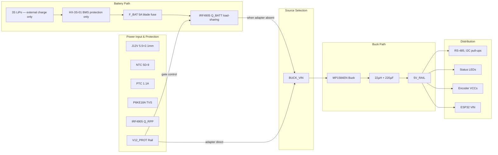

# Power Supply Subsystem — V2 Design

> 12V DC input, 3S LiPo battery backup (no onboard charging), MP1584EN buck.  
> **100% through-hole**, LPKF S63 compatible.  
> Battery charged externally via balance charger. Active MOSFET adapter-priority load-sharing.

---

## 1. System Overview



---

## 2. Input Protection

### 2a. Connector

```
J12V — DC barrel jack, 5.5mm outer × 2.1mm inner, center positive
Panel-mount or PCB-mount depending on enclosure
```

### 2b. Inrush Current Limiter

```
    J12V+ ──── NTC 5D-9 ──── F1

    NTC 5D-9: 5Ω cold, ~0.5Ω hot @ 1A
    At power-on: limits inrush to ~12V/5Ω = 2.4A (vs >10A without)
    After warm-up: ~0.5Ω drop = 0.5V @ 1A (negligible)
```

**Why NTC instead of resistor?** Self-heating reduces resistance after startup, so normal operation has minimal loss.

### 2c. Overcurrent Protection

```
    NTC output ──── F1 (Bourns MF-R110, 1.1A hold, 2.2A trip)
    
    PTC polyfuse: resettable, no field spares needed
    Trip time: ~3 seconds at 2.2A
    Alternative: Littlefuse 0251020.NRT1 glass fuse (2A) + holder
```

**Recommendation:** Use **PTC** for field-serviceability. Use glass fuse only if you need faster trip (<100ms).

### 2d. Transient Voltage Suppression

```
    F1 output ────┬──── P6KE18A ────┬──── GND
                  │    (DO-15 axial) │
                  │    cathode band   │
                  │    toward rail    │
                  │                   │
             to Q1 (RPP)              │
```

| Parameter | P6KE18A |
|-----------|---------|
| Standoff voltage | 15.3V (above normal 12V rail — TVS inactive during normal operation, only conducts on transients) |
| Breakdown voltage | 17.1–18.9V |
| Clamping voltage | 25.2V @ 23.8A |
| Peak pulse power | 600W (1ms) |

**Note:** P6KE18A standoff (15.3V) is slightly below 16V Class A max. If your adapter routinely outputs >15V, use **P6KE20A** (17.1V standoff) instead.

### 2e. Reverse Polarity Protection

```
    TVS output ──────────────── Pin 3 (Source)
                                    │
                               ┌────┴────────────┐
                               │    IRF4905       │
                               │   TO-220AB       │
                               │  P-ch MOSFET     │
                               │  Vds = -55V      │
                               │  Rds(on) = 20mΩ  │
                               └────┬────────────┘
                                    │
                         100kΩ ─────┤ Pin 1 (Gate)
                                    │
                                   GND

                          Pin 2 (Drain) ──── V12_PROT
                          Tab (Drain) ──── V12_PROT
```

**Operation:**
- Correct polarity: Gate = 0V, Source = +12V → Vgs = -12V → MOSFET fully ON
- Reversed polarity: Source negative, Gate at 0V → Vgs ≈ 0V → MOSFET OFF
- Voltage drop: 20mΩ × 1.5A = **30mV** (negligible)

**Important:** IRF4905 tab is connected to Drain (V12_PROT). Do NOT bolt it to a grounded heatsink. No heatsink needed at 45mW.

**Alternative:** Series Schottky SS36 (3A, 60V, DO-201 axial). Drop ~0.35V at 1.5A. Simpler wiring but higher loss.

---

## 3. Source Selection — Active MOSFET Load-Sharing (Q_BATT)

Schottky diode OR-ing cannot guarantee adapter priority: a fully charged 3S battery (12.6V) has
higher potential than the 12V adapter (11.6V after diode drop), so the battery drains even while
the adapter is connected. Replaced by a discrete IRF4905 gate circuit.

```
    BAT_PLUS ─── F_BAT (5A ATO blade fuse) ─── Q_BATT Source (pin 3)
    
    Q_BATT Gate control:
    V12_PROT ──── D_GATE (SS14 Schottky, band→Gate) ──┬── Q_BATT Gate (pin 1)
                                                       │
                                                  R_G2 100kΩ pull-down
                                                       │
                                                      GND
    
    Z1 (1N4742A Zener 12V, cathode→Gate, anode→Source): V_GS clamp
    
    Q_BATT Drain (pin 2/tab) ──── BUCK_VIN
    
    V12_PROT ────────────────── BUCK_VIN  (adapter feeds buck directly)
```

**Behavior:**

| Condition | Q_BATT | BUCK_VIN | Source |
|-----------|--------|----------|--------|
| Adapter only | OFF (gate ≈ V12_PROT) | ~12V | External |
| Battery only | ON (gate pulled to GND) | ~9–12.6V | 3S LiPo |
| Both present | OFF — battery isolated | ~12V | External (priority guaranteed) |
| Adapter removed | ON within <1ms | Battery takeover | 3S LiPo |

**Hold-up during switchover:** C_IN1 (220µF/35V) provides energy. At 500mA load and 1ms transition:
```
dV = I × dt / C = 0.5A × 0.001s / 220µF = 2.27V
```
BUCK_VIN drops from 12V to ~9.73V — MP1584EN operates down to 4.5V, so this is safe.

### 3a. Battery Branch Fuse (F_BAT)

```
F_BAT: 5A ATO/ATC automotive blade fuse
Holder: inline fuse holder, within 15cm of J_XT60 positive terminal
```

A 3S LiPo can source hundreds of amperes into a short circuit. PTC polyfuses cannot interrupt
this current safely. The F_BAT fast-acting blade fuse provides reliable short-circuit protection
on the battery discharge path. The adapter-side PTC (F1) is retained for adapter overcurrent only.

---

## 4. Buck Converter — 12V to 5V

### 4a. MP1584EN Module

> **Note:** MP2315 is not stocked in Turkey. MP1584EN (direnc.net, 26.46₺) is the confirmed
> in-stock replacement. With the 22µH + 220µF LC post-filter downstream, output ripple is
> <5mVpp — equivalent performance for this application.

```
    BUCK_VIN ── 220µF/35V ──┬── VIN (MP1584EN module)
                            │
                       100nF ceramic disc
                            │
                           GND

    VOUT (module) ──── 22µH ──┬── 220µF/10V low-ESR ── GND
                              │
                         5V_BUCK
                              │
                         SS36 Schottky ──── 5V_RAIL
```

**MP1584EN specs:**
- Input: 4.5V–28V
- Output: 0.8V–25V (adjustable via trim pot)
- Current: 3A max
- Switching frequency: ~1.5MHz
- Efficiency: ~92% @ 12V→5V, 500mA
- Ripple: ~50mVpp (before LC filter; <5mVpp after 22µH + 220µF post-filter)

**Pre-set procedure:**
1. Connect MP1584EN module to 12V input via lab supply
2. Connect 25Ω/2W dummy load (~200mA)
3. Adjust trim pot to **5.10V** (compensates for SS36 Schottky drop)
4. Verify <50mV ripple with multimeter or scope
5. Then connect to rest of circuit

### 4b. LC Post-Filter

| Component | Value | Purpose |
|-----------|-------|---------|
| L_FILT | 22µH, 2A rated | Series inductor blocks switching ripple |
| C_FILT | 220µF/10V low-ESR | Shunt capacitor absorbs ripple |
| C_FILT_HF | 100nF ceramic disc | High-frequency bypass |

**Calculated ripple at 5V_RAIL:** <2mVpp (vs ~5mVpp with old 10µH+100µF)

**Why this matters:** Encoder signals are 5V TTL. A noisy 5V rail can couple into the quadrature edges, causing miscounts at high rotation speeds.

### 4c. 5V Rail Distribution

```
    5V_RAIL
       │
       ├── ESP32 VIN  (direct — SS36/D_OR is upstream of 5V_RAIL, not downstream)
       │
       ├── FB1 ──── J1 VCC (Theta encoder)
       │             └── 100nF ceramic disc to GND
       ├── FB2 ──── J2 VCC (Phi encoder)
       │             └── 100nF ceramic disc to GND
       ├── FB3 ──── J3 VCC (Wire encoder)
       │             └── 100nF ceramic disc to GND
       ├── 1kΩ ──── LED1 (Green, power)
       │
       └── 220µF/16V ── GND (bulk decoupling)
```

---

## 5. Battery Charging — External Only

**There is no onboard battery charging circuit on this PCB.**

### 5a. Why No Onboard Charging?

Three problems make onboard CC/CV charging of an RC LiPo unsafe in this topology:

| Problem | Explanation |
|---|---|
| **No cell balancing** | BQ24650 charges pack to 12.6V total; it cannot monitor individual cells. HX-3S-01 provides <50mA passive balance — inadequate for any meaningful LiPo capacity |
| **Termination trap** | With system load (200–400mA) present at the battery node, charge current never tapers to the termination threshold. Charger float-charges at 4.2V/cell indefinitely → lithium plating, cell swelling within weeks |
| **No voltage headroom** | 12V adapter charging a 12.6V 3S pack has ~0V headroom at full charge. Synchronous buck chargers require VIN > VBAT + margin to operate correctly |

### 5b. External Charging Procedure

```
    Required: iMax B3 / SkyRC E3S / any balance charger rated for 3S LiPo
    
    1. Disconnect battery XT60 from PCB (unplug J_XT60)
    2. Connect battery MAIN lead (XT60) to charger
    3. Connect battery BALANCE lead (JST-XH-4P) to charger balance port
    4. Select: LiPo 3S balance charge, 1C rate (≤1A for 2200mAh, ≤2A for 5000mAh)
    5. Charge until all cells reach 4.20V ± 0.02V (charger indicates complete)
    6. Reconnect J_XT60 to PCB after charging
    
    NEVER connect charger through J12V or any PCB input connector.
```

### 5c. Battery Connectors

```
    J_XT60 (XT60 male, panel mount, on PCB edge):
    Positive: BAT_PLUS → inline F_BAT (5A blade fuse) → Q_BATT Source
    Negative: GND
    
    J_BAL (JST-XH-4P, 2.5mm pitch — passive balance header at PCB edge):
    ┌──────────────────────────────┐
    │ Pin 1: B-  (Cell 1 −)       │
    │ Pin 2: BM  (Cell 1-2 mid)   │
    │ Pin 3: B2  (Cell 2-3 mid)   │
    │ Pin 4: B+  (Cell 3 +)       │
    └──────────────────────────────┘
    (Passive header — wires run directly to battery JST-XH balance connector. No PCB circuitry on this header.)
```

### 5d. HX-3S-01 BMS — Protection Role Only

The BMS remains in the battery discharge path for hardware protection. Its balancing capability
is not relied upon — cell balancing is performed by the external balance charger.

```
    Battery cells → BMS (B+/BM/B2/B-) → P+ → BAT_PLUS → F_BAT → Q_BATT → BUCK_VIN
                                       → P- → GND
```

| BMS Function | Status |
|---|---|
| Overdischarge cutoff (~9.6V / 3.2V/cell) | Active — hardware undervoltage backstop |
| Short-circuit protection (<1ms) | Active — secondary protection alongside F_BAT |
| Overcharge cutoff | Not used (no onboard charging) |
| Passive balancing (<50mA) | Not relied upon — external charger handles balancing |

### 5e. Firmware Undervoltage Thresholds (Mandatory)

With no BMS in the charging path, firmware battery monitoring is the primary protection layer.
The BMS undervoltage cutoff is an emergency hardware backstop only.

| Threshold | Voltage | Firmware Action |
|---|---|---|
| Full charge | 12.60V | Reference |
| Nominal | 11.10V | Normal operation |
| Low battery warning | **10.50V** | Activate fault LED (GPIO 10); alert operator |
| Graceful shutdown | **9.90V** | Halt motion, save state, enter deep sleep |
| BMS hardware cutoff | ~9.60V | HX-3S-01 emergency disconnect |
| Absolute minimum | 9.00V | Do not allow cells below 3.0V/cell |

ADC measurement: GPIO 1 (ADC1_CH0), 120kΩ/27kΩ divider from BUCK_VIN.
Scale = 5.444. At 10.50V: V_adc = 1.93V, raw = 2394. At 9.90V: V_adc = 1.82V, raw = 2259.

---

## 6. 12V Voltage Monitoring

### 6a. Divider for ESP32 ADC

```
    V12_PROT ── 120kΩ 1% ──┬── GPIO 1 (ADC1_CH0)
                           │
                      27kΩ 1%
                           │
                          GND
    
    Scale factor: (120k + 27k) / 27k = 5.444
    
    At 12.0V: V_adc = 12.0 / 5.444 = 2.20V
    At 9.0V (3S empty): V_adc = 9.0 / 5.444 = 1.65V
    At 15.0V (max expected): V_adc = 15.0 / 5.444 = 2.75V
```

**Why GPIO 1 instead of GPIO 36?** On ESP32-S3, GPIO 36 is reserved for SPI flash/PSRAM. GPIO 1 is ADC1_CH0, which remains available when WiFi is active (unlike ADC2 channels).

### 6b. ADS1115 Header (Optional, 16-bit)

For precision monitoring, add an ADS1115 module on the I2C header:

| ADS1115 Channel | Signal | Expected Voltage |
|-----------------|--------|------------------|
| AIN0 | V12_PROT (via 120k/27k divider) | 1.65–2.75V |
| AIN1 | 3S_OUT+ (via 120k/27k divider) | 1.65–2.31V |
| AIN2 | 5V_RAIL | 0–5V (use 10k/10k divider to scale to 2.5V max) |
| AIN3 | 3.3V rail | 0–3.3V |

**Firmware:** Read all 4 channels every 1 second, broadcast via WebSocket/TCP for remote diagnostics.

---

## 7. Net Summary

| Net | Source | Destinations | Voltage |
|-----|--------|-------------|---------|
| J12V+ | DC jack | NTC → F1 → TVS → Q_RPP | 9–16V (Class A) |
| V12_PROT | Q_RPP drain | Q_BATT gate (via D_GATE), BUCK_VIN, ADC divider | ~12V (protected) |
| BAT_PLUS | BMS P+ | F_BAT → Q_BATT source | 9.0–12.6V |
| BUCK_VIN | V12_PROT (adapter) or Q_BATT drain (battery) | MP1584EN VIN | 9.0–12V |
| 5V_BUCK | MP1584EN output | LC filter → SS36 | 5.10V |
| 5V_RAIL | SS36 cathode | ESP32 VIN, encoders, LEDs, RS-485 | 4.75–4.85V |
| GND | Common | All components | 0V |

---

## 8. Test Points

| TP | Signal | Expected |
|----|--------|----------|
| TP12 | V12_PROT | 11.5–12.5V |
| TP_BV | BUCK_VIN | 9.0–11.6V |
| TP5 | 5V_RAIL | 4.75–4.85V |
| TP33 | 3.3V (ESP32 onboard LDO) | 3.25–3.35V |
| TP_BAT | 3S_OUT+ | 9.0–12.6V |
| TPG | GND | 0V reference |

---

## 9. Assembly Warnings

1. **Pre-set MP1584EN to 5.10V** before connecting ESP32. Use 25Ω/2W dummy load. After calibration, **apply one drop of CA glue to the trimpot body** — prevents vibration-induced voltage drift.
2. **Install F_BAT blade fuse before connecting battery.** Place inline fuse holder within 15cm of J_XT60 positive terminal. 5A for 2200mAh pack; 10A for 5000mAh pack.
3. **Never charge battery through J12V or any PCB input.** Use external balance charger via XT60 + JST-XH-4P balance lead only.
4. **Verify BMS undervoltage threshold** — HX-3S-01 should cut off at ~9.6V (3.2V/cell). Bench-test before installing: apply decreasing voltage to P+/P- terminals and confirm cutoff occurs above 3.0V/cell.
5. **D_GATE Schottky direction** — band (cathode) faces Q_BATT Gate. Reversed = battery never isolated when adapter is connected.
6. **Do not bolt either IRF4905 to a grounded heatsink** — tabs are connected to Drain nets (V12_PROT on Q_RPP, BUCK_VIN on Q_BATT).
7. **Do not apply 12V to ESP32 VIN** — only 5V_RAIL connects to VIN pin.

---

## 10. Thermal Budget

| Component | Power | Temperature Rise |
|-----------|-------|-----------------|
| MP1584EN buck | ~0.35W @ 500mA | ~15°C (module heatsink sufficient) |
| Q_RPP (IRF4905) | ~45mW @ 1.5A | Negligible |
| Q_BATT (IRF4905) | ~15mW @ 750mA | Negligible |
| SS36 diode (D_OR) | ~0.3W | Warm, acceptable |
| D_GATE (SS14) | <5mW (gate current) | Negligible |
| ESP32 AMS1117 | ~0.34W @ 200mA | ~20°C |
| **Total** | **~1.0W** | Well spread across board |

**No fan required.** BQ24650 module removed — total board dissipation reduced by ~65% vs prior design.
