# evka_position — Donanim Karsilastirma ve Karar Rehberi

**Hedef kitle:** Guc elektronu, MOSFET surucu devreleri ve gomulu sistemler konusunda deneyimli muhendisler.  
**Amac:** Hangi donanim versiyonunun uretilmesi gerektigini belirlemek icin referans dokumani. Kaynak tasarim dosyalari `docs/hardware_design/` altindadir; bu dokuman onlarin yerine gecmez, sentezler ve duzeltilmis guvenlik analizi sunar.

---

## 1. Tasarim Evrimi

Uc temel mimari degisim tum versiyonlari sekillendirmistir:

1. **5V → 12V:** Ilk tasarim 5V adaptorden besleniyordu. Makine ortamlari 12V kullanir; 1S LiPo cok dusuk enerji depolar.
2. **Schottky OR → Aktif Q_BATT:** Pasif Schottky devresi oncelik garantisi vermez. Tam sarjli 3S pil, 12V adaptor uzerinden daha yuksek gerilim saglar ve sistemi besler.
3. **Wemos D1 R32 → ESP32-S3:** Daha iyi donanim PCNT sayaci, yerel USB-C ve uzun vadeli destek.

### 1.1 Kronolojik Akis

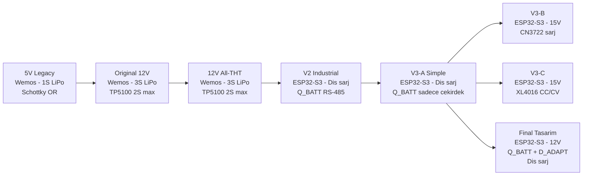

---

## 2. 5V ve 12V Mimarisinin Karsilastirilmasi

Bu bolum 5V Legacy'den 12V tasarimlara gecisi, hangi parcalarin degistigi, ve 2S LiPo secenegini aciklarsa.

### 2.1 Ne Degisir, Ne Kalir

| Blok | 5V Legacy | 12V Tasarimlar | Degisikligner |
|---|---|---|---|
| Giris voltaji | 5V DC | 12V DC | Adaptoru degistir |
| Gerilim dusurucu | Yok | MP1584EN buck 12V→5V | Yeni devre ekle |
| Ters kutup koruma | SI2301 SOT-23 | IRF4905 TO-220 | Kolaylasti |
| Kaynak secimi | Schottky OR | Aynisini saklandi | Sorun devam eder |
| Pil | 1S LiPo 3.7V | 3S LiPo 11.1V | Sarj IC tamamen degisir |
| Pil sarji | TP4056 | TP5100 (2S max, 3S YANLIS) | **Kriitik hata asagida** |
| BMS | DW01A 1S | HX-3S-01 3S | Degistir |
| Encoder kondisyonlama | 10k/20k + 1nF + TVS | Ayni | Degismez |
| MCU | Wemos D1 R32 | Wemos D1 R32 | Degismez |

**Gercek is yuku:** guc yolu ve pil sarj devresinde.

### 2.2 TP5100 Kritik Hatasi

**TP5100 bir 1S/2S sarj IC'sidir. Maksimum cikis gerilimi 8.4V'dur (2 hucre × 4.2V).** Bir 3S paketi 12.6V'a sarj etmek fiziksel olarak mumkun degildir.

Original 12V ve 12V All-THT tasarimlarinda TP5100'un 3S paketi sarf edecegi varsayilmistir. **Bu yanlistir.** MT3608 boost cevirmeci girisi 15V'a cikarsa da, TP5100'un ic referans ve geri besleme devresi bunu 8.4V'un uzerine cikarmaz.

**Sonuc:** Bu iki tasarimdaki dahili sarj devresi 3S paketi dogru sarj edemez.

### 2.3 2S LiPo Secenegi

12V adaptoru olan bir tasarimda 3S yerine 2S LiPo kullanilabilir. Bu secenek onemli avantajlar saglar:

**Avantajlar:**
- TP5100 bir 2S pil icin dogru IC'dir.
- Schottky OR oncelik sorunu ortadan kalkar: 12V adaptoru SS34 uzerinden yakl. 11.6V verir; tam sarjli 2S pil yakl. 8.0V verir. Adaptoru her zaman kazanir.
- Daha hafif ve kucuk pil.

**Dezavantajlar:**
- Enerji depolama dustur: 2S (2200mAh × 7.4V = 16.3 Wh) vs 3S (2200mAh × 11.1V = 24.4 Wh).
- Buck cevirmeci gereksinimi devam eder.

### 2.4 Gecis Zorlukları

1. Voltaj regulasyonu: MP1584EN'i 5.05V'a ayarla ve LC filtresi.
2. Ters kutup koruma degisimi: SI2301 SOT-23 yerine IRF4905 TO-220.
3. Pil ve sarj altyapisi yenilenmelidir: 3S BMS ve dogru charger (TP5100 degil 2S'de, 3S'de hic).
4. Kaynak secimi: Schottky OR belirsizligi devam eder.
5. Encoder kondisyonlama ve firmware hicbir degisiklik gerektirmez.

---

## 3. Genel Karsilastirma

| Tasarim | MCU | Giris | Pil | Sarj | Kaynak | Montaj | Firmware |
|---|---|---|---|---|---|---|---|
| 5V Legacy | Wemos D1 R32 | 5V | 1S | TP4056 dahili | Schottky OR | Orta | Hazir |
| Original 12V | Wemos D1 R32 | 12V | 3S | TP5100 (2S max) | Schottky OR | Zor | Hazir |
| 12V All-THT | Wemos D1 R32 | 12V | 3S | TP5100 (2S max) | Schottky OR | Orta | Hazir |
| V2 Industrial | ESP32-S3 | 12V | 3S | Yalnizca dis | Q_BATT | Orta | S3 bekliyor |
| V3-A Simple | ESP32-S3 | 12V | 3S | Yalnizca dis | Q_BATT | Orta | S3 bekliyor |
| V3-B + CN3722 | ESP32-S3 | 15V | 3S | CN3722 dahili | Q_BATT | Orta | S3 bekliyor |
| V3-C + XL4016 | ESP32-S3 | 15V | 3S | XL4016 CC/CV | Q_BATT | Orta | S3 bekliyor |
| **Final Tasarim** | **ESP32-S3** | **12V** | **3S** | **Dis zorunlu** | **Q_BATT+D_ADAPT** | **Orta** | **S3 bekliyor** |

---

## 4. Tasarim-Basina Inceleme

### 4.1 5V Legacy

Ilk Wemos D1 R32 tasarimi. Değeri encoder sinyal kondisyonlaması temelinde yatar; tum sonraki tasarimlar bunu yeniden kullanir.

#### Guc Topolojisi

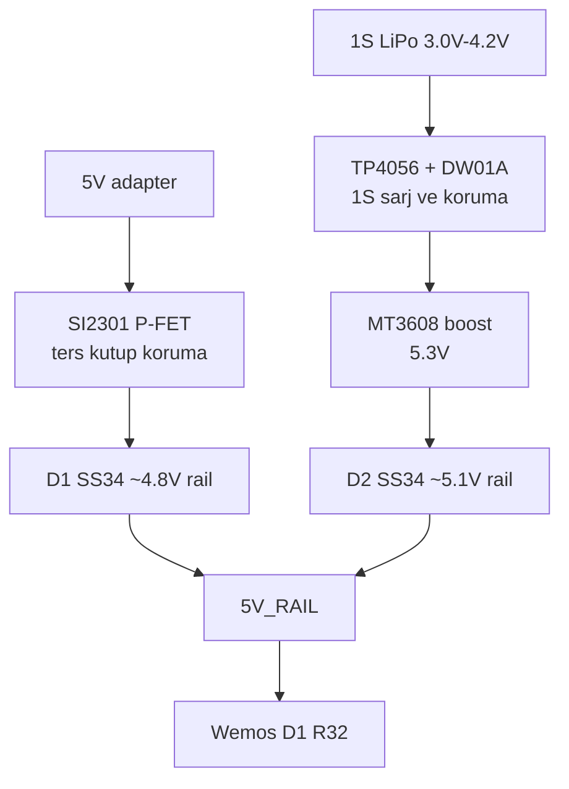

**Best part:** Encoder sinyal kondisyonlama ispatlanmis cizgi.

**Weaknesses**
- 1S LiPo dusuk enerji.
- SI2301 SMD pertinaksta zor.
- 5V adaptoru makine gucune uyum saglamaz.

**Best for:** Firmware gelistirme ve tarihsel referans.

---

### 4.2 Original 12V

12V girise gecis. MP1584EN buck, 3S pil voltaji, ve Wemos pin haritasi.

#### Guc Topolojisi

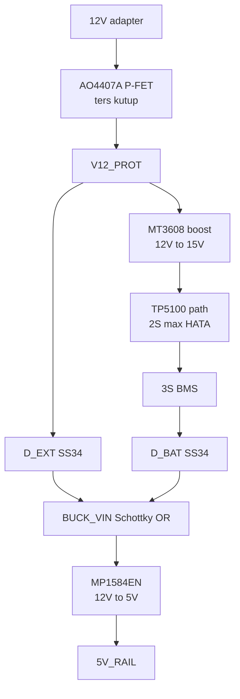

**Best part:** Ilk faydali 12V donusumu.

**Weaknesses**
- TP5100 3S icin guvensiz/dogrulanmamis.
- Pasif Schottky OR oncelik belirsizligi.
- AO4407A SOIC-8 SMD.

**Best for:** Tarihsel referans.

---

### 4.3 12V All-THT

12V elektrik topolojisini korur, SMD/THT degisir.

#### Guc Topolojisi

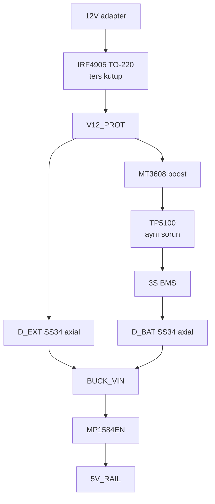

**Best part:** El ile lehimlenebilir versiyon.

**Weaknesses**
- TP5100 + 3S sorunu kalir.
- Schottky OR oncelik sorunu kalir.

**Best for:** Wemos 12V taşınabilir, sadece kurulum uyumluluğu onemli oldugunda.

---

### 4.4 V2 Industrial

Ilk tam ESP32-S3 yeniden tasarimi. Aktif pil yalitimi, dis sarj, RS-485, donanım watchdog.

#### Guc Topolojisi

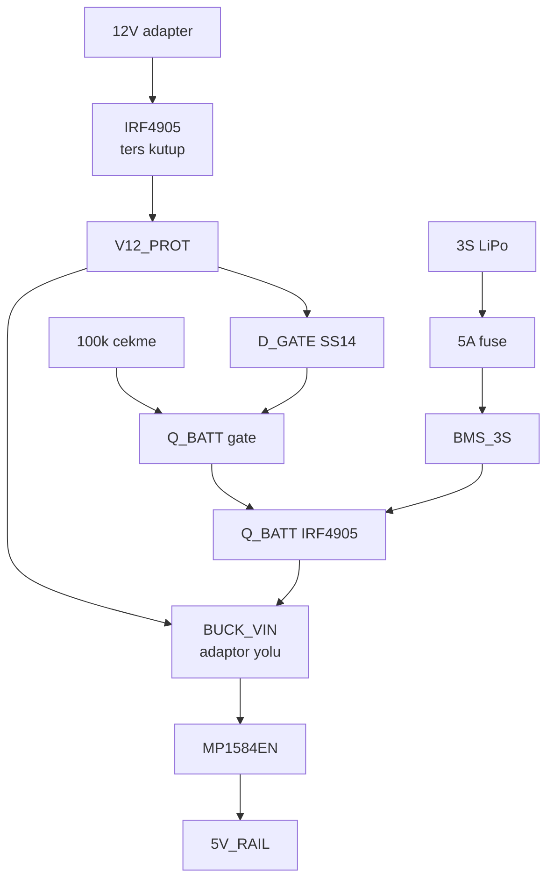

**Best part:** Endüstriyel hazirlik. Q_BATT Schottky sorunu cozer.

**Weaknesses**
- En karmasik tahta.
- V3-D'nin D_ADAPT dueteltmesi eksik.

**Best for:** RS-485/Modbus veya donanım watchdog gerekliyse.

---

### 4.5 V3-A Simple

V2'nin endüstriyel katmanini kaldirir, cekirdek sensör.

#### Guc Topolojisi

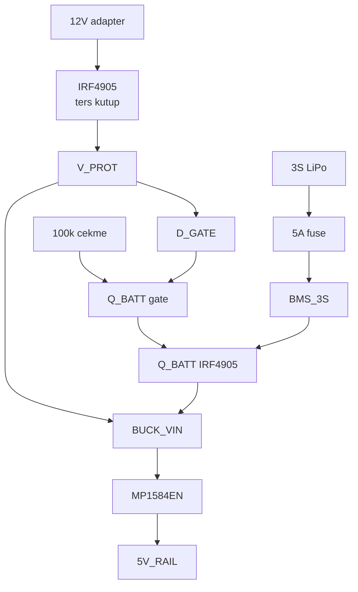

**Best part:** En temiz 12V cekirdegi Final Design oncesi.

**Weaknesses**
- D_ADAPT yok.
- ESP32-S3 gecisi bekleniyor.

**Best for:** Tarihsel referans, tum yeni tahta icin Final Design'i kullan.

---

### 4.6 V3-B + CN3722

V3 cekirdegi, CN3722 sarj zonu. 15V adapter gerekli.

#### Guc Topolojisi

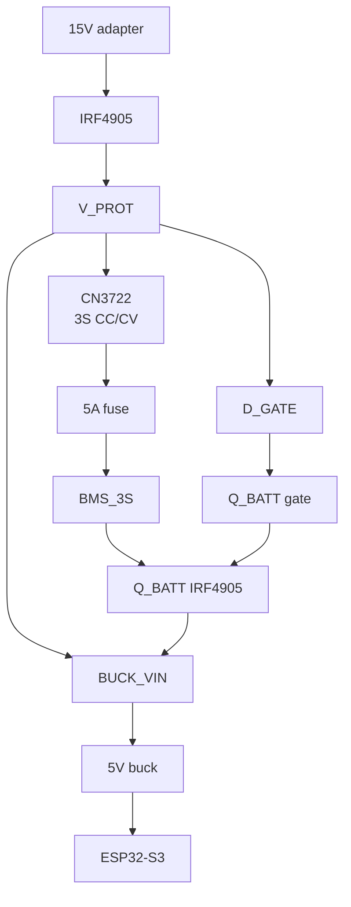

**Best part:** Guvenilir dahili 3S sarj.

**Weaknesses**
- 15V adapter gerekli.
- Hucre dengeleme yok.

**Best for:** Dahili sarj mecburi ve 15V adaptor kabul edilebilirse.

---

### 4.7 V3-C + XL4016

XL4016 CC/CV modulu. Supervised lab yalnizca.

#### Guc Topolojisi

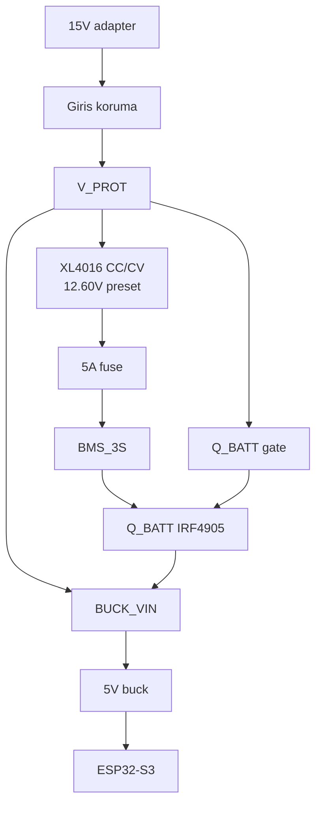

**Best part:** Kaynak esnekligi.

**Weaknesses**
- XL4016 akilli sarjici degil.
- Float-charge riski.
- Trimpot kayması.

**Best for:** Supervised lab yalnizca.

---

### 4.8 Final Tasarim

Secilen yeni-yapim paketi. V3-A tabani, D_ADAPT eklendi, Q_BATT marji dokumante edildi, 12V yalnizca.

#### Guc Topolojisi

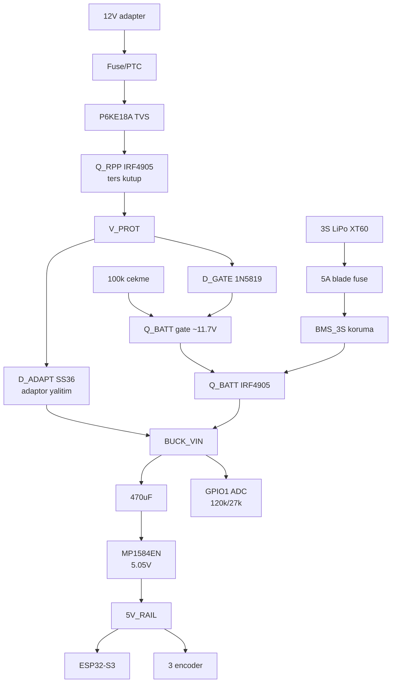

**Best part:** Tek belirsiz olmayan, gozden gecirilen temel.

**Weaknesses**
- Dahili sarj kolayligi yok.
- ESP32-S3 gecisi bekleniyor.

**Best for:** Yeni EVKA cekirdek sensor harita basilan.

---

## 5. Çapraz Tasarim Analizi

### 5a. Kaynak Secimi Evrimi

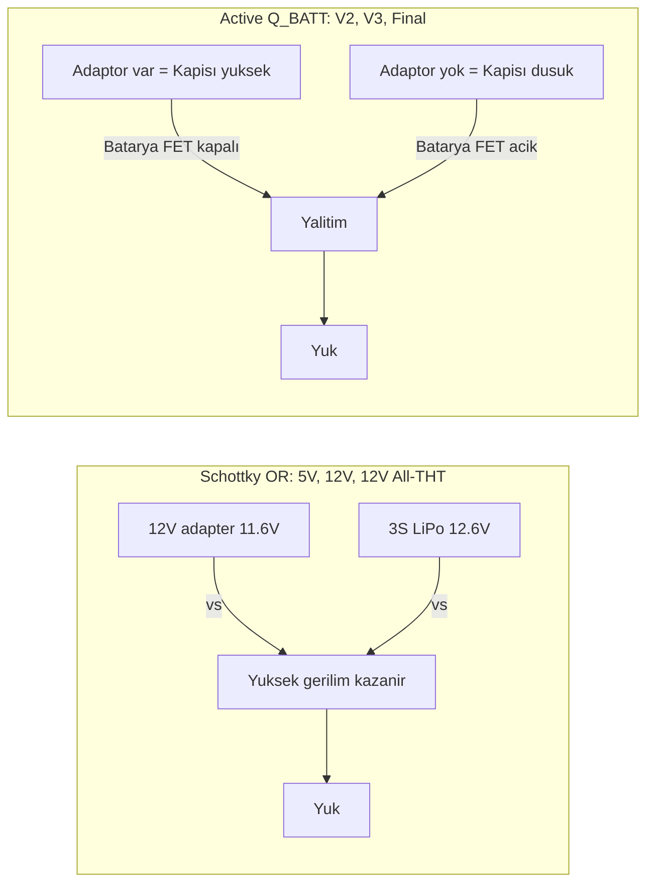

**Q_BATT mantigi:** Adaptor varsa pil yalisilir. Final Design, D_ADAPT ile batarya-guclu BUCK_VIN'i adaptor-duyusu rayina geri sinirlamaz.

### 5b. Sarj Guvenlik Ilerlemesi

| Tasarim | Dahili sarj | Dengeleme | Sonlandirma | Float riski | Termal |
|---|---|---|---|---|---|
| 5V Legacy | TP4056 1S | Yok (1S) | Dogru 4.2V | Dusuk | Dusuk |
| Original 12V | TP5100 path | Yok | Guvensiz 3S | Yuksek | Yuksek |
| 12V All-THT | TP5100 path | Yok | Guvensiz 3S | Yuksek | Yuksek |
| V2 | Hayir | Dis sarj | Dis | Yok | Yok |
| V3-A | Hayir | Dis sarj | Dis | Yok | Yok |
| V3-B | CN3722 | Yok | CN3722 | Dusuk | Orta |
| V3-C | XL4016 | Yok | Yok | Ciddi | Orta |
| **Final** | **Hayir** | **Dis sarj** | **Dis** | **Yok** | **Yok** |

### 5c. Inşa Edilebilirlik ve Guc Maliyeti

| Tasarim | SMD | THT-only | Modül | Guc BOM | Maliyet (₺) |
|---|---|---|---|---|---|
| 5V Legacy | Evet | Hayir | 2 | 12 | 80-120 |
| Original 12V | Evet | Hayir | 4 | 18 | 150-200 |
| 12V All-THT | Hayir | Evet | 4 | 18 | 150-200 |
| V2 Industrial | Hayir | Evet | 2-3 | 16 | 250-350 |
| V3-A Simple | Hayir | Evet | 1-2 | 13 | 180-250 |
| V3-B + CN3722 | Hayir | Evet | 2-3 | 16 | 220-300 |
| V3-C + XL4016 | Hayir | Evet | 2-3 | 15 | 200-280 |
| **Final Design** | **Hayir** | **Evet** | **1-2** | **14** | **180-250** |

### 5d. Firmware Hazirlik

| Grup | Firmware uyumu | Gerekli isler |
|---|---|---|
| 5V Legacy | Direkt uyum | Yok |
| 12V Wemos | Ayni pin haritasi | ADC ayarlandirilmali |
| V2/V3/Final | Goc gerektiriyor | ESP32-S3 PlatformIO, GPIO yeniden esleme, PCNT encoder sayicisi |

| Sinyal | Wemos D1 R32 | ESP32-S3 |
|---|---|---|
| Theta A | GPIO 14 | GPIO 4 |
| Theta B | GPIO 12 | GPIO 5 |
| Phi A | GPIO 32 | GPIO 6 |
| Phi B | GPIO 35 | GPIO 7 |
| Wire A | GPIO 16 | GPIO 15 |
| Wire B | GPIO 17 | GPIO 16 |
| Supply ADC | GPIO 36 | GPIO 1 |

---

## 6. Karar Akisi

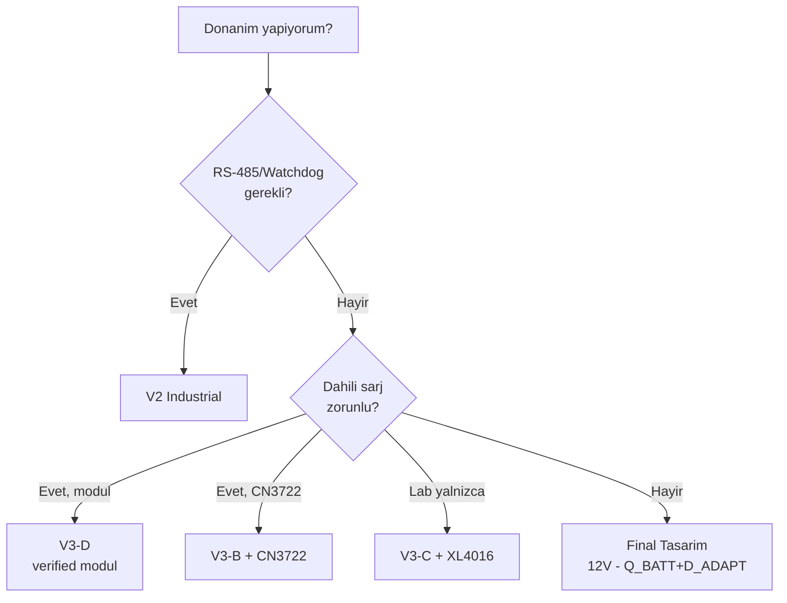

---

## 7. Tavsiye

Yeni EVKA cekirdek sensor haritasi icin **Final Tasarim** yapmaniz gerekir cunkü:

1. **Q_BATT + D_ADAPT:** Adaptor onceligi garantili, batarya yalitimi net.
2. **12V yalnizca:** Makine gucune uyumlu, V15 degiskenlerinin belirsizligi yok.
3. **Dis sarj zorunlu:** Dahili sarj modulu sourcing riskini kaldirir.
4. **ESP32-S3 yolu:** S3 uzun vadeli destegi, PCNT sayici, yerel USB-C.
5. **Tek unambiguous paket:** Hiçbir charger varyant secenek onus degil.

**Oncelikli is:** Guc yolunu dogrulamak icin ilk tahtayı yapin. ESP32-S3 firmware goc ve gercek hardvare validasyon beklemektedir.

| Alan | Tamamlanmis | Kalan |
|---|---|---|
| Donanim karari | Final secildi | Ilk tahtayi insa et |
| Guc yolu | Q_BATT, D_ADAPT, buck, ADC dokumante | Rails, switchover, termal gerçek hardvare'de dogrula |
| Dis sarj | 3S balance charger gerekli | Kasa/hizmet erişim dokumante et |
| Firmware platform | GPIO harita var | ESP32-S3 PlatformIO ortami ekle |
| Encoder kutuphane | PCNT yonu dokumante | ESP32Encoder tercih yap, dogrula |

**V3-D'yi (dahili sarj) yalnizca** eger zorunlu ise ve dogrulanmis modul seti secilmis ise yapin: Secenek A, 5000mAh icin 12.6V/2A modul + 25A BMS + 15V/3A adaptor.

**Tarihsel icin** (5V Legacy veya 12V All-THT): 12V TP5100 3S yolu güvenli/doğrulanmamış olarak ele alın, yeni yapım için kullanmayın.
