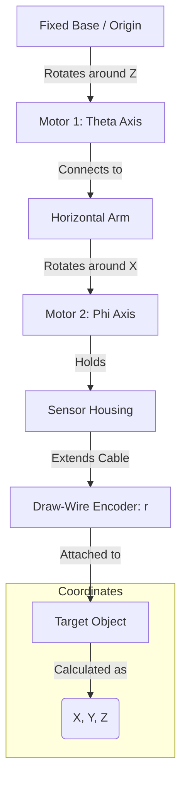

# System Architecture: Spherical 3D Positioning

## Overview
This system calculates the 3D position $(X, Y, Z)$ of a target using a **Spherical Coordinate System** $(r, \theta, \phi)$. It employs two rotary axes for angles and one linear axis for distance.

- **$\theta$ (Theta):** Azimuth angle (Horizontal rotation around Z-axis)
- **$\phi$ (Phi):** Polar angle (Vertical tilt around X-axis)
- **$r$ (Radius):** Linear distance (Extension from origin)

## Kinematic Chain
The mechanical structure follows a serial chain:
`Base` → `Rotary Motor 1 (Theta)` → `Arm` → `Rotary Motor 2 (Phi)` → `Draw-Wire (r)` → `Target`

### Mermaid Diagram

## Mathematical Model

### Coordinate Transformation (Spherical → Cartesian)
Given the sensor readings converted to standard units (radians and meters):

$$
\begin{align*}
X &= r \cdot \sin(\phi) \cdot \cos(\theta) \\
Y &= r \cdot \sin(\phi) \cdot \sin(\theta) \\
Z &= r \cdot \cos(\phi)
\end{align*}
$$

> **Note on Coordinate Convention:**
> - **Z-axis:** Vertical (Up/Down). $\phi=0$ is typically "Up" (aligned with Z).
> - **X-axis:** Forward. $\theta=0$ aligns with X.
> - **Y-axis:** Right/Left.
> *Adjust formulas if your mechanical zero positions differ (e.g., if $\phi=0$ is horizontal).*

### Inverse Kinematics (Cartesian → Spherical)
To find the required sensor values for a target point $(X, Y, Z)$:

$$
\begin{align*}
r &= \sqrt{X^2 + Y^2 + Z^2} \\
\theta &= \text{atan2}(Y, X) \\
\phi &= \text{acos}(Z / r)
\end{align*}
$$

## Accuracy Analysis
Theoretical accuracy at maximum range ($5m$):

| Axis | Sensor | Resolution | Error Contribution (at 5m) |
| :--- | :--- | :--- | :--- |
| **$\theta$** | E40S6 Encoder | $0.018^\circ$ (360°/20000 PPR) | $\approx 1.57mm$ arc length |
| **$\phi$** | E40S6 Encoder | $0.018^\circ$ (360°/20000 PPR) | $\approx 1.57mm$ arc length |
| **$r$** | Draw-Wire | $\pm 0.025mm$ (MM\_PER\_PULSE) | $\pm 0.025mm$ linear |
| **Total** | **Combined** | | **$\approx \pm 3.2mm$** (Worst Case) |

## Calibration Requirements
1. **Zero Point ($\\theta=0, \\phi=0$):** Establish a mechanical home position.
   - Typically: Boom pointing straight up ($\\phi=0$) and forward ($\\theta=0$).
2. **Scale Factors:**
   - Confirm pulses-per-degree for rotary axes.
   - Confirm mm-per-pulse for draw-wire.
