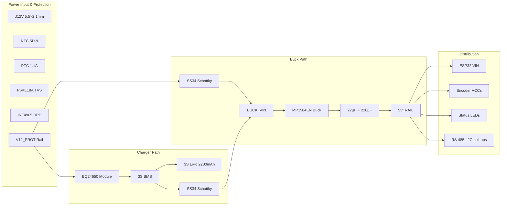

# Power Supply Subsystem — V2 Design

> 12V DC input, 3S LiPo battery backup, BQ24650 switch-mode charger, MP1584EN buck.  
> **100% through-hole**, LPKF S63 compatible.  
> Target: lower heat, lower ripple, simpler assembly than V1.

---

## 1. System Overview



---

## 2. Input Protection

### 2a. Connector

```
J12V — DC barrel jack, 5.5mm outer × 2.1mm inner, center positive
Panel-mount or PCB-mount depending on enclosure
```

### 2b. Inrush Current Limiter

```
    J12V+ ──── NTC 5D-9 ──── F1

    NTC 5D-9: 5Ω cold, ~0.5Ω hot @ 1A
    At power-on: limits inrush to ~12V/5Ω = 2.4A (vs >10A without)
    After warm-up: ~0.5Ω drop = 0.5V @ 1A (negligible)
```

**Why NTC instead of resistor?** Self-heating reduces resistance after startup, so normal operation has minimal loss.

### 2c. Overcurrent Protection

```
    NTC output ──── F1 (Bourns MF-R110, 1.1A hold, 2.2A trip)
    
    PTC polyfuse: resettable, no field spares needed
    Trip time: ~3 seconds at 2.2A
    Alternative: Littlefuse 0251020.NRT1 glass fuse (2A) + holder
```

**Recommendation:** Use **PTC** for field-serviceability. Use glass fuse only if you need faster trip (<100ms).

### 2d. Transient Voltage Suppression

```
    F1 output ────┬──── P6KE18A ────┬──── GND
                  │    (DO-15 axial) │
                  │    cathode band   │
                  │    toward rail    │
                  │                   │
             to Q1 (RPP)              │
```

| Parameter | P6KE18A |
|-----------|---------|
| Standoff voltage | 15.3V (above normal 12V rail — TVS inactive during normal operation, only conducts on transients) |
| Breakdown voltage | 17.1–18.9V |
| Clamping voltage | 25.2V @ 23.8A |
| Peak pulse power | 600W (1ms) |

**Note:** P6KE18A standoff (15.3V) is slightly below 16V Class A max. If your adapter routinely outputs >15V, use **P6KE20A** (17.1V standoff) instead.

### 2e. Reverse Polarity Protection

```
    TVS output ──────────────── Pin 3 (Source)
                                    │
                               ┌────┴────────────┐
                               │    IRF4905       │
                               │   TO-220AB       │
                               │  P-ch MOSFET     │
                               │  Vds = -55V      │
                               │  Rds(on) = 20mΩ  │
                               └────┬────────────┘
                                    │
                         100kΩ ─────┤ Pin 1 (Gate)
                                    │
                                   GND

                          Pin 2 (Drain) ──── V12_PROT
                          Tab (Drain) ──── V12_PROT
```

**Operation:**
- Correct polarity: Gate = 0V, Source = +12V → Vgs = -12V → MOSFET fully ON
- Reversed polarity: Source negative, Gate at 0V → Vgs ≈ 0V → MOSFET OFF
- Voltage drop: 20mΩ × 1.5A = **30mV** (negligible)

**Important:** IRF4905 tab is connected to Drain (V12_PROT). Do NOT bolt it to a grounded heatsink. No heatsink needed at 45mW.

**Alternative:** Series Schottky SS36 (3A, 60V, DO-201 axial). Drop ~0.35V at 1.5A. Simpler wiring but higher loss.

---

## 3. Schottky OR — External 12V vs Battery

```
    V12_PROT ── Anode ─┤ │─ Cathode (band) ──┬── BUCK_VIN
                       │SS34│                │
    3S_OUT+  ── Anode ─┤ │─ Cathode (band) ──┘
                       │SS34│
```

**Behavior:**

| Condition | BUCK_VIN | Source |
|-----------|----------|--------|
| 12V only | ~11.6V (12V − 0.4V) | External via D_EXT |
| Battery only | ~10.7V (11.1V nom − 0.4V) | 3S LiPo via D_BAT |
| Both present | ~11.6V | External wins (higher voltage) |
| 12V disconnected | Seamless switchover <1ms | Battery takes over |

**Hold-up during switchover:** C_IN1 (220µF/35V) provides energy. At 500mA load and 1ms transition:
```
dV = I × dt / C = 0.5A × 0.001s / 220µF = 2.27V
```
BUCK_VIN drops from 11.6V to ~9.33V — MP1584EN operates down to 4.5V, so this is safe.

---

## 4. Buck Converter — 12V to 5V

### 4a. MP1584EN Module

> **Note:** MP2315 is not stocked in Turkey. MP1584EN (direnc.net, 26.46₺) is the confirmed
> in-stock replacement. With the 22µH + 220µF LC post-filter downstream, output ripple is
> <5mVpp — equivalent performance for this application.

```
    BUCK_VIN ── 220µF/35V ──┬── VIN (MP1584EN module)
                            │
                       100nF ceramic disc
                            │
                           GND

    VOUT (module) ──── 22µH ──┬── 220µF/10V low-ESR ── GND
                              │
                         5V_BUCK
                              │
                         SS36 Schottky ──── 5V_RAIL
```

**MP1584EN specs:**
- Input: 4.5V–28V
- Output: 0.8V–25V (adjustable via trim pot)
- Current: 3A max
- Switching frequency: ~1.5MHz
- Efficiency: ~92% @ 12V→5V, 500mA
- Ripple: ~50mVpp (before LC filter; <5mVpp after 22µH + 220µF post-filter)

**Pre-set procedure:**
1. Connect MP1584EN module to 12V input via lab supply
2. Connect 25Ω/2W dummy load (~200mA)
3. Adjust trim pot to **5.10V** (compensates for SS36 Schottky drop)
4. Verify <50mV ripple with multimeter or scope
5. Then connect to rest of circuit

### 4b. LC Post-Filter

| Component | Value | Purpose |
|-----------|-------|---------|
| L_FILT | 22µH, 2A rated | Series inductor blocks switching ripple |
| C_FILT | 220µF/10V low-ESR | Shunt capacitor absorbs ripple |
| C_FILT_HF | 100nF ceramic disc | High-frequency bypass |

**Calculated ripple at 5V_RAIL:** <2mVpp (vs ~5mVpp with old 10µH+100µF)

**Why this matters:** Encoder signals are 5V TTL. A noisy 5V rail can couple into the quadrature edges, causing miscounts at high rotation speeds.

### 4c. 5V Rail Distribution

```
    5V_RAIL
       │
       ├── ESP32 VIN  (direct — SS36/D_OR is upstream of 5V_RAIL, not downstream)
       │
       ├── FB1 ──── J1 VCC (Theta encoder)
       │             └── 100nF ceramic disc to GND
       ├── FB2 ──── J2 VCC (Phi encoder)
       │             └── 100nF ceramic disc to GND
       ├── FB3 ──── J3 VCC (Wire encoder)
       │             └── 100nF ceramic disc to GND
       ├── 1kΩ ──── LED1 (Green, power)
       │
       └── 220µF/16V ── GND (bulk decoupling)
```

---

## 5. Charger Path — BQ24650

### 5a. Why BQ24650 instead of TP5100+MT3608?

> **Important:** CN3767 (Consonance Electronics) is a lead-acid/MPPT solar battery charger —
> it is **not suitable for LiPo/Li-ion cells**. It does not implement Li-ion CC/CV termination,
> has no per-cell overvoltage cutoff, and will overcharge a 3S LiPo pack. The BQ24650 module
> replaces it as the correct switch-mode 3S LiPo charger for this design.

| Aspect | TP5100 + MT3608 (V1) | BQ24650 Module (V2) |
|---|---|---|
| Topology | Linear charger + boost pre-stage | **Synchronous buck charger (switch-mode)** |
| Input voltage | Needs 15V (from MT3608 boost) | **Accepts 6–28V, 12V nominal is ideal** |
| Output | 12.6V CC/CV (after MT3608 to 15V) | **12.6V CC/CV — factory configured for 3S** |
| Heat dissipation | ~2.9W total (TP5100 2.4W + MT3608 0.5W) | **~1.2W** |
| Efficiency | ~84% | **~95%** |
| Modules count | 2 (MT3608 + TP5100) | **1** |
| Pre-set required | 2 trim pots (MT3608→15V, TP5100 current) | **1 trim pot (ISET current limit)** |
| LiPo compatibility | Yes | **Yes — TI BQ24650 is Li-ion/LiPo dedicated** |

**Result:** Remove one module, reduce board heat by 59%, simplify assembly, correct LiPo chemistry.

### 5b. BQ24650 Wiring

```
    V12_PROT ──── BQ24650 VIN+ (module)
    GND ────────── BQ24650 GND (module)
    
    BQ24650 VOUT+ ──── 3S BMS P+ (charge path)
    BQ24650 GND ────── 3S BMS P- (charge path)
    
    BQ24650 BAT+ ──── BMS B+ (or direct to cell 3 +)
    BQ24650 BAT- ──── BMS B- (or direct to cell 1 −)
```

**BQ24650 module features:**
- Input: 6–28V (12V nominal is ideal, well within range)
- Output: 12.6V CC/CV — factory-set for 3S Li-ion/LiPo via precision resistor divider
- Charge current: adjustable via on-board ISET potentiometer
- Status LEDs: charging (red CHRG), charge complete (green DONE)
- Topology: synchronous buck — inductor + FETs, not linear dropout
- **No cell balancing** — BMS handles this

**Pre-connection check:** Measure BQ24650 module output with a multimeter before connecting battery. Confirm 12.55–12.65V open-circuit. Adjust ISET pot to ≤1A for 1500–2200mAh packs.

### 5c. UVLO — Under-Voltage Lockout

The BQ24650 has **internal UVLO** — no external divider circuit is needed. The IC monitors VIN internally and automatically disables charging when input falls below the minimum operating threshold (~4.5V VIN minimum).

```
    BQ24650 internal UVLO:
    ─ Charges when VIN > VBAT + Vmargin (typically ~200mV headroom above pack voltage)
    ─ Inhibits charge when VIN < 4.5V (absolute minimum)
    ─ At 12V input charging a 12.6V 3S pack: VIN headroom ≈ 0V at full charge — normal, charger transitions to standby
```

**Effect in this design:** When 12V adapter sags or is removed, the BQ24650 simply stops charging. The battery then supplies load through the D_BAT Schottky path. No external CE pin resistor divider required.

### 5d. 3S BMS

```
    BQ24650 VOUT+ ──── P+ ┌───────────────┐ B+ ──── Cell 3 (+)
    BQ24650 GND ─────── P- │   HX-3S-01    │ B- ──── Cell 1 (−)
                           │   3S BMS       │ BM ──── Cell 1-2 junction
                           │   10A rated    │ B2 ──── Cell 2-3 junction
                           └───────────────┘
                                │
    3S_OUT+ ◄──── P+ (discharge terminal, to D_BAT)
    GND      ◄──── P- (discharge terminal)
```

**BMS protections:**
- Overcharge cutoff: 4.25V/cell (12.75V total)
- Overdischarge cutoff: 2.5–2.8V/cell (7.5–8.4V total)
- Short-circuit protection: <1ms cutoff
- Overcurrent: 10A continuous
- **Passive balancing:** Small bleed resistors across cells (if present on your BMS board)

**CRITICAL:** Verify your BMS has the **balance function**. Look for small 100Ω resistors near the balance pins. If not, cells will drift over months of cycling.

### 5e. Battery Connector

```
    J_BAT (JST-XH-4P, 2.5mm pitch)
    ┌──────────────────────────────┐
    │ Pin 1: B-  (Cell 1 −)       │
    │ Pin 2: BM  (Cell 1-2 mid)   │
    │ Pin 3: B2  (Cell 2-3 mid)   │
    │ Pin 4: B+  (Cell 3 +)       │
    └──────────────────────────────┘
```

Match polarity to your LiPo pack's balance lead.

---

## 6. 12V Voltage Monitoring

### 6a. Divider for ESP32 ADC

```
    V12_PROT ── 120kΩ 1% ──┬── GPIO 1 (ADC1_CH0)
                           │
                      27kΩ 1%
                           │
                          GND
    
    Scale factor: (120k + 27k) / 27k = 5.444
    
    At 12.0V: V_adc = 12.0 / 5.444 = 2.20V
    At 9.0V (3S empty): V_adc = 9.0 / 5.444 = 1.65V
    At 15.0V (max expected): V_adc = 15.0 / 5.444 = 2.75V
```

**Why GPIO 1 instead of GPIO 36?** On ESP32-S3, GPIO 36 is reserved for SPI flash/PSRAM. GPIO 1 is ADC1_CH0, which remains available when WiFi is active (unlike ADC2 channels).

### 6b. ADS1115 Header (Optional, 16-bit)

For precision monitoring, add an ADS1115 module on the I2C header:

| ADS1115 Channel | Signal | Expected Voltage |
|-----------------|--------|------------------|
| AIN0 | V12_PROT (via 120k/27k divider) | 1.65–2.75V |
| AIN1 | 3S_OUT+ (via 120k/27k divider) | 1.65–2.31V |
| AIN2 | 5V_RAIL | 0–5V (use 10k/10k divider to scale to 2.5V max) |
| AIN3 | 3.3V rail | 0–3.3V |

**Firmware:** Read all 4 channels every 1 second, broadcast via WebSocket/TCP for remote diagnostics.

---

## 7. Net Summary

| Net | Source | Destinations | Voltage |
|-----|--------|-------------|---------|
| J12V+ | DC jack | NTC → F1 → TVS → Q1 | 9–16V (Class A) |
| V12_PROT | Q1 drain | D_EXT, BQ24650 VIN, ADC divider | ~12V (protected) |
| 3S_OUT+ | BMS P+ | D_BAT anode | 9.0–12.6V |
| BUCK_VIN | D_EXT/D_BAT cathodes | MP1584EN VIN | 9.0–11.6V |
| 5V_BUCK | MP1584EN output | LC filter → SS36 | 5.10V |
| 5V_RAIL | SS36 cathode | ESP32 VIN, encoders, LEDs, RS-485 | 4.75–4.85V |
| BAT_CHG+ | BQ24650 BAT+ | BMS P+ | 0–12.6V |
| GND | Common | All components | 0V |

---

## 8. Test Points

| TP | Signal | Expected |
|----|--------|----------|
| TP12 | V12_PROT | 11.5–12.5V |
| TP_BV | BUCK_VIN | 9.0–11.6V |
| TP5 | 5V_RAIL | 4.75–4.85V |
| TP33 | 3.3V (ESP32 onboard LDO) | 3.25–3.35V |
| TP_BAT | 3S_OUT+ | 9.0–12.6V |
| TPG | GND | 0V reference |

---

## 9. Assembly Warnings

1. **Pre-set MP1584EN to 5.10V** before connecting ESP32. Use 25Ω/2W dummy load.
2. **Pre-set BQ24650 ISET current** to ≤1A for 1500–2200mAh packs. Never exceed 1C charge rate. Verify output is 12.55–12.65V open-circuit before connecting battery.
3. **Verify BMS 3S jumper** (if present) — some modules ship in 2S mode.
4. **Double-check all Schottky diode bands** — reversed diode in OR circuit causes back-feed.
5. **Do not bolt IRF4905 to grounded heatsink** — tab is Drain (V12_PROT).
6. **Do not apply 12V to ESP32 VIN** — only 5V_RAIL connects to VIN pin.

---

## 10. Thermal Budget

| Component | Power | Temperature Rise |
|-----------|-------|-----------------|
| MP1584EN buck | ~0.35W @ 500mA | ~15°C (module heatsink sufficient) |
| BQ24650 charger | ~1.2W @ 1A charge | ~40°C (ensure airflow) |
| IRF4905 RPP | 45mW @ 1.5A | Negligible |
| SS36 diodes (3×) | ~0.3W each | Warm, acceptable |
| ESP32 AMS1117 | ~0.34W @ 200mA | ~20°C |
| **Total** | **~2.9W** | Spread across board |

**No fan required.** Ensure BQ24650 module has ~5mm clearance on all sides.
