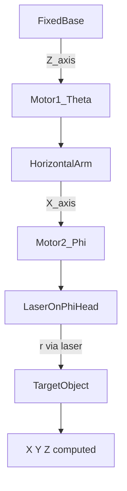

# Laser Radius Research — Spherical Positioning Variant

**Location:** `laser_radius/` at repo root — all detailed research deliverables live here.

**Scope:** Detailed research for an EVKA positioning variant that replaces the draw-wire radius encoder with a laser distance measurement, while keeping two rotary encoders for azimuth (θ) and elevation (φ).  
**Status:** Detailed study, revised to a fixed requirement (2026-07-01) — device shortlists, kinematics/calibration, firmware sketch, procurement plan, and a LaTeX summary report are documented below and in the linked files. Physical bench testing has not started.  
**Baseline (current production):** ESP32-WROOM + 2× E40S6 rotary encoders + OPKON DWEM2 draw-wire.  
**Target platform (this variant):** ESP32-S3-DevKitC-1 on EVKA_position_v2 carrier direction.

---

## Executive Summary

**Fixed requirement:** laser range ≤ 40 m, laser device accuracy ≤ 10 mm (target sub-cm) across that full range. This is the laser sensor's own datasheet spec, not the total combined-system XYZ accuracy — see [`kinematics_and_calibration.md`](kinematics_and_calibration.md) §4 for why the rotary encoders separately add error that this spec doesn't cover.

**This single number is a real physics dividing line, and it reshaped the shortlist from an earlier draft of this study:** cheap pulsed time-of-flight LIDAR modules (the entire Benewake TF-series, DFRobot SEN0492) measure round-trip pulse timing directly and only achieve ±5cm–±1%-of-reading accuracy — they **fail this spec** and are excluded as recommendations (kept only as documented "does not meet spec" reference entries in `version_b_integrated_modules.md` §1). Phase-shift (AMCW) laser distance meters — the Leica handheld class, and industrial OEM modules like Meskernel and Dimetix — measure phase difference of a modulated beam and achieve flat, distance-independent mm-class accuracy across their full rated range. Every **certified** device below is confirmed phase-shift; two popular families (**Bosch** handhelds and the **JRT** OEM modules) are **flagged** rather than certified — the stricter 2026-07-08 survey could not confirm their measurement principle is phase-shift from any primary source, so they are held out of the recommended pass list until that is verified (they are *not* excluded — they are not ToF or %-of-reading; see `version_a_handheld_devices.md` §2.3).

**Recommendation (confirmed-phase-shift-first, revised 2026-07-08):** lead the bench path with a device whose phase-shift principle *and* price are both confirmed. Cheapest such path is the **Meskernel LDL-T** — both 2026-07-08 surveys confirm it as phase-shift; ±1 mm, 100 Hz, UART TTL/RS232/RS485; confirmed street price ~$87.50 (~4,097 TRY) for the 80 m LDL-T-80, ~$68–80 for the 40 m LDL-T 40. For the lowest *integration* risk, the **Dimetix D-series** is the only candidate with a fully public ASCII command set — the newly-confirmed **DBN-50-050** (±5 mm, still under the ≤10 mm bar) at CHF 1,076 / ~$1,332 is the budget entry, the **DAE-10-050** (±1 mm) at ~$2,700 the precise one. For a confirmed, domestically-stocked handheld, the **Leica DISTO D5** (±1 mm, 200 m, BLE) is now confirmed available in Turkey. **Flagged — do not certify yet:** the **Bosch PLR 40 C / GLM 50-27 CG** and **JRT B605B / M88B** are attractive on price and (for Bosch) domestic availability, but the stricter survey could not confirm their measurement principle from any primary source — treat them as promising-but-unverified and confirm the principle before committing. Reach for an industrial module (Micro-Epsilon ILR2250/3800, WayCon LDI, FAE LS 121/122 FA) only if IP-rated/certified housing becomes a hard requirement — a large cost premium for accuracy margin the Meskernel/Dimetix path already clears. Full reasoning: [`version_a_handheld_devices.md`](version_a_handheld_devices.md), [`version_b_integrated_modules.md`](version_b_integrated_modules.md), and the bench-test order in [`procurement_and_bom.md`](procurement_and_bom.md).

**2026-07-01 addendum — extended shortlist:** a second research pass (assisted by a Copilot CLI research agent) more than tripled the candidate count — 8 more handheld/BLE devices (Hilti PD-I, Leica DISTO D2/S910, Bosch GLM 50-27CG/165-27CG, Stanley TLM165i, RS PRO/CEM iLDM-150H, ADA Cosmo 60 Green) and 5 more industrial fixed-mount devices (Micro-Epsilon optoNCDT ILR1181-3/ILR2250/ILR3800, Jenoptik LDM4x, WayCon LDI, Scantron SLS), all confirmed phase-shift and meeting the ≤10mm/≤40m spec. Two standouts worth knowing about even in this summary: **RS PRO ILDM-150H** (~$90–130) is the cheapest BLE handheld found, potentially unseating Bosch on price with comparable local availability via RS Components' Turkey branch; **Leica DISTO S910** (~$900–1,200) is the single best-specified handheld (±1.0 mm, 300 m range, *native* wired USB — no accessory cable needed), priced near the industrial tier. The research also produced a documented "don't re-check these" list of 15+ rejected devices/manufacturers (wrong tech, wrong range, or no data interface) — see §3.1/§3.2 in the two device files.

**2026-07-08 addendum — confirmed pricing & SKU survey:** a targeted Istanbul price/model survey (two independent passes) replaced most of the earlier *estimates* with **CONFIRMED** prices and exact SKUs, and it changed two recommendations:
- **Confirmed prices/SKUs:** Dimetix **DAE-10-050** (P/N 500633, ±1 mm, ~$2,700) and **DBN-50-050** (P/N 500635, ±5 mm, ~$1,332 — cheapest qualifying Dimetix); Leica **DISTO D5** (confirmed in TR), **S910** (~$1,916–2,132 — **corrected up** from the earlier ~$900–1,200 estimate), and D2 (current refresh SKU 986858 = 150 m); Bosch **GLM 50-27 CG** (8,200 TRY / ~$175); Meskernel **LDL-T-80** (~$87.50, and its rate corrected **30 → 100 Hz**).
- **New models added:** Leica **DISTO X6** (250 m, ±1 mm — the practical rugged X4 successor alongside the D5), Dimetix **DBN-50-050**, Meskernel **LDK-40**, JRT **M88B**, and **FAE LS 121/122 FA** (50 m, ±3 mm industrial). New price *anchors* (still ESTIMATE) for the previously quote-only Micro-Epsilon **ILR2250** (~$1,800) and Jenoptik **LDM41** (~$1,500).
- **Corrections:** Bosch and JRT **demoted to a flagged (uncertified) tier** — see the physics note above. Micro-Epsilon's older **ILR1171/1181/1191** family is **pulsed ToF** (rejected); ILR2250/ILR3800 remain the confirmed phase-comparison picks. Jenoptik LDM4x's 150 m headline is reflector-dependent (~30 m on natural surfaces) — flagged.
- **New figures:** `report/figures/price_vs_accuracy.png` (same ±1 mm accuracy spans ~$43→$2,772) and `turkey_availability.png` (lead-time by sourcing class), generated by `report/figures/make_figures.py`. FX used: USD/TRY 46.85, CHF/USD 1.238, EUR/USD 1.141, GBP/USD 1.336 (2026-07-08).

**A brief LaTeX report summarizing this whole study is in [`report/`](report/report.pdf).**

**A key finding that affects both versions:** the RS-485 GPIO plan cited below (§1.4) comes from the older `12v_legacy/v2` pin map. The current as-built 5V v2 board wires those same pins differently (no dedicated RS-485/RS422 header exists yet) — see [`version_b_integrated_modules.md`](version_b_integrated_modules.md) §4 for the corrected wiring and the new-hardware implications.

---

## 1. Overview and Concept

### 1.1 Relation to Current System

The existing system computes 3D position from spherical coordinates `(r, θ, φ)` and converts to Cartesian `(X, Y, Z)` using the same elevation-azimuth convention documented in [`docs/hardware_design/system_architecture.md`](../docs/hardware_design/system_architecture.md) and implemented in `firmware/src/SphericalSensor.cpp`.

In this variant, **only the radius source changes**: instead of quadrature counts from a draw-wire drum, `r` comes from a laser distance measurement on the phi (elevation) head. The two rotary encoders remain unchanged in role.

### 1.2 Kinematic Chain

Current draw-wire chain:

`Base → Theta → Arm → Phi → Draw-Wire → Target`

Proposed laser chain:

`Base → Theta → Arm → Phi → Laser (on phi head) → Target`

The laser is mounted on the phi head and points at the target along the boom, replacing the draw-wire cable path.

### 1.3 Why Laser Instead of Draw-Wire

| Factor | Draw-wire (current) | Laser (proposed) |
|--------|---------------------|------------------|
| Mechanical coupling | Cable sag, wrap, drum wear | Line-of-sight only |
| Calibration | `CAL_W`, drum circumference, PPR | Device offset, reflectivity |
| BOM / wiring | 3rd quadrature encoder (2 lines) | Serial or RS232/RS422/RS485 interface |
| Dual use | Fixed to machine | Version A: detachable handheld possible |
| Accuracy at 40 m | Good linear step (~0.025 mm/count), but ≤3 m practical reach | ±1–2.6 mm class (phase-shift devices) at full 40 m range |

### 1.4 ESP32-S3 Pin Baseline

Align with V2 pin assignment ([`pin_assignment_v2.md`](../docs/hardware_design/12v_legacy/v2/pin_assignment_v2.md)):

| Function | GPIO | Notes |
|----------|------|-------|
| Theta A/B | 4, 5 | Unchanged |
| Phi A/B | 6, 7 | Unchanged |
| Wire A/B/Z | 15, 16, 17 | **Freed** — no draw-wire in this variant |
| RS-485/RS422 TX/RX/DE | 13, 14, 18 | Version B fixed laser; optional for Version A wired serial. **Superseded** — the current as-built 5V v2 board wires 13/14 as general AUX pins and 18 as BTN2; see [`version_b_integrated_modules.md`](version_b_integrated_modules.md) §4 for the corrected 13/14/15 wiring. |
| Battery ADC | 1 | Optional, if carrier retains 12V monitor |

### 1.5 Accuracy Baseline (Current vs. Fixed Requirement)

Current draw-wire system (from system architecture, at ~5 m, ≤3 m practical reach):

| Axis | Source | Typical error contribution |
|------|--------|---------------------------|
| θ, φ | E40S6 @ 20000 PPR | ~1.57 mm arc at 5 m (grows linearly with range — ~12.6 mm at 40 m) |
| r | Draw-wire | ±0.025 mm per count step |
| Combined XYZ | — | ~±3.2 mm worst case at 5 m |

**Laser variant fixed requirement:** ≤ 40 m range, ≤ 10 mm laser device accuracy (device spec, confirmed as the target — see Executive Summary). Every shortlisted device meets this with 4–10× margin (§2/§3 below and the linked files) — the harder number to watch is the *combined* system accuracy at long range, which the encoders alone push to ~18 mm at 40 m regardless of laser choice (see `kinematics_and_calibration.md` §4); that's out of scope for this laser-selection study per the user's decision but worth keeping in mind.

### 1.6 Related Work in This Repo

[`docs/research/improvement_research.md`](../docs/research/improvement_research.md) mentions a VL53L1X ToF sensor for cross-validation against the draw-wire — that is a short-range sanity check, not a full radius replacement. This folder covers a dedicated laser-radius architecture with two sub-versions below.

---

## 2. Version A — Detachable Handheld / Wired-Serial Laser

Mounted on the phi head during operation, quick-disconnect so the same tool can be used standalone in the field. **Full shortlist, per-device specs, protocol notes, and pricing: [`version_a_handheld_devices.md`](version_a_handheld_devices.md).**

Top candidates against the ≤40m/≤10mm spec: **Meskernel LDL-T** (confirmed phase-shift, ±1mm to 80m, RS232/RS485/USART, native **100 Hz**, ~$68–87.50), **Leica DISTO D5/S910** (±1mm to 200–300m, BLE + native USB on S910, confirmed TR pricing), and — *flagged, phase-shift unconfirmed by the stricter survey* — **JRT B605B/M88B** (≈±2.6mm @ 40m, RS232 TTL, cheapest wired option) and **Bosch PLR 40 C** (±2mm flat to 40m, BLE-only, best local availability). Extended research added Hilti PD-I, Leica DISTO D2/X6/S910, Bosch GLM 50-27CG/165-27CG, Stanley TLM165i, RS PRO/CEM iLDM-150H, ADA Cosmo 60 Green — 13 qualifying/flagged devices total. **UNI-T LM50A (and Makita LD050P, found in the addendum) remain unsuitable** regardless of the spec change — neither has any automated data interface at all (no Bluetooth/USB/RS232), which is an integration problem, not an accuracy one.

---

## 3. Version B — Built-In Fixed Laser Module

Permanently mounted on the phi head — no operator handling. **Full shortlist, wiring, and the as-built GPIO correction: [`version_b_integrated_modules.md`](version_b_integrated_modules.md).**

The previously-considered primary pick (Benewake TF02-i-RS485, and its TF03/TFmini/SEN0492 alternatives) **fails the ≤10mm spec** — pulsed-ToF modules land at ±5cm–±1% of reading, 5–40× over budget — and is now excluded, kept only as a documented reference for why. The primary path is a **Dimetix D-series** industrial phase-shift sensor — now pinned to confirmed SKUs: **DAE-10-050** (±1mm, ~$2,700) or the cheaper **DBN-50-050** (±5mm, still ≤10mm, ~$1,332), both with a fully public ASCII command set (lowest integration risk of any candidate). Far cheaper: panel-mount the **Meskernel LDL-T** bare module (confirmed phase-shift, ±1mm, 100 Hz) as a fixed installation instead of a handheld dock — the **JRT B605B** works the same way but is flagged (phase-shift unconfirmed). Extended research added industrial-tier alternatives to Dimetix (Micro-Epsilon optoNCDT ILR2250/ILR3800 ~$1,800, Jenoptik LDM41 ~$1,500, FAE LS 121/122 FA ~$1,400, WayCon LDI quote-only, Scantron SLS — all ±1-3mm class) plus a sweep of 13 manufacturers (SICK, Banner, Wenglor, Balluff, Contrinex, Riftek, and others) that turned out to sell the wrong technology (pulsed ToF or short-range triangulation) — documented as a "don't re-research" list. Note: Micro-Epsilon's older ILR1171/1181/1191 line is pulsed ToF (2026-07-08 correction) and now rejected — use the phase-comparison ILR2250/ILR3800 instead.

---

## 4. Open Questions

1. ~~Range and accuracy requirements~~ — **resolved**: ≤40 m, ≤10 mm laser device accuracy (2026-07-01).
2. **Spherical origin offset** — distance from laser aperture to mechanical pivot; correction term in `r` before `sphericalToCartesian()`. See `kinematics_and_calibration.md` §1.
3. **Target reflectivity** — dark, glossy, or angled surfaces; need for retroreflector plate or laser filter window on phi head. See `kinematics_and_calibration.md` §2.
4. **Exact pricing for most candidates** (JRT B605B, Meskernel LDL-T, Leica's current D-line, and all 4 addendum industrial modules) — unconfirmed, need direct quotes. See `procurement_and_bom.md` Open Risks.
5. **Update rate** — resolved for the recommended devices (JRT ~8Hz needs hold-last-value gap-filling; Meskernel/Bosch/Dimetix don't). See `firmware_integration.md` §2.
6. **Firmware architecture** — new `LaserRadiusSensor` class vs extending `SphericalSensor.h`; removal of wire encoder and `CAL_W` / `PPR_WIRE` paths. Sketch in `firmware_integration.md` §4.
7. **Calibration workflow** — replace draw-wire `CAL_W` with laser zero offset and optional scale check. Proposed in `kinematics_and_calibration.md` §3.
8. **Safety and enclosure** — Class 1 vs Class 2 exposure; interlocks if operator can remove dock (Version A).
9. **CMD / WiFi dashboard** — expose radius source type in `STATUS` / WebSocket JSON; update calibration UI tab.
10. **Dimetix's exact current-catalog SKU** for a confirmed 40 m RS232/RS422 unit — see `version_b_integrated_modules.md` Open Risk #1.

---

## 5. Next Steps

1. Order a **Meskernel LDL-T** (confirmed phase-shift, cheapest such option) and a **Dimetix DBN-50-050** (confirmed public ASCII protocol, lowest integration risk) as the two confirmed-phase-shift leads — see `procurement_and_bom.md` §2 for the full bench-test order.
2. Bench-test the confirmed lead at 5 m / 20 m / 40 m against a known reference to confirm its datasheet accuracy holds in practice.
3. Measure spherical origin offset (`d_offset_mm`) on a physical phi-head mock-up.
4. Draft the `LaserRadiusSensor` firmware class and prototype the non-blocking poll pattern from `firmware_integration.md` §2 on a bare ESP32-S3 dev board.
5. Only pursue the **flagged** Bosch/JRT modules after confirming their phase-shift principle from a primary source; escalate to the industrial tier (Micro-Epsilon, WayCon, FAE) only if IP-rated housing becomes a hard requirement.

---

## Folder Index (detailed research)

| File | Status |
|------|--------|
| `README.md` | Executive summary + brief overview (this file) |
| `RESEARCH_PROMPT.md` | Prompt used for the original deep-dive research pass |
| [`version_a_handheld_devices.md`](version_a_handheld_devices.md) | Done — 12 wired/BLE candidates vs. the ≤40m/≤10mm spec (4 original + 8 from the 2026-07-01 addendum); why UNI-T LM50A / Makita LD050P are excluded |
| [`version_b_integrated_modules.md`](version_b_integrated_modules.md) | Done — Dimetix D-series + 4 more industrial-tier options + JRT/Meskernel budget path; TF02-i-class and 13 rejected manufacturers documented with physics reasoning |
| [`kinematics_and_calibration.md`](kinematics_and_calibration.md) | Done — offset geometry, `CAL_W`-replacement workflow, combined error-budget table |
| [`firmware_integration.md`](firmware_integration.md) | Done — interface options, 20 Hz feasibility, BLE+WiFi coexistence, `LaserRadiusSensor` sketch |
| [`procurement_and_bom.md`](procurement_and_bom.md) | Done — pricing/supplier table, recommended bench-test order |
| [`report/report.pdf`](report/report.pdf) | Done — brief LaTeX report summarizing this whole study |

---

*Document created: 2026-07-01. Revised same day to a fixed ≤40m/≤10mm requirement (dropping the earlier proposed tier framework). Detailed study — not a build specification; no firmware or PCB files were changed. Physical bench testing is the next phase (see each file's "Next Physical Test Steps").*
