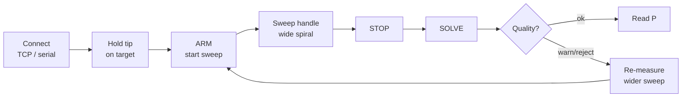
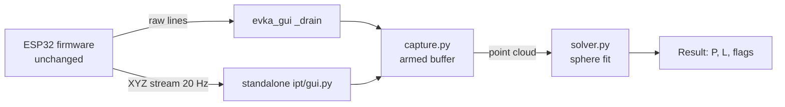

# Quick IPT — hidden-point measurement

Recover a target point that the pen **cannot touch directly** (around a corner,
behind an obstacle, inside a recess) using the same method as the Prodim Proliner V9's
"Quick IPT" (Inverted Pen Technology).

You hold the pen **tip** fixed on the hidden target and sweep the **handle**. The
draw-wire attaches to the pen *body*, a fixed distance `L` from the tip, so every
point evka_position measures during the sweep lies on a **sphere of radius `L`
centred on the target**. Fitting that sphere returns the target. evka_position has
the same sensor topology as the Proliner V9 (one wire + two angle encoders), so the
method transfers directly — this tool needs **no firmware change**.

Prototype limitation: theta count loss is unresolved, so real IPT accuracy is not accepted. Results
are sensor-frame points. `tools/evka_gui` does not apply an endpoint/world transform, and no current
transform has been accepted.

```
            measured attachment points  M_i  (on a sphere of radius L)
                      .  .  .
                  .            .
                .    target P    .        the tip is held on P;
                .   (tip fixed)  .        the handle sweeps, so the wire-side
                  .            .          attachment point M_i traces a sphere
                      .  .  .             centred on P.
```

## Quick start

```bash
# Unified GUI (recommended) — connect once, then use inline Quick IPT
python -m tools.evka_gui --tcp 192.168.1.50:8080

# Standalone IPT (own connection UI)
# WiFi (raw CMD server, default port 8080) — AP CMDCNC_EVKA @ 192.168.1.50
python -m tools.ipt --tcp 192.168.1.50:8080

# Serial
python -m tools.ipt --serial /dev/ttyUSB0 --baud 115200

# No flag → opens disconnected; pick TCP/serial in the panel
python -m tools.ipt
```

When using `evka-gui` / `python -m tools.evka_gui`, use the inline **Quick IPT**
group on the main panel (ARM/STOP/SOLVE). Optional toolbar **IPT plots…** opens
full-height projections. No second connection is needed.

**Dependencies:** `numpy`, `PyQt5`, `pyqtgraph`, `pyserial` (all in `pyproject.toml`).

## Trying it out — step by step

### Option A: No hardware (solver self-check)

You can run the sphere-fit solver on synthetic data right now, no ESP32 needed:

```bash
python -m tools.ipt.solver
```

Expected output:

```
P_hat = [1200.101 -450.051  300.389]  L_hat = 399.596 mm  rms = 0.0734 mm  cond = 35  slip = ok  geom = ok
target error = 0.405 mm
```

This generates 12 points on a synthetic 35° spiral, fits the sphere, and prints
the recovered target, pen length, RMS residual, and quality flags. It proves the
math works before you touch any hardware.

### Option B: Run the tests

```bash
python -m pytest tools/ipt/tests/ -v
```

10 offline tests: solver recovery, known-radius path, slip detection, geometry
conditioning, too-few-points, large-offset centering, capture arming, dedup,
invalid-frame dropping, and TCP XYZ/SENSOR pairing.

### Option C: Connect to a real EVKA device over WiFi (TCP)

**Recommended:** use the unified GUI and the inline **Quick IPT** panel after
connecting (no second socket). Standalone steps below still apply if you
prefer `python -m tools.ipt`.

1. **Power on the EVKA device.** It creates a WiFi AP:
   - SSID: `CMDCNC_EVKA`
   - Password: `cmdcnc1234`

2. **Connect your PC to that WiFi network.**

3. **Run the tool:**
   ```bash
   # Unified GUI (recommended)
   python -m tools.evka_gui --tcp 192.168.1.50:8080
   # Connect, then use inline Quick IPT

   # Standalone IPT
   python -m tools.ipt --tcp 192.168.1.50:8080
   ```
   Or open standalone without arguments and fill in the panel:
   ```bash
   python -m tools.ipt
   ```
   Then select **TCP**, enter `192.168.1.50` : `8080`, click **CONNECT**.

4. **If the device is in router (STA) mode** instead of AP, use the STA IP:
   ```bash
   python -m tools.ipt --tcp 192.168.1.84:8080
   ```
   (STA static IP is `192.168.1.84`, gateway `192.168.1.254` — see
   `SphericalSensor.h` for the current profile.)

5. **Subnet conflict?** If `192.168.1.50` is unreachable, your PC may be routing
   it to your home router. Disconnect from home/office WiFi and connect to
   `CMDCNC_EVKA` only.

### Option D: Connect over serial (USB)

1. **Plug the ESP32 into your PC** via USB.

2. **Find the serial port:**
   ```bash
   # Linux
   ls /dev/ttyUSB* /dev/ttyACM*

   # macOS
   ls /dev/cu.usbserial* /dev/cu.usbmodem*

   # Windows (Device Manager → Ports)
   #   COM3, COM4, etc.
   ```

3. **Run the tool:**
   ```bash
   # Linux
   python -m tools.ipt --serial /dev/ttyUSB0 --baud 115200

   # macOS
   python -m tools.ipt --serial /dev/cu.usbserial-XXXX --baud 115200

   # Windows
   python -m tools.ipt --serial COM3 --baud 115200
   ```

   Or open the GUI and pick **Serial** in the connection panel.

### Using the GUI

Once connected, the GUI has three panels:

**Connection** (top right):
| Field | Default | Description |
|---|---|---|
| TCP / Serial radio | TCP | Pick transport |
| Host (TCP) | `192.168.1.50` | AP fallback IP |
| Port (TCP) | `8080` | CMD TCP port |
| Serial port | `/dev/ttyUSB0` | USB serial device |
| Baud | `115200` | Firmware baud rate |
| CONNECT / DISCONNECT | — | Start/stop transport |

**Capture** (middle right):
| Control | Action |
|---|---|
| Known pen length L | Enter mm (e.g. `400`) or leave blank for self-calibration |
| ARM / START SWEEP | Begin capturing points (clears previous buffer) |
| STOP | Stop capturing |
| SOLVE | Fit sphere to captured points and show result |
| CLEAR | Clear points and result |

**Result** (bottom right):
| Field | Shows |
|---|---|
| Points | Count of accepted samples (need ≥ 8) |
| P | Recovered target X, Y, Z in mm (sensor frame) |
| L_hat / L used | Fitted pen length (self-cal) or entered value + independent fit |
| RMS residual | Sphere fit quality in mm + status [ok/warn/reject] |
| Geometry cond | Sweep quality number + status [ok/warn/block] |

**3D view** (left): green dots = captured points, blue translucent sphere = fit,
orange marker = recovered target P.

### Doing a real measurement

1. **Connect** (TCP or serial — see above).
2. **Attach a pen** to the draw-wire body at a fixed offset from the tip. The
   exact offset doesn't matter if you leave L blank (self-calibrating).
3. **Hold the pen tip firmly** on the point you can't reach directly.
4. Click **ARM / START SWEEP**.
5. **Sweep the handle** in a wide spiral — aim for 30°+ of movement in multiple
   directions. The bigger the sweep, the better the geometry.
6. Click **STOP** (need at least 8 points; 15–20 is better).
7. Click **SOLVE**.
8. **Check the quality flags:**
   - **RMS residual [ok]** + **Geometry cond [ok]** → good measurement, read P.
   - **[warn]** → marginal; consider re-measuring with a wider sweep.
   - **[reject]** or **[block]** → re-measure. Tip slipped or sweep too small.
9. The recovered **P** (X, Y, Z) is in the sensor origin frame, in mm.

### Headless use (no GUI)

`solve_ipt()` works on any numpy array — useful for batch processing or scripts:

```python
import numpy as np
from tools.ipt.solver import solve_ipt

# M is an (n, 3) array of measured attachment points in mm
M = np.array([
    [1200.1, -450.0, 300.2],
    [1205.3, -448.1, 310.5],
    # ... at least 8 points
])

# Self-calibrating (L unknown)
out = solve_ipt(M)
print(out["P"], out["L_hat"], out["L_fit"],
      out["slip_warning"], out["geom_warning"])

# Known pen length (L = 400 mm)
out = solve_ipt(M, L=400.0)
print(out["P"], out["L_hat"], out["L_fit"])  # L_hat == 400, L_fit == independent
```

Return dict fields:

| Key | Type | Meaning |
|---|---|---|
| `ok` | bool | True if enough points; False if < 8 |
| `P` | np.ndarray (3,) | Recovered target [X, Y, Z] in mm |
| `L_hat` | float | Fitted pen length (self-cal) or entered L (known-L mode) |
| `L_fit` | float | Independent algebraic sphere-fit radius (sanity check) |
| `rms_resid` | float | RMS residual of the sphere fit in mm |
| `cond` | float | Geometric Jacobian condition number |
| `n_points` | int | Number of accepted points |
| `slip_warning` | str | "ok" / "warn" / "reject" |
| `geom_warning` | str | "ok" / "warn" / "block" |

## Workflow



1. **Connect** (TCP or serial).
2. Hold the pen **tip** on the hidden target.
3. **ARM / START SWEEP**, then sweep the handle through a **wide spiral** (the
   bigger the cone, the better the result — see "Why a big movement").
4. **STOP**, then **SOLVE**.
5. Read the recovered **P**, the self-calibrated **L_hat** (or **L used** if you
   entered a fixed value), and the quality flags. Leave the *Known pen length L*
   field blank to self-calibrate, or enter the nominal pen length (e.g. 200/400/600)
   to use the better-conditioned solver and sanity-check `L_fit` against it.

The recovered **P is in the sensor origin frame** (the boot zero-point set by
`setZeroPoint()`), in mm — the same frame as the live X/Y/Z readout, *not* a world
frame.

## Reading the quality flags

| Field | Meaning |
|---|---|
| **Points** | Accepted samples. Need ≥ 8; more averages down noise (~1/√n). |
| **L_hat** | Self-calibrated pen length (when L field is blank). Should match your physical pen within a few mm. |
| **L used / fit** | When L is entered: `L used` is the fixed value; `fit` is the independent algebraic sphere-fit radius — compare to sanity-check the entered length against the data. |
| **RMS residual** | How cleanly the points lie on one sphere. Rises when the tip slips. |
| **Geometry cond** | Dilution of precision from the sweep shape. High = sweep too small/flat. |

Status bands (heuristics, tuned in simulation — re-tune on real hardware):

- **RMS residual** — `ok < 2 mm`, `warn 2–5 mm`, `reject > 5 mm`.
- **Geometry cond** — `ok` up to ~25° sweep, `warn` ~10–20° (≈2 mm error),
  `block` below ~5° (≈20 mm error).

### Why a big movement?

A small or single-plane sweep leaves the sphere centre poorly determined along the
sweep axis (a small patch of a big sphere is nearly flat — it doesn't pin a
centre). This is geometric dilution of precision, exactly like poor satellite
geometry in GNSS. Simulation: a 3° sweep gives ~85 mm error; a 70° sweep gives
~0.17 mm. If `Geometry cond` warns, **open the sweep wider**. In tight spaces, a
two-direction "cross" motion is the minimum viable substitute for a full spiral.

### "Reject" / tip slipped

If the tip wanders off the target during the sweep, the points no longer lie on a
single sphere and the RMS residual climbs. A `reject` flag means re-measure.

## Hardware assumptions

- **Sensor topology:** one draw-wire encoder (radius) + two rotary encoders (θ, φ).
- **Coordinate frame:** sensor origin at boot zero-point; X/Y/Z in mm; θ azimuth, φ elevation from horizontal.
- **Update rate:** 20 Hz DATA stream over serial; 20 Hz X/Y/Z + SENSOR over TCP.
- **Validity:** firmware emits `is_valid` flag; invalid frames are dropped by the capture buffer.
- **Dedup:** points closer than 1 mm to the last accepted point are rejected (20 Hz emits many near-identical frames when the handle is momentarily still).

## Troubleshooting

| Symptom | Likely cause | Fix |
|---|---|---|
| `need >= 8 points` | Sweep too short or dedup too aggressive | Sweep wider; move handle more between samples |
| `RMS residual: reject` | Tip slipped off target | Re-measure; hold tip firmly on target |
| `Geometry cond: block` | Sweep too small or flat | Open sweep wider; use spiral motion |
| `L_fit` differs from entered `L` by >5 mm | Entered L is wrong or tip slipped | Re-measure pen length; leave L blank to self-calibrate |
| No points captured | Not armed or invalid frames | ARM first; check `is_valid` in firmware stream |
| TCP connection fails | Wrong IP/port or subnet conflict | Use AP fallback `192.168.1.50:8080`; disconnect from home/office WiFi |

## Known-radius mode

When you enter a fixed pen length `L` in the GUI:

- The solver uses the better-conditioned differencing method (trilateration).
- The radius is held at `L` during refinement.
- `L used` shows the fixed value you entered.
- `L fit` shows the independent algebraic sphere-fit radius — if this differs from `L` by more than a few mm, the entered length is wrong or the tip slipped.

When you leave `L` blank:

- The solver fits both centre and radius (self-calibrating).
- `L_hat` is the fitted radius — should match your physical pen within a few mm.

## Files

| File | Role |
|---|---|
| `solver.py` | Sphere-fit estimators + `solve_ipt()` entry point. Pure numpy; no I/O. |
| `capture.py` | Armed buffer: dedup + TCP XYZ/SENSOR pairing + serial frame ingest. |
| `gui.py` | Standalone pyqtgraph GUI (own connection panel). |
| `../evka_gui/ipt_panel.py` | Embedded IPT panel for unified GUI (shared connection). |
| `../evka_gui/ipt_window.py` | Optional IPT projection plot pop-out. |
| `__main__.py` | CLI entry point (`python -m tools.ipt`). |
| `tests/` | Offline pytest suite (no hardware): `test_solver.py`, `test_capture.py`. |



`solve_ipt(M, L=None)` is usable headlessly on any `(n, 3)` array of mm points:

```python
import numpy as np
from tools.ipt.solver import solve_ipt
out = solve_ipt(my_points)          # {ok, P, L_hat, L_fit, rms_resid, cond, n_points, ...}
print(out["P"], out["L_hat"], out["L_fit"], out["slip_warning"], out["geom_warning"])
```

## Tests

```bash
python -m pytest tools/ipt/tests/ -q
python -m tools.ipt.solver          # self-check demo on a synthetic spiral
```

## Implementation notes

- **Transport asymmetry.** Serial carries one full `DATA,...` line per cycle (with
  validity); the raw TCP server sends `X..,Y..,Z..` and `SENSOR,...` as *separate*
  lines, so the TCP path pairs each XYZ line with the following SENSOR line to
  recover validity.
- **Threading.** Transports run on daemon threads. The TCP client only enqueues
  raw lines; a `QTimer` on the GUI thread drains the queue and polls the serial
  `DataStore`. All pyqtgraph GL updates happen on the GUI thread only.
- **Centering.** The cloud is centred before the algebraic fit so the condition
  number reflects geometry, not coordinate magnitude. Because that removes the
  scale-driven ill-conditioning, the *geometry* warning instead uses the condition
  number of the geometric Jacobian (the true dilution-of-precision indicator).
- **Finite-value guard.** TCP XYZ floats are checked for `isfinite` before acceptance;
  serial `DATA` parsing already rejects non-finite values.

## Limitations

- **3-DOF only.** evka_position returns a point, not a pose (no orientation sensor).
  IPT recovers the hidden *point*, not the full 6-DOF pose of the pen tip.
- **Tip slip detection.** RMS residual flags slip, but cannot correct it. If the tip
  wanders, re-measure.
- **Sweep geometry.** Small or flat sweeps give poor geometry conditioning. The
  `Geometry cond` warning is the operator's cue to sweep wider.
- **Coordinate frame.** Results are in the sensor origin frame (boot zero-point),
  not a world frame. Transform externally if you need world coordinates.

## References

- Prodim patent **US 9,267,794 B2** / EP 2,792,994 B1 (Teune & Janssen) — the IPT method.
- Z. Yaniv, *"Which Pivot Calibration?"*, SPIE 2015 — pivot-calibration estimators/accuracy.
- I. D. Coope, *"Circle fitting by linear and nonlinear least squares"*, JOTA 76(2), 1993.
